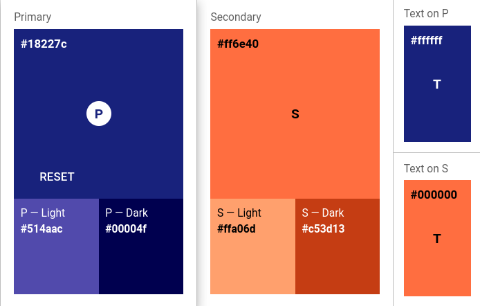

# Rough Branding Guidelines

Bear in mind, I'm no marketing/UX expert nor an MBA so I'm trying my best here 

## Colors

Using [Material Colors](https://material.io/resources/color/#!/?view.left=0&view.right=0&primary.color=1A237E&secondary.color=FF6E40).

### Primary
Indigo 900

Main: `#1a237e`

Light: `#534bae`

Dark: `#000051`

Text: `#ffffff`

### Secondary
Deep Orange A200

Main: `#ff6e40`

Light: `#ffa06d`

Dark: `#c53d13`

Text: `black`

### Grays
Heading: `#141414`

Text: `#3d3d3d`

Main Background: `#ffffff`

Muted: `#888888`

## Brand Archetypes

[Sage](https://www.kayeputnam.com/brandality-archetype-sage/), [Everyman](https://www.kayeputnam.com/brandality-archetype-everyman/)