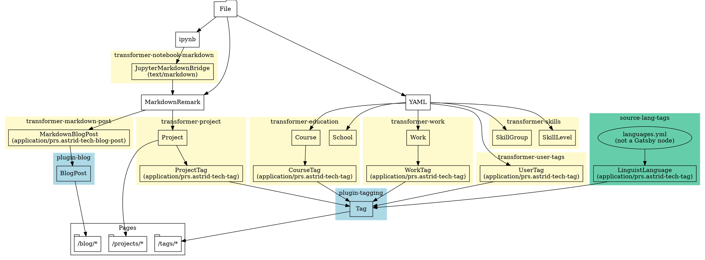

One of the big parts of the 0.2 release is a thing that no one will ever get to see directly: The brand new, highly modular backend. This post will likely be highly technical, but if anyone wants to see how it all works inside, this is for you.

## A quick primer on Gatsby

### Static Site Generation

A static site generator is a program that outputs a website that is completely pre-built. It outputs a big bundle of HTML, CSS, and JS plus media and nothing else. Some examples include [Gatsby](https://www.gatsbyjs.org/), which this site is built on, and [Jekyll](https://jekyllrb.com/), which is one of the more popular ones.

**What's the point?** Essentially, the reason you would do this instead of making a dynamic site (one where the server renders HTML every request) is because you can host it anywhere without any server-side logic. All you really need is a barebones Apache or Nginx server, or you can be like me and host it on [GitHub Pages](https://pages.github.com/). Because the HTML isn't changing unlike on a dynamic website, it's super duper good for browsers, since the browser can just cache all the data and only need to download things once.

**Why would you do this instead of just writing the HTML by hand?** Because writing HTML by hand is repetitive and prone to error, not to mention _boring_. By using a static site generator, you can do cool things like:

- Write your blog posts in Markdown!
- Write your blog posts as Jupyter notebooks!
- Use YAML to describe certain pieces of content!
- Programmatically link tags to the correct location so you don't need to do so much copying and pasting of HTML!

All of this, by the way, is stuff that this site does.

My `create-react-app`-based website from the very beginning _really wanted to do this!_ But I don't think `create-react-app` was really designed to make static sites. At one point, I was rendering blog posts like this one in the browser, which is obviously a pretty terrible idea.

Luckily for me, Gatsby exists and it solves all of my problems!

### Why Gatsby?

Gatsby uses React, so it wasn't too hard to migrate my old stuff over. Additionally it has a pretty cool content sourcing system.

1. You have source nodes, like files or remote resources or the time that the website was built
2. ...that get transformed into other nodes by transformers (for example, `gatsby-transformer-remark` takes markdown files and spits out `MarkdownRemark` nodes)
3. ...and they might get transformed into more nodes (I might take one of those markdown nodes and convert it into a `Project`)
4. ...and at the very end, you can create pages from nodes or run GraphQL queries on them.

When I was first learning it, I was doing a lot of things rather poorly and incorrectly. But after a month of triumphs and mistakes, I've learned a lot about the framework, so I was confident enough to rewrite my backend to be better.

## The new backend

### Why it was needed

Before this refactoring, the backend was spread across a 528-line `gatsby-node.js` in the root directory and 284 lines of Typescript in `src/gatsby`. The `gatsby-node.js` was very hard to maintain, which was why after a certain point I just wrote all new code in Typescript. Even then, I still felt a twinge of pain every time I had to _touch_ anything near the backend.

Now, the code is spread across 1283 lines of Typescript in 10 highly modular plugins. The line count increase is somewhat misleading, due to me having added a few more features and defined the schema of most of the nodes. However, the other reason it's bigger is because of Typescript, and the fact that I also defined the types of some of my objects.

Additionally, all files except for one are under 200 lines, and they're all in Typescript, making them much easier to work with for me. Whereas before, my code was in a gigantic monolith, now each plugin has its own well-defined, highly-specific focus. Each typescript file is small enough to be easily digestible by my tiny brain. It was super easy to test individual failing plugins because all I had to do was comment out the plugin declaration in `gatsby-config.js`.

### High-level architectural overview

Within my `plugins/` directory, there are 10 plugins and 1 util folder for shared code. Here is what each plugin does:

- `gatsby-astrid-plugin-blog` - Finds blog posts and makes pages for them.
- `gatsby-astrid-plugin-tagging` - Responsible for making it easy to query objects for their tags, and tags for their objects.
- `gatsby-astrid-transformer-markdown-post` - Converts markdown posts in the blog folder into blog post objects.
- `gatsby-astrid-transformer-notebook-markdown` - Converts Jupyter notebooks into Markdown nodes and is responsible for Jupyter notebook posts like [this one](/blog/2020-06-18-frequency-shifting).
- `gatsby-astrid-source-lang-tags` - Responsible for making colorful language tags.
- `gatsby-astrid-transformer-user-tags` - Responsible for "user tags," or tags whose names and parameters I manually defined. This is why some tags, like React and Gatsby, have colors correctly corresponding to their branding.
- `gatsby-astrid-transformer-education`, `gatsby-astrid-transformer-project`, `gatsby-astrid-transformer-skills`, `gatsby-astrid-transformer-work`, and more to come - The actual content of the site.

Here is the graph of all the node type transformations my code does.



It looks pretty complicated, but that's only because of the sheer quantity of stuff there is. It's all very wide, but not actually very deep. For example, you may notice some repeated structures here, such as

```dot
digraph {
    bgcolor = transparent
    direction = LR

    node [shape=box, color=black]

    project [label="Project"]
    project_tag [label="ProjectTag\n(application/prs.astrid-tech-tag)"]
    tag [label="Tag"]
    course [label="Course"]
    course_tag [label="CourseTag\n(application/prs.astrid-tech-tag)"]
    project -> project_tag -> tag
    course -> course_tag -> tag
}
```

This type of structure is used to automatically generate tags out of certain pieces of content. In fact, you can see it in action with this blog post, which is linked to [the astrid.tech project](/projects/astrid-tech).

Now, Gatsby doesn't like it when two plugins define and create the same type. However, to get around this, I create a (`ProjectTag`) with a special mimetype on it (`application/prs.astrid-tech-tag`) that the tagging plugin detects. The tagging plugin then uses the data in that node to create an actual tag.

Though it does add some complexity and indirectness, the really nice side effect of this is that I can actually remove some plugins and the site will still work perfectly, as if nothing was changed.

## Conclusion

In this post, we examined the high-level architecture of the new backend. In future posts, we will take a look at some of the individual plugins, and how they work.
