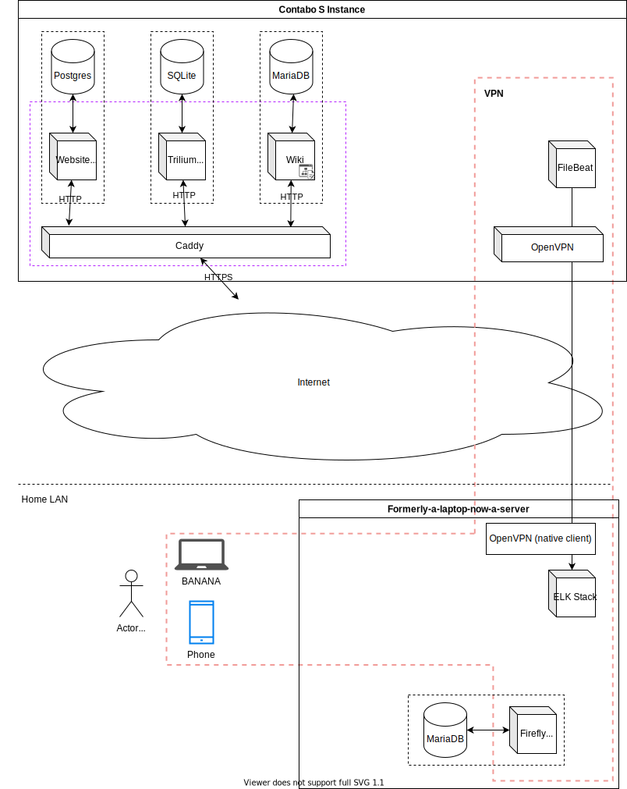

Setting servers up is a pain in the ass. There's so many installation steps for
each service, and then there's the potential for conflicting services, and then
when you have to set everything up again due to migration or something like
that, you give up because it's just so much manual work. Luckily, I have Docker
to make things less difficult.

<!-- excerpt -->

On my VPS, I'm running several dockerized self-hosted apps right now, including:

- api.astrid.tech, the backend to this website that I was talking about
  [last issue](/2020/12/20/backend)
- [Caddy](https://caddyserver.com/) as the reverse proxy for everything
- [Trilium Notes](https://github.com/zadam/trilium), on
  [notes.astrid.tech](https://notes.astrid.tech), and password-protected so you
  can't access it >:(
- [OpenVPN](https://openvpn.net/), on vpn.astrid.tech
- [Firefly III](https://www.firefly-iii.org/), on the OpenVPN network
- [Keycloak](https://www.keycloak.org/), which I haven't figured out how to use
  for authentication yet
- [DokuWiki](https://www.dokuwiki.org/dokuwiki), on
  [wiki.dnd.astrid.tech](https://wiki.dnd.astrid.tech), for keeping track of the
  D&D campaign I'm running and possibly future ones too

These are all configured with the
[IaC repo here](https://github.com/astralbijection/infrastructure). The last
commit before I published this article was
[commit 56e26b](https://github.com/astralbijection/infrastructure/tree/56e26b678b5c14026da32e920f4804554fcdcf9e).

## Organization

Every app gets its own docker-compose file and folder. This makes it easy for me
to test that everything runs and is configured correctly on my local machine.
Once I'm done with ensuring that I didn't royally fuck up the configs, I'm
probably 80% of the way there. I can push to the git repo and run the app in
production.

## Networks

Every app gets its own internal network for compartmentalization. However, there
are a couple of shared networks that I'm using for specific purposes:

- `proxied`: This network includes the Caddy proxy server and every app with a
  web interface.
- `vpn`: This network includes the OpenVPN server and every app that I want to
  restrict.

## Where to go from here?

I have a whole checklist of things I want to try next.

1. **Recomission my old laptop into a server hooked up to the VPN.** This will
   allow me to cheaply and relatively securely extend the functionalities of my
   infrastructure.
2. **Proper centralized logging.** I will run
   [FileBeat](https://www.elastic.co/beats/filebeat) and possibly a few other
   [Beats](https://www.elastic.co/beats/) on the VPS, then run and an
   [ELK stack](https://www.elastic.co/what-is/elk-stack) on the laptop. I'm
   doing it this way instead of just running ELK on the VPS mostly for
   performance reasons; from what I've heard, ElasticSearch is a memory and CPU
   hog. There's some nice security benefits that come with that too, because (in
   theory) it will be hard to get to my laptop.

   

3. **Actually set up backups.** I don't know how I'm planning on doing this, but
   I imagine it's probably best to do it on my VPN-connected laptop as well. You
   might notice that there's a lot dependent on the VPN laptop.
4. **Expand the network.** I learned from someone at the
   [Cal Poly Linux Users Group](https://cplug.org/) that Oracle gives you
   [two free 1GB 1-core](https://www.oracle.com/cloud/free/) VPSes, along with 2
   databases, a bunch of storage, and a load balancer! I can definitely move my
   OpenVPN server to one of these, for further compartmentalization of my
   network. As for the other one, I'll have to figure something else to run on
   that.
5. **Further expand the network.** I estimate I have around 4 non-zero Raspberry
   Pis lying around my room (I think there's a 2B, 3B, 3B, and 3B+, but don't
   quote me on that). One of those is being used for OctoPrint, but suppose I
   were to cluster the other three and run god knows what on them...
6. **Learn Kubernetes.** If I've accomplished steps (1) and (4), then I'll have
   4 different machines I'm working with. Step (5) will mean I have 7 machines.
   It might be a good idea to learn how to Kubernetes. I think I can do it with
   step (5).
7. **Self-host MOAR apps!** Server management is painful sometimes, but it's
   really fun! The end product is a complicated, well-functioning system that
   works, and that's always really satisfying.
