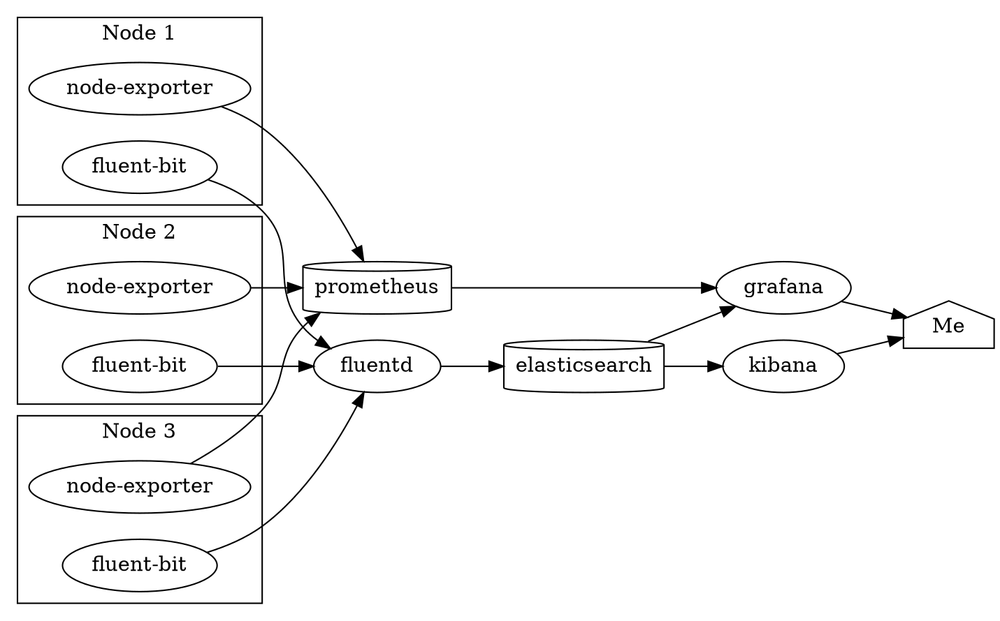

A 7-node server cluster would be terrible to monitor if you had to SSH and `top` every individual node. Thankfully, that's where Grafana and Prometheus come in to save the day.

<!-- excerpt -->


## Deploying my monitoring and redeploying my logging

After much finagling with Kubernetes manifests and general pain, I learned about [Helm Charts](https://helm.sh), which is essentially a package manager for Kubernetes. I have a [Helmfile](https://github.com/roboll/helmfile) set up to essentially declaratively deploy my Charts, as well.

So, I got Prometheus and Grafana set up using the [`prometheus-community/kube-prometheus-stack`](https://github.com/prometheus-community/helm-charts/tree/main/charts/kube-prometheus-stack) helm chart, which bundles all the metrics stuff together into one nice package. I also redeployed my logging stack using the [`bitnami/fluentd`](https://github.com/bitnami/charts/tree/master/bitnami/fluentd/), [`fluent/fluent-bit`](https://github.com/fluent/helm-charts), [`elastic/elasticsearch`](https://github.com/elastic/helm-charts/tree/master/elasticsearch), and [`elastic/kibana`](https://github.com/elastic/helm-charts/tree/master/kibana).



Here's a small chart demonstrating how my full monitoring stack works.

A log might go through the following process:

1. The container writes a log to stdout or stderr, or systemd produces a log.
2. Every node runs Fluent-bit, which is a very lightweight log forwarder. Fluent-bit just reads every container's output, does very minimal parsing of the log, gives it a tag (in the form of `kube.infra.<namespace_name>.<pod_name>.<container_name>`), and sends it off to the central Fluentd aggregation service.
3. Fluentd receives logs from Fluent-bit and turns them into JSON based on predefined rules. So far, I have processing set up for Nginx and Kibana. Then, Fluentd writes the data to Elasticsearch.
4. Finally, I can read the logs from Elasticsearch using Kibana or Grafana, depending on my mood, though it's usually Kibana.

Metrics data is slightly different.

1. A node exporter app runs on every node, reading CPU, load, memory, and other fun metrics, and exposes it as a HTTP server.
2. Every 10 seconds, Prometheus scrapes this data from all the nodes' exporters and stores it on disk.
3. Finally, I can look at the cool graphs that Grafana produces from this data stored in Prometheus.

## KaaP: Kubernetes as a Paparazza

This is it! I'm finally running _something_ on this godforsaken cluster!

At the last [IndieWeb Homebrew Website Club (HWC)](https://indieweb.org/Homebrew_Website_Club) I attended, someone suggested to me that I could somehow have a live feed of my 3D printer. Although I can't have a _live_ feed because I have a slow internet connection, I can take a picture every few minutes and upload it to my server.

So, I added a new endpoint to my API server, then wrote a [small script](https://github.com/astralbijection/printer_image_snapper) that does exactly that. It scrapes data from my OctoPrint instance's API, snaps a picture from the exposed MJPG-streamer endpoint, and sends a PATCH request to my API server with all the information. I [Dockerized it](https://hub.docker.com/repository/docker/astridyu/printer_image_snapper) using `python3.9-alpine` for minimum image size, and created a CronJob for my cluster that runs the script every 10 minutes:[^1]

[^1]: Yes, I know this can be run on a normal server with a normal cronjob. I just wanted to try something new and give my cluster a purpose, okay?

```yaml
apiVersion: v1
kind: Namespace
metadata:
  name: printer-image-snapper
---
apiVersion: batch/v1beta1
kind: CronJob
metadata:
  name: printer-image-snapper
  namespace: printer-image-snapper
spec:
  schedule: "*/10 * * * *"
  jobTemplate:
    spec:
      template:
        spec:
          affinity:
            nodeAffinity:
              requiredDuringSchedulingIgnoredDuringExecution:
                nodeSelectorTerms:
                  - matchExpressions:
                      - key: kubernetes.io/arch
                        operator: In
                        values: [amd64]
          containers:
            - name: printer-image-snapper
              image: astridyu/printer_image_snapper:latest
              imagePullPolicy: Always
              env:
                - name: SNAPSHOT_URL
                  value: http://192.168.1.73/webcam/?action=snapshot
                - name: PRINTER_ENDPOINT
                  value: https://api.astrid.tech/api/3dprinter/1/
                - name: OCTOPRINT_ROOT
                  value: http://192.168.1.73/
              envFrom:
                - secretRef:
                    name: printer-image-snapper
          restartPolicy: OnFailure
```

I deployed it and found that my script was broken. However, I was tired, so I just went to bed.

## Debugging time

When I woke up the next morning on Wednesday, I saw the weirdest thing happen on Grafana.


There were these strange, very noticeable spikes in memory consumption every few minutes. Worse, they seemed to be 1 GB tall!


How bad could my Docker image be? It runs Python, which isn't exactly a lightweight runtime, but it wouldn't be 1 GB either. It stores a very low-res JPEG of my printer in RAM, probably at most 30 KB, and it doesn't send much extra data.

My mom's old laptop was also running at 18 load (it has 4 cores, mind you) because Elasticsearch got assigned to it, but I didn't pay it much mind.


I continued debugging my script that afternoon, checking for, well, honestly, I don't know what would be causing it. In a stroke of bad luck, Docker Hub happened to be freaking out on that day/week and taking extremely long on my builds, and not because I wrote inefficient code. Here's an image from my [API server's repository](https://hub.docker.com/repository/docker/astridyu/astrid_tech_api). Yes, those are 177-minute queue times and 252-minute build times. But that had nothing to do with my problem, it only made debugging and testing cycles harder.


I did eventually get the script working (see the second image [here](https://astrid.tech/projects/quadfrost-leds/) for now, but I will make a dedicated page for it eventually).

Then, after demoing my printer images it during the HWC meeting, I remembered: there was one Elasticsearch pod that was always crashing because it kept going OOM on my mom's old laptop, wasn't it? So, I added a new graph to my dashboard called "Poorly-Terminated Containers." It's a heatmap of container terminations that aren't because of `Completed`.


According to this graph, my printer paparazza stopped crashing halfway through the afternoon when I fixed it, but my logging namespace continued doing so.


And sure enough, every one of these crashes seems to correspond with that 1GB drop in memory usage.

Yeah, it's Elasticsearch being too damn big and getting killed for it.

## What now?

I tried tweaking Elasticsearch a bit, maybe running it on my Raspberry Pis instead, but I wasn't able to really do much. So, I shut it down and freed up 2.5 GB of memory across my entire cluster, which is 1/3 of what I use in total. Given that my cluster is composed of very small and low-powered devices, I don't think Elasticsearch is a very good option for me. I'll have to look into more lightweight logging systems. I've heard Loki is a good option, and there is a Fluentd plugin for it.
