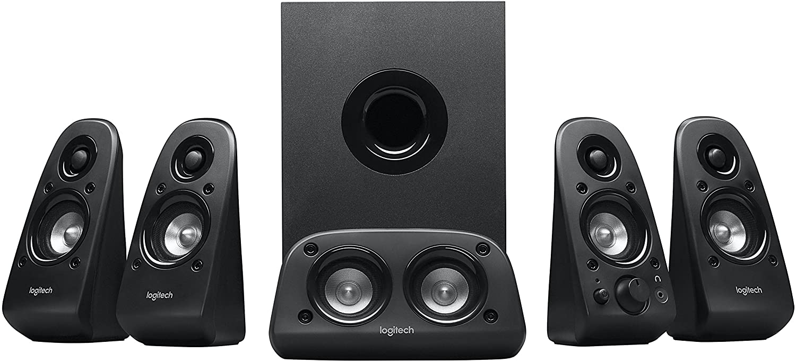

I have these Z506 speakers that I got for cheap on eBay a couple years ago. They
worked pretty well until one day, the audio was extremely loud and the
potentiometer was not able to turn the sound down, so I had to either run my
audio at 4% or not at all.

That's not good. Let's fix that!

## Wild Conjecturing as to What Went Wrong

I'm not an audio or electrical engineer, but I had a few guesses as to what
might have gone wrong.

- Since the control speaker is connected to the subwoofer with a D-sub
  connector, I suspected that maybe the subwoofer is the one doing the volume
  control, and maybe something on there broke.
- A component in the control speaker may broken.

I decided to open up the control speaker and check that first.

## Opening it up

I removed the six bolts on the front, and slowly pried the case open.

I pulled it fully open and disconnected the speaker and the connector. However,
the case was still refusing to budge.

It turns out that I had forgot to free the potentiometer's nut and washer on the
front of the case!

Getting rid of that made the chip much easier to remove.

## Staring at the Chip

Here's what the chip looks like. This was a strange and very tall pot that I had
never seen before. After a bit of research, I found that it was a dual-gang
potentiometer. Essentially, that that means is that it's pretty much the same as
a normal potentiometer, but the same shaft controls 2 separate potentiometers
simultaenously, one for each ear.

I began making measurements on it, to make sure that it was working.

As advertised, this is was a $20k\Omega$ potentiometer, give or take a
$k\Omega$. However, when I tried measuring the resistance of the middle leads, I
noticed that the bottom one changed resistance as I turned the potentiometer,
but the top one didn't. I thought I was maybe measuring it wrong, or my leads
were broken, so I swapped leads and noticeD the same thing. Very strange.

Rotary potentiometers have a wiper inside that moves when you spin the shaft,
controlling the resistance. I stared inside, and saw that the bottom one moved
as expected. However, I didn't even see a wiper for the top one!

I thought my eyes were deceiving me, so I desoldered and pried open the
potentiometer. And sure enough, the top gang was missing its wiper!

It seems I'll need to replace this potentiometer. I desoldered the rest of it
off, and ordered a new one from online.

## Conclusion

My initial guesses were both way off the mark. It was something even more basic,
even more fundamental than some component somewhere frying: it was a mechanical
issue inside the potentiometer.

I'll follow up with a post about the repair when the new potentiometer arrives.
