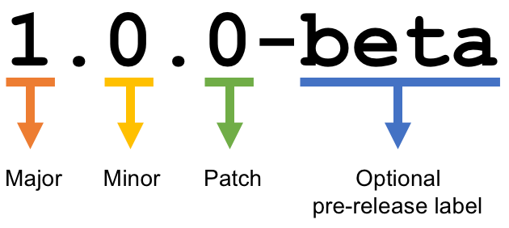

My website is now live! Actually, it's been live for a few days by now, I'm just
a bit late to make the post. As you can see, it's not completely done, but don't
worry, I'll still be pushing new updates and content to it.

There's a few posts before this that I wrote while the website was in
development. Please feel free to look at those as well.

## Semantic Versioning

My release versions are on a semantic versioning system.

We are currently in major version `0`, which I will consider the "beta" phase.
The website doesn't have all the bells and whistles that I want it to have, but
I will slowly add more as we go along. When I reach a version that I consider to
be extremely user friendly and it shows off everything I want it to show off, I
will call that major version `1`, or the "release" phase.

## Roadmap for the near future

In version 0.2, I will make mostly infrastructural changes to my website, but I
will improve on some of the user-facing website features as well.

- I'm completely throwing out my current monolithic Gatsby configuration and
  replacing it with a more modular, advanced, and type-safe configuration that
  leverages modular plugins, TypeScript, and GraphQL type checking. I won't be
  adding much content as a result of this change, except for perhaps a blog post
  explaining how it works, unfortunately, but it _will_ make my life a lot
  easier and make content easier to produce in the future.

- I will redesign the portfolio page to be more user-friendly.

  - I'll add a sidebar with filtering options so that you can select specific
    tags to view.
  - I'll attempt to also reduce the download size as well, so that users don't
    have to download as much data when viewing it.

- Going along with the portfolio page, I will also improve on the project detail
  pages as well, hopefully integrating it with the outer portfolio page.

- And finally, as always, bugfixes when I find them. Or, when _you_ find them
  and report them to
  [the issues page](https://github.com/ifd3f/astrid.tech/issues).

## Conclusion

That just about sums up my plans. I will release another post when `0.2` comes
out. Thank you, and please stay tuned!
