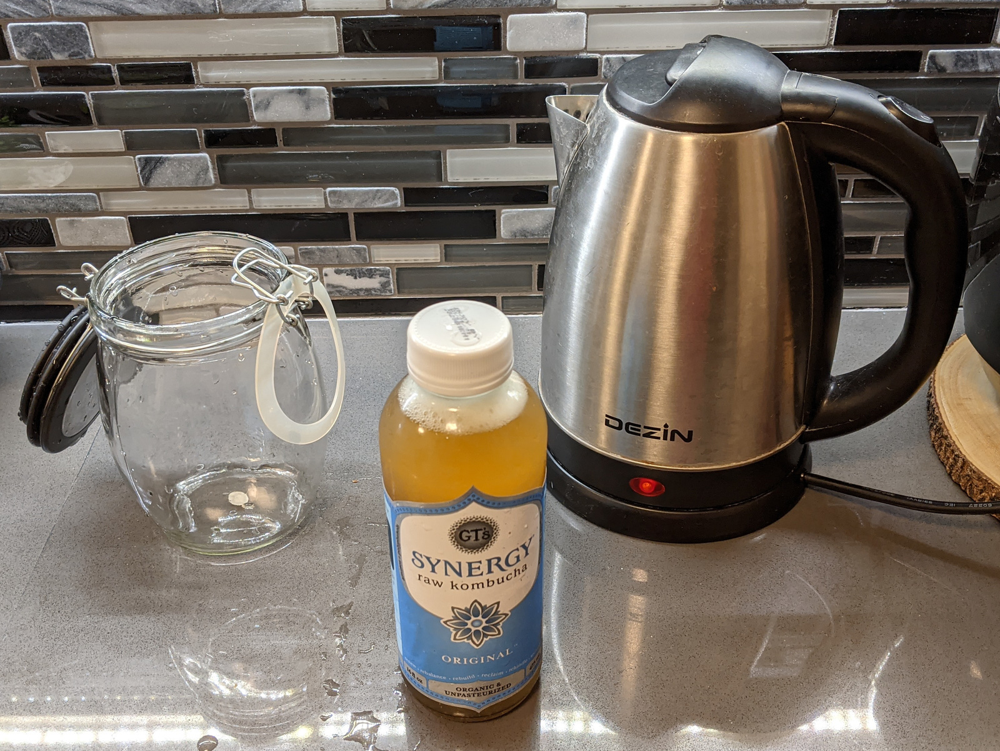
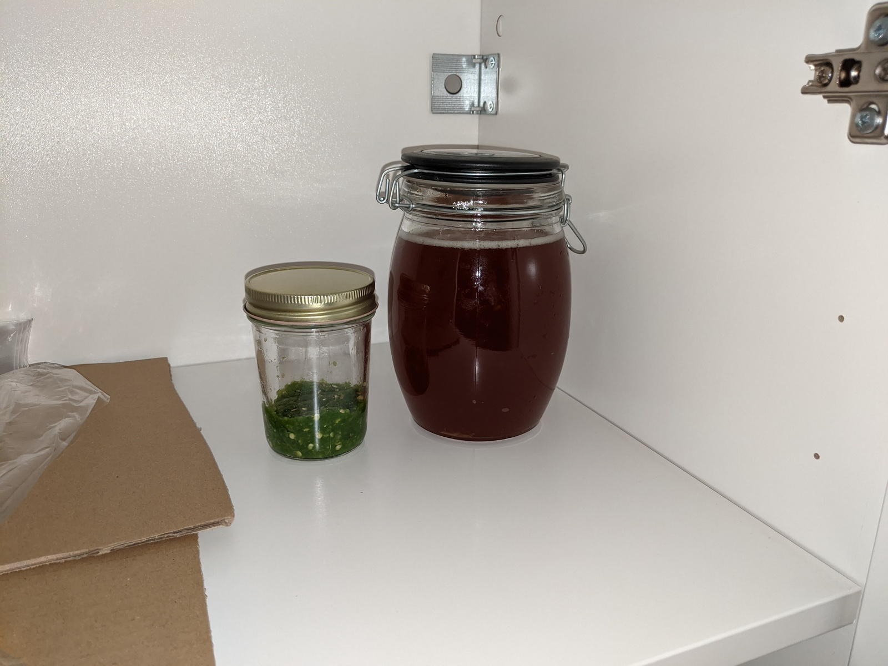
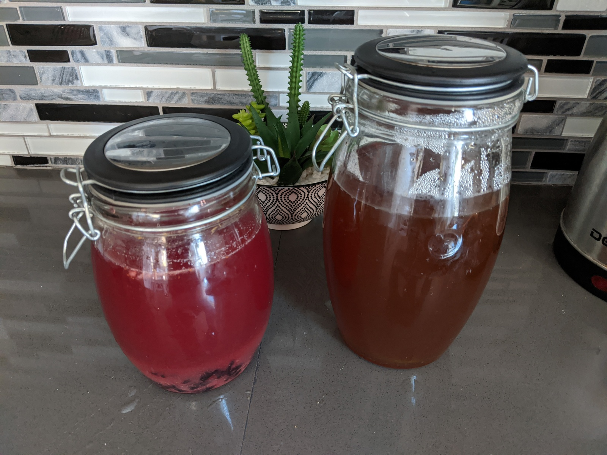
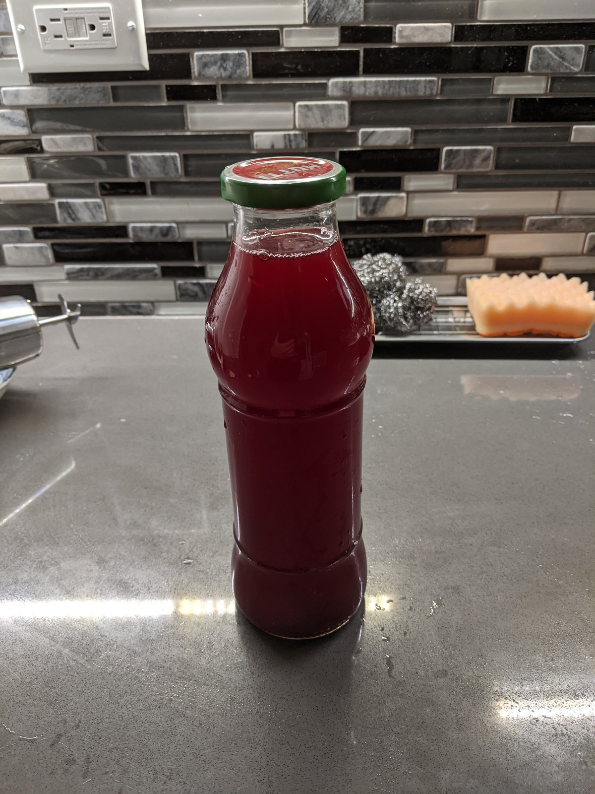

And now for something completely different.

I first tried kombucha back in spring, and it was absolutely not what I
expected. It was fizzy, sweet, and it had a little bit of a nice sour taste to
even it out. Like soda, if it had probiotics in it!

So a few weeks ago, I decided to try making my own kombucha for the first time!
It's as simple as just throwing stuff into a jar and letting the microorganisms
do their thing... right?

## A possibly incorrect crash course on Kombucha

Here is a summary of my limited understanding of kombucha.

- Kombucha gets made when **SCOBY** (**S**ymbiotic **C**ulture **O**f
  **B**acteria and **Y**east), or a bunch of microorganisms, are used to ferment
  tea (specifically _Camellia sinensis_) and sugar.
- You can get a **pellicle**, which lots of people _think_ is the SCOBY, but in
  reality, it's just a bunch of celluose that the SCOBY generates during
  fermentation.
  - There is SCOBY on the pellicle, but pellicle $\neq$ SCOBY. The pellicle is
    apparently edible, too.

There are two fermentation steps:

1.  First fermentation (**F1**)

    - You grow SCOBY with tea, plain sugar, and kombucha from your last batch.
    - Supplying a pellicle is optional but recommended.
    - Takes 7-14 days.
    - Ends up with sour probiotic water and usually a pellicle.
    - You can drink it if you want.

2.  Second fermentation, (**F2**)
    - You take F1 results and add flavoring.
    - Takes 2-4 days.
    - Ends up with carbonated fruity probiotic water.
    - If you add yeast at this step it becomes alcoholic.

Unfortunately, since I'm just starting out, there is no last batch. But that's
what health food stores are for!

## Spooky Halloween Preparation Day

As the sun set on All Hallow's Eve, I started brewing my evil concoction. First,
I acquired the following ingredients:

- A bottle of
  [GT's Original Kombucha](https://gtslivingfoods.com/offering/synergy-kombucha/original-enlightened/)
  from a local Mollie Stone's
- Organic brown cane sugar
- 2 Lipton Tea bags

There was already a mini-pellicle inside the kombucha, which according to some
other internet people happens often enough.

I brewed the Lipton tea inside the mason jar and threw in "enough" sugar, plus
some agave syrup for good measure. Should I have measured out my additions
accurately? Probably, to be honest. But I didn't, and just like with everything
else I cook, it seems to have turned out fine despite my lack of precision! I
waited for the tea to cool down to 85°F before throwing in the starter.

I poured in about a third of the starter and drank the rest. I hadn't had
kombucha in a while, and it tasted pretty good!

I let it sit in a shelf for the first fermentation and went back to being busy
with schoolwork. The green stuff next to it is an attempt at hot sauce that...
didn't go so well, I'll just say.

## First Fermentation

On day 6 mark, it was looking decently healthy, but the air was getting colder
and colder.

Here's what it looked like on the 8 day mark.

But at this point, our poorly insulated house got kinda cold. 60°F cold. So cold
that in the mornings, I had to lay in bed for many minutes to gather my
willpower to get up, because I'm a flimsy temperature-sensitive stick. If it
were just me that was like that, then it would be fine, but unfortunately, so is
SCOBY. I had to figure out a way to keep it a bit warmer, or else the SCOBY
wouldn't be very happy.

### Shitty Idea Time

You see, on the part of the shelf that is under my desk, there are a pair of old
computers that I'm using as "servers," though I haven't had the time to actually
use them very much so they're mostly acting like heaters.

The shelf right above it was empty and at 75°F, and we all know what happens to
hot air...

That's right! Brewing vessels get placed in hot air!

And by day 12, a thin pellicle had formed!

And by day 13, I gave it a taste, and it was wonderfully sour. I decided it was
ready for second fermentation!

## Second Fermentation

Now that I knew that this kombucha fermentation was possible, I made sure to
prepare the next F1.

I took the pellicle and about a third of the first batch and put it in the new
kombucha so that I can make more. I thawed and crushed some frozen blueberries
and threw it into the other two thirds. I also added a small amount of honey to
both because I felt like it.

And I put it back on the server incubator.

## Bottling

I saw bubbles in the jar and was really happy, and I decided to bottle my
kombucha! Unfortunately, it didn't look as bubbly as I was expecting, but I
proceeded to bottle it anyway because I felt like it. I strained out all the
mush, spooned the final mixture into a bottle, and refrigerated it.

I gave it a bit of a taste, and to my surprise, it tasted really good, and it
was way fizzier than it looked! The fizziness surprised me so much that I
actually spat some of it out a bit, even!

It turns out in the end, I was a massive idiot and fermented for only 35 hours
when I probably should have been aiming for 48. I've been losing track of time
due to school and work! If I did it longer, perhaps it might be more outwardly
fizzy, but whatever. Anyways, if I don't die of septic shock within the next 48
hours as my mother has been warning me, I'll deem this experiment a success!

EDIT on 2020-11-15: I have not gotten septic shock.
