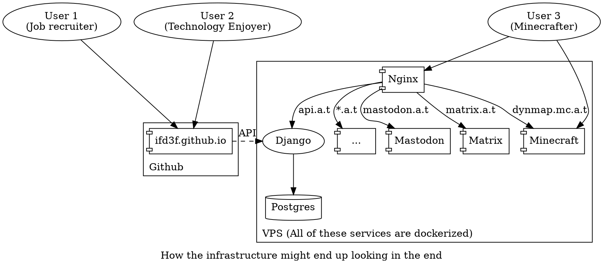
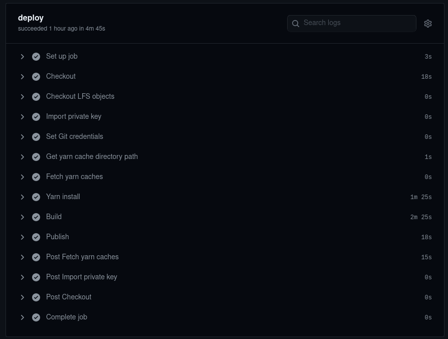

My website currently only has a frontend. Now, that's cool and all, but I want
my website to be fancier than that, and have more user interactability that I
can customize.

Okay, yes, there's no one visiting my site to begin with, but that won't stop me
from wasting my time on this!

Some tasks, like commenting and analytics, are currently delegated to others
(Disqus and Google Analytics to be precise). However, those services often track
users and harvest their data. And plus, it would be fun and to code those
features in myself. With all these in mind, that's why I'm building a backend.

## Planned Features

I want to add the following features when I release it:

- A login system that supports signing in with other providers, like Google or
  Github
- Self-hosted commenting
- A thing that tracks how many hits my pages get, so that I can display that on
  the page

Later on, I want to add more server-enhanced features:

- Blogging that's faster than running a full rebuild of the site
- Webmentions? IndieAuth?
- Fun analytics stuff.
- A full social media feed aggregator that tracks everything I post (not that I
  even post that much, though...)
- Maybe even a forum system! (Or I could just roll a Mastodon instance and call
  it a day. Or both...)

I'm also thinking of adding some other stuff to the server besides just a
website backend. For example, a Minecraft server, or a Mastodon server.

## The technical crap

### Deployment and repo organization

The backend is currently on the `backend` branch of my git repo, located in the
`astrid_tech_api` subfolder. It's written in Django, and I'll have an app for
each major responsibility. Currently, I'm mostly working on commenting. I tried
to build an authentication system, but I may have gone slightly overkill in
that.

In terms of deployment, I'll keep the frontend on Github Pages so I can leech
off of Microsoft's hosting.

For the backend, I'm looking at [Contabo](https://contabo.com/), because their
rates look way better than anyone else I've seen. Their cheapest service is
€4/mo (\$4.89/mo) and it gives you 2 cores, 4GB RAM, and 300GB hybrid drive
storage! It's in Germany, however, which has 137ms latency from where I live, so
that might not be the best. Their cheapest US-based service is €6/mo
(\$7.34/mo).

Even though I'm running containers, I'm avoiding container hosting because I'm
really cheap and I don't really care much for scalability. Plus, I want the
experience of managing a server myself. I'm planning on Dockerizing my backend
and deploying it with either docker-compose or Kubernetes. So far,
docker-compose seems a lot easier to use, but Kubernetes may be a bit more
commonplace in the tech industry.



### Replacing Gatsby?

With this new backend coming in, I'm also considering moving to a new frontend
framework. Essentially, Gatsby has a lot of issues with it. One of them is the
long build times, which is worsened by how unreliable the cache is with my
several custom plugins. Most of the runtime seems to be in generating images,
but it might not be doing it very optimally; when it generates images, my CPU
isn't being 100% used.




I wrote the following script to limit the size of every image in my repository
to 1600x1600, but that only reduced build time by 30 seconds.

```bash
maxsize () {
  convert $1 -resize 1600x1600\> $1
}

for file in $(find content assets -type f \( -iname "*.jpg" -o -iname "*.png" -o -iname "*.jpeg" \) )
do
  echo $file
  maxsize $file
done
```

The other issue is that it's
[run by a sketchy company](https://twitter.com/tesseralis/status/1293649007739191296)
with a somewhat racist, sexist, and transphobic record, so I feel like I'd want
to transition my own website off of that.

Using Next.js and building my own thumbnail generation/data pull system seems
like the most logical alternative because:

1. It uses React, so I don't have to throw away all my components.
2. It's also statically generated so I can keep my site fast. Plus, there's an
   option for server-side rendering, allowing potentially faster updates if I
   choose to use it in the future.
3. It doesn't prescribe for you a data sourcing system to use, meaning I can
   write a custom data pulling/processing system that's more optimized for my
   site.
4. I don't really see anything _too_ massively controversial about Next.js from
   a quick Google search.

## Conclusion

I will admit, I'm essentially taking a jackhammer to a nail for this entire
solution. I'm only running a single server, there really isn't a need for
Kubernetes. Heck, even Docker is somewhat overkill for this. However, I'm doing
all this to learn DevOps technologies that I've never used before, stepping
outside of my comfort zone, because I'm curious about them.

It's gonna be an interesting experience to add this in, because I'm essentially
taking an established product and adding functionality to it while maintaining
it. I'm essentially a one-woman end-to-end software development team. So, I'm
fairly hopeful for this server setup, and I hope to get it out within the next
few weeks.
