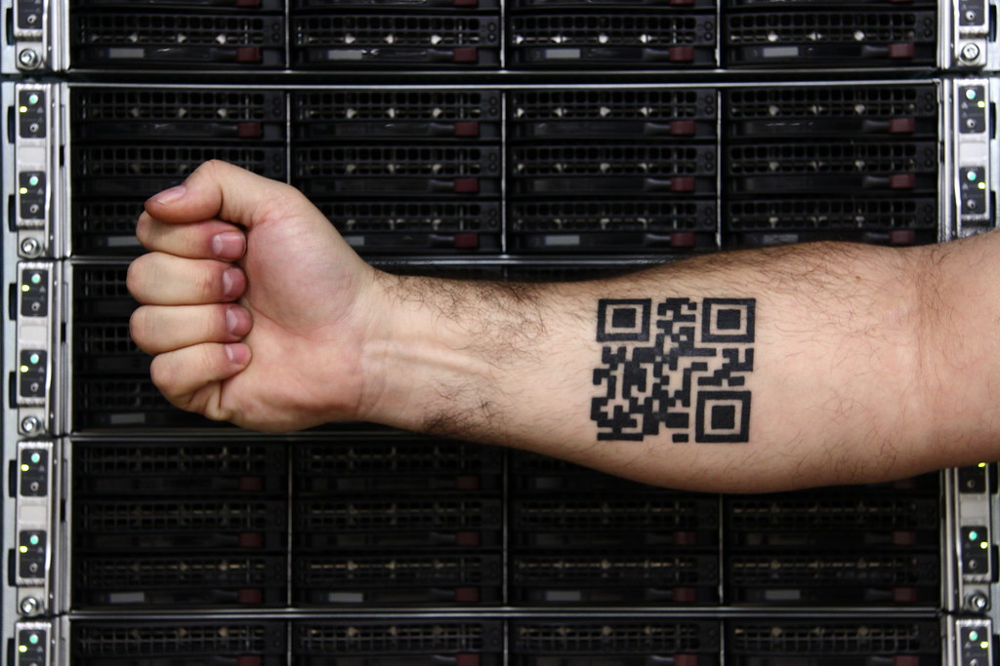
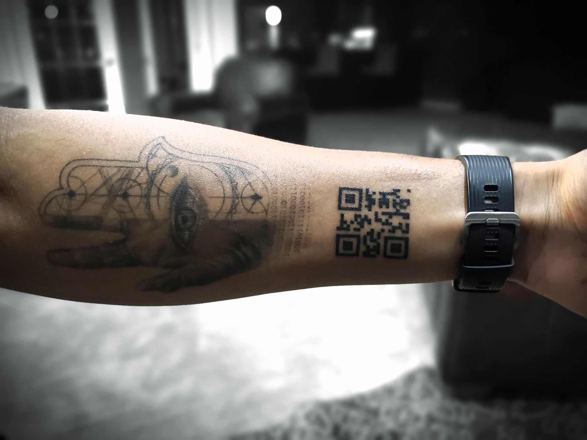
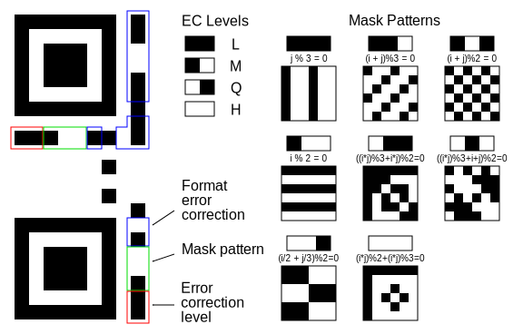
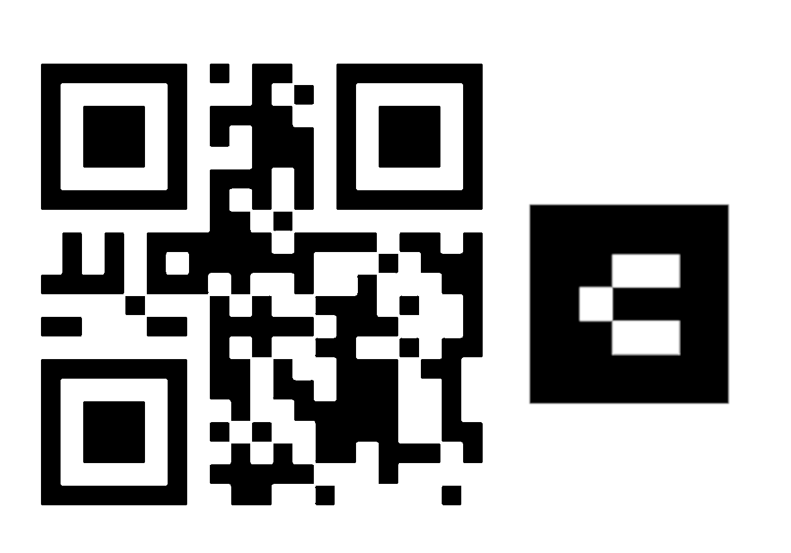
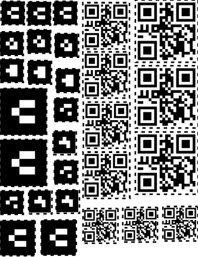

I'm already a transhuman trans humanist transhumanist human, so I thought, "why
not just go all the way and get a QR code tattoo?" This article is a compilation
of basically all of the research I've done on this topic.

<!-- excerpt -->

Now, I know what you're thinking: "what happens if your tattoo goes to a broken
link?" It happened to
[this unfortunate Argentinian football fan](https://www.sportbible.com/football/reactions-news-fails-river-plate-fans-tattoo-is-now-useless-after-youtube-remove-video-20190412),
after all.

However, unlike him, I have the foresight to link it to a domain I own instead
of some random video on YouTube. Specifically, I'm linking it to a subdomain of
my short domain, either `q.aay.tw` or `qr.aay.tw`. (I'll still need to analyze
which one produces the easiest-to-draw codes, so the specific link is still up
in the air.)

## Prior art

Some people on Reddit have already gotten QR tattoos, and their experiences
provide the inspiration for mine.

- [u/bgrnbrg](https://www.reddit.com/user/bgrnbrg/) made a
  [5-year update post on his tattoo](https://www.reddit.com/r/tattoofade/comments/7cyk6f/a_5_year_update_on_my_qr_tattoo/)
  about 4 years ago. It seems to still hold up, and it's certainly still
  scannable from the images he provided. 

- [u/Odd-Care](https://www.reddit.com/user/Odd-Care/) got
  [this tattoo](https://www.reddit.com/r/tattoos/comments/g1jnbw/qr_code_tattoo_healed_done_a_couple_months_ago_by/),
  which also links to his own page, which then links to the NBA Raptors vs
  Warriors video on YouTube. 

u/bgrnbrg suggests a couple of things to make the tattoo more resillient:

- Reducing the complexity to make it easier to draw, by using the smallest
  possible code (21x21 dots)
- QR codes have built-in error correction, so you should crank up the error
  correction rate.
- Drawing it on a flat surface, like the inner wrist, so it's easier to scan.
- Increasing the dot size to at least 1/8" squares, so a 21x21 code is a 2.75"
  square.
- QR codes might end up having orphans, or individual white or black dots
  without any neighbors. These are liable to bleed over time, which can corrupt
  the code, so you should try to minimize those as much as possible by adjusting
  the mask.

## Picking a QR code

Given all those constraints, we need some very fine-grained control over our QR
generation. Most QR code generators are too simple, and don't give enough
control or output enough useful diagnostics about our generated code. However,
[there is _one_ online generator that _does_ give that fine control I need](https://www.nayuki.io/page/qr-code-generator-library)
(and it's a demo for a QR generator library, funnily enough). It's been so
useful, I'm actually thinking of using it to write a script that searches for an
optimal QR code.

There are a couple of dials that I set on this generator:

- **Quartile error correction.** High unfortunately requires at least 25x25
  dots, so quartile is the best we've got.
- **Mask pattern.**
  [There are 8 possible masks that a QR code can have](https://en.wikipedia.org/wiki/QR_code#Encoding),
  and this is usually optimized to ensure scanners can see the QR code in the
  first place. In my case, however, I'm choosing this value to minimize orphaned
  dots. Unfortunately, some values still have a lot of orphans, even after you
  finagle with the mask pattern! That's why I'm still deciding on the subdomain
  to encode.

## What do I put there?

I have a couple of ideas:

- A simple redirect to [astrid.tech](https://astrid.tech). Boring, but it works.
- A [vCard](https://en.wikipedia.org/wiki/VCard). It would be quite useful,
  especially when doing some professional networking.
- Medical information, like my blood type, what medicines I'm taking, etc.
  Though, that would make it publicly available, which would kinda suck.
- A link to
  [this New York Times article](https://www.youtube.com/watch?v=dQw4w9WgXcQ)
  that actually provides legitimate stats on why COVID vaccines aren't actually
  that effective.
- Inspired by
  [this article](https://medium.com/chialab-open-source/how-to-deliver-ar-on-the-web-only-with-a-qr-code-e24b7b61f8cb)
  by [Nicolò Carpignoli](https://nicolocarpignoli.github.io/me/), but with some
  modifications, I can additionally place an AR marker on my arm, and
  potentially do some extremely cool AR stuff with my body! (elaborated on
  later)

Naturally, being the greedy engineer that I am, I will choose all of the above.

### A tattoo controller webservice!

I'll link my QR code's domain to a custom webservice, so I can link to any page
of my choosing! I'll also make an admin page so that I can control it from my
phone! The vision is, I can literally just change the link seconds before
someone else scans it, so they can see what I want them to see at that moment.

Obviously, since this is a public subdomain, the content will _not_ be private,
and it _can_ be accessed by anyone with the link, whether or not they can see
the QR code. Still, it will definitely provide something fun, and it will
definitely be a conversation starter or party trick.

## Augmented reality!?

I mentioned AR earlier. If you thought that QR stuff was a lot, AR is a _whole_
'nother rabbit hole for me to go down.

There is a library by Carpignoli called
[AR.js](https://github.com/AR-js-org/AR.js), which provides AR tracking in
JavaScript. That's the library that he describes in the article mentioned above.
It can track [ARToolKit markers](https://artoolkit.org/), with
[pregenerated markers here](https://github.com/nicolocarpignoli/artoolkit-barcode-markers-collection).
The method described by Carpignoli's article involves putting the AR marker over
the QR code, but since my QR code is too small, I'll simply put it to the side,
something like this:

Technically, that makes it off-center now, but it wouldn't be too hard to adjust
the marker's its offset in the AR library.

On the consideration list for the AR markers I'll use:

- Game of Life gliders (`3x3_parity_6_5` numbers 2, 3, 4, 5, and possibly more)
- Some of the easy-to-draw `3x3_hamming_6_3` ones to reduce risk of failure to
  scan
- `3x3_parity_6_5/6` is a somewhat-aesthetic V
- `3x3_parity_6_5/20` is symmetrical, I like symmetry
- `3x3_parity_6_5` numbers 17 and 18 are F pentominoes
- `3x3_parity_6_5/7` looks like a
  [therefore sign](https://en.wikipedia.org/wiki/Therefore_sign)
- ... more stuff? IDK

## Temporary tattoos

I'm currently consulting a local tattoo artist about this, and I'm very certain
that I'll get it tattooed on me. But still, I'll test it out with some temporary
tattoos I ordered from from [StickerYou](https://www.stickeryou.com/). I want to
test how well scanners can pick up the tattoos, and ensure that the locations I
want them in are actually good locations to put them in.

StickerYou lets you customize a 8.5"x11" tattoo sheet with whatever tattoos you
want for a $20 (incl. shipping) fee, and because I have a lot of different kinds
of tattoos I want to test, they seemed to be the best deal around for what I
want to do. Their UI was extremely laggy, buggy, and hard to use, and it took
forever to make my tattoo sheet, but I did end up creating it:

It has the following objects on it:

| Type                    | Size | Quantity | Notes                                                                                    |
| :---------------------- | ---: | -------: | :--------------------------------------------------------------------------------------- |
| QR: q.aay.tw            | 1.5" |        3 | This looks around the size u/Odd-Care got his in.                                        |
| QR: q.aay.tw            | 2.0" |        4 |                                                                                          |
| QR: q.aay.tw            | 2.7" |        3 | This is the size u/bgrnbrg got his in.                                                   |
| AR: `3x3_hamming_6_3/0` | 1.0" |        3 |                                                                                          |
| AR: `3x3_hamming_6_3/1` | 1.0" |        3 |                                                                                          |
| AR: `3x3_parity_6_5/6`  | 1.0" |        3 | This is the one that Carpignoli's AR playground uses by default, so it is easily tested. |
| AR: `3x3_parity_6_5/17` | 1.0" |        3 | It looks like a F pentomino!                                                             |
| AR: `3x3_parity_6_5/20` | 1.0" |        3 | It's kinda aesthetic, ngl                                                                |
| AR: `3x3_parity_6_5/6`  | 1.5" |        2 | If the 1" ones are too small, fallback to this size.                                     |
| AR: `3x3_parity_6_5/6`  | 2.0" |        2 | If 1.5" is too small, then god help me.                                                  |

Anyway, this tattoo seems like it will be extremely cool! I'm quite hyped.
