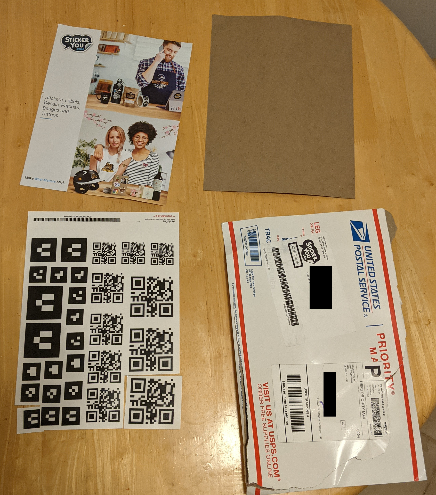
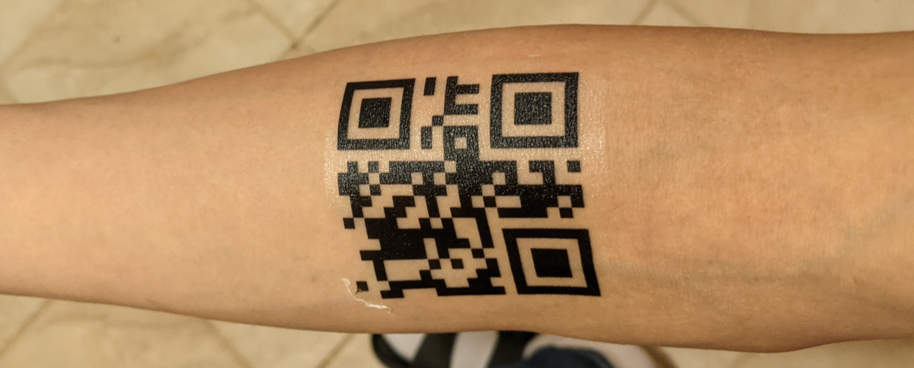
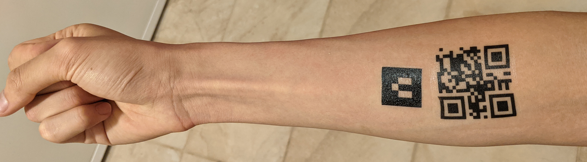
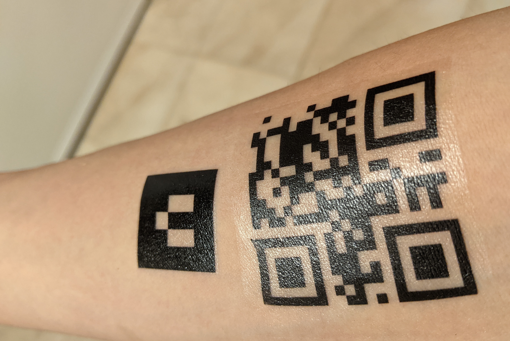
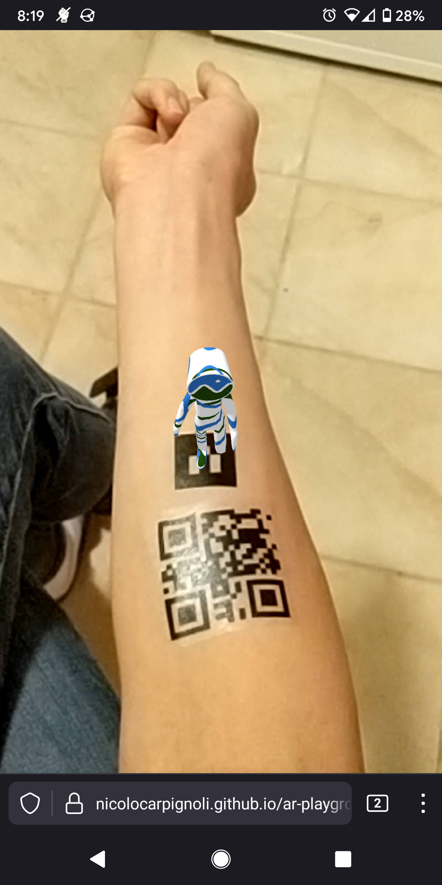
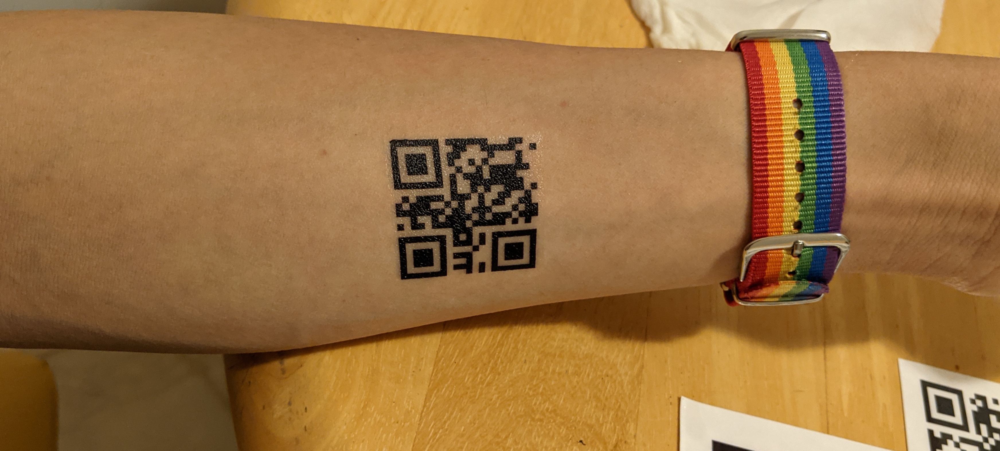
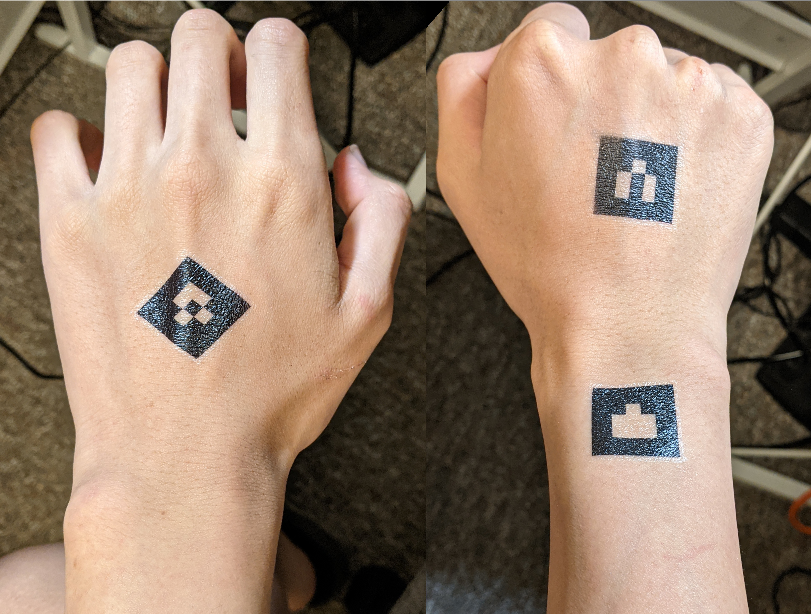
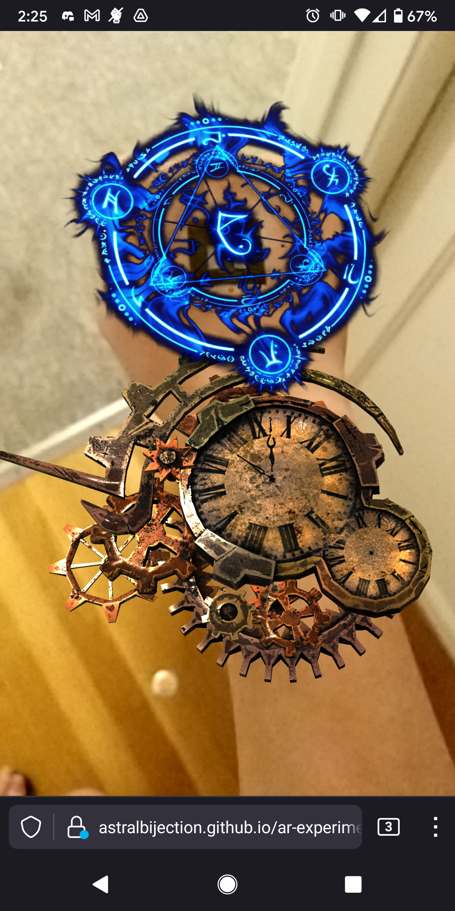

Continuing from my
[last post about the QR code tattoos](/2021/09/22/0/qr-tattoo), my package of
temporary tattoos arrived from StickerYou on Thursday:

So, I eagerly I cut out the tattoos and pasted them onto my skin.

## Applying the temporary tattoos

The instructions to paste them on are quite simple:

> 1. Cut out your tattoo.
> 2. Peel away the clear plastic layer to expose the adhesive.
> 3. Apply the tattoo's adhesive side to skin. Cover with a wet cloth for 10-15
>    seconds.
> 4. To remove wipe skin with baby oil and wipe away with a cloth.

The first one I attempted was the 2.75" one, applied to my upper right forearm
where u/bgrnbrg placed his. Unfortunately, as you might be able to see from the
image, it was way too big. It ended up wrapping around my skin somewhat, and was
therefore unable to be scanned.

I removed it (I did not need baby oil, actually, I could just peel and rub it
off), then tried on the 2" one. That fit quite well, and was able to scan.

I also applied an AR marker to my skin, as you can see. On the
[AR playground](https://nicolocarpignoli.github.io/ar-playground/index.html), it
worked quite well!

As a last test, I tried on the 1.75" tattoo at the center of my left forearm,
approximately where u/Odd-Care placed his:

Again, this was able to scan perfectly fine.

## Rigorous scientific testing of QR code scannability

I downloaded 9 different Android apps that scanned QR codes:

- Barcode Scanner
- Google Lens
- QR & Barcode Scanner
- QR Code Reader
- QR Code Reader and Scanner - Qr Scanner
- QR Droid
- QR Reader
- QR Scanner
- Snapchat

As a control, I generated and scanned a 21x21 dot QR code on my computer screen
as a control subject. Then, I proceeded to use the app to scan both codes.

<iframe 
  width="400"
  height="400" 
  src="https://docs.google.com/spreadsheets/d/e/2PACX-1vSf0p4a_I8QFy30p78zHc-U-9_xL4AyLnwrUX4-kWuE7tvp6w8Uy4QJTmFIwkl8OGNWjbyqjNwzaszj/pubhtml?gid=0&amp;single=true&amp;widget=true&amp;headers=false">
</iframe>

### Results

Every app was able to scan the control code from my monitor. Additionally, all
of them except for Snapchat were able to scan the QR code. However, some trials
appeared to have a delay in scanning (i.e., they needed a certain angle, and I
had to move my arm around to get that angle). The 4 trials where this happened
were:

- 1.5" on left mid wrist with Barcode Scanner
- 1.5" on left mid wrist with QR Code Reader and Scanner - Qr Scanner
- 1.5" on left mid wrist with QR Droid
- 2" on right upper forearm with QR Droid

The likely cause of this may have been that the mid wrist is much more textured
compared to the upper forearm.

## Starting conversations

On Friday and Saturday, at various club meetings and outside, a lot of people
noticed my tattoo. It seems to serve as a fun conversation starter, which is
very helpful as someone who is socially awkward as fuck.

If not for the fact that I already have a job lined up for next year, I would
probably go to the Cal Poly Career Fair this year and show off my QR code on my
arm, too!

## Making my own AR webapp

The AR playground was not enough, so I went further. Last night, added more AR
markers, but to my hands this time.

Then, I made a quick-and-dirty test webapp by essentially taking
[Nicolo Carpignoli's code](https://github.com/nicolocarpignoli/nicolocarpignoli.github.io/tree/master/ar-playground),
adding some custom GLTF models downloaded from
[Sketchfab](https://sketchfab.com), then modifying the code to point to those
models.
[My code is located here](https://github.com/ifd3f/ar-experiment), and
[the webapp is located here](https://ifd3f.github.io/ar-experiment/).

## Wearing off

Today, I did a lot of meal prep, and it seems that as a result, those AR markers
on my hands ended up wearing off somewhat. However, the ones on my upper
forearms were completely unaffected.

I think it was because I was using oil, and as the instructions say,

> 4\. To remove wipe skin with baby oil and wipe away with a cloth.

Though this is only a property of the temporary tattoos, I can imagine that
permanent tattoos on my hands would not last as long either because they rub
against a lot more things.

## Conclusion

I'm really happy that this worked, and it worked so well! I'm definitely gonna
make this permanent!
