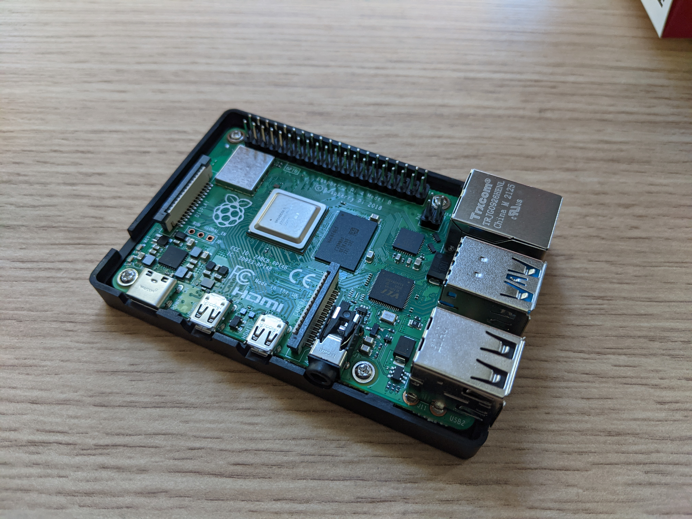
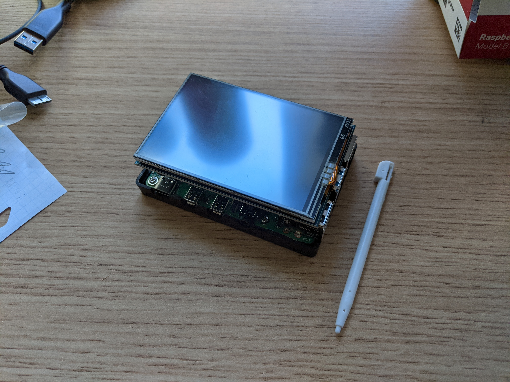
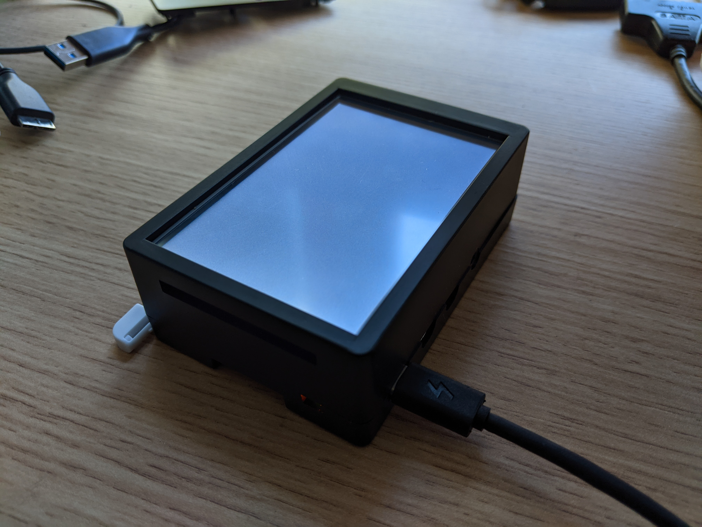
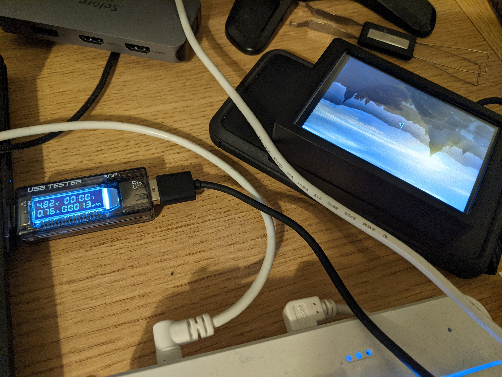
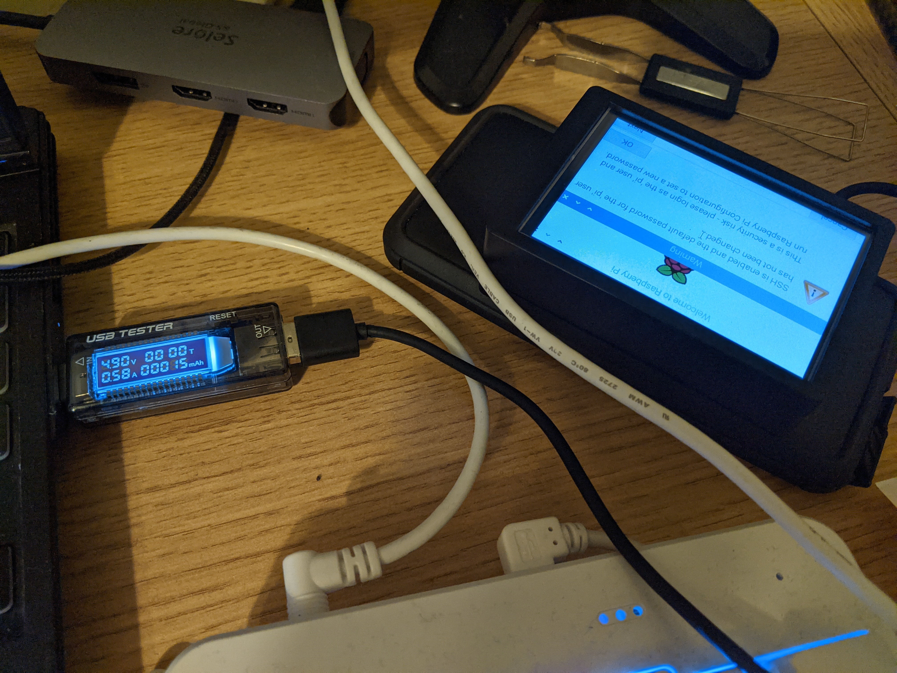

Today, my Raspberry Pi 4 and
[TFT/case bundle](https://www.ebay.com/itm/123778645736) came in the mail, so I
decided to give it a spin and see how it works. This will be used for an
upcoming project that I will not spoil.

## Assembly

The case came with 4 screws to screw the Pi into the bottom of the case.



Then, I slotted the TFT screen onto the GPIO pins.



Finally, the upper part of the case had a cover (which I assume is for when you
don't have a TFT screen). I removed that cover, and the case simply snapped into
place.



## Testing the TFT screen

I found a spare micro SD card to install
[Raspberry Pi OS](https://www.raspberrypi.com/software/operating-systems/) onto.

For my first attempt, I tried Raspberry Pi OS Lite (no X11, no desktop). Then,
following some (modified) instructions from the TFT store page, I ran the
following commands on the Pi:

```sh
wget https://github.com/goodtft/LCD-show/archive/refs/heads/master.zip
unzip master
cd LCD-show/
sudo ./LCD35-show
```

I expected it to render the standard systemd services output, but the script
failed because I guess it relied on X11 being there. Raspberry Pi OS with
Desktop worked, however, and I was able to see the desktop rendered on the TFT
screen and interact with it via the resistive touch sensor.

![The desktop showing on the Pi, with stylus interaction!)(./working-tft.jpg)

## Power consumption

I then proceeded to measure the power consumption of the Pi.

Desktop just loaded: 4.82V, 0.76A, 13mAh 

Desktop finished loading: 4.90V, 0.58A, 15mAh


I noticed that my tester is actually USB 2.0, which only provides a maximum of
10W, which may mean these results are inaccurate. However, maybe my computer's
power output isn't that high either.

## Next steps

- I want to see if I can get the kernel module and stuff working on NixOS. That
  will make configuration management less of a headache.
- I want to underclock the Pi to reduce power consumption.
