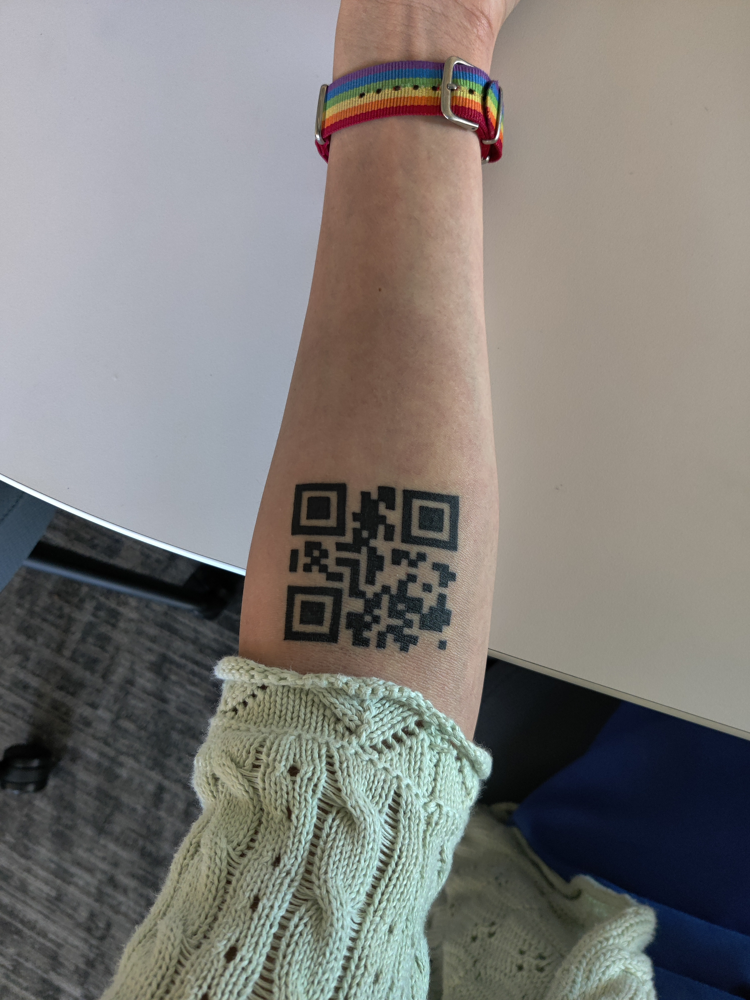
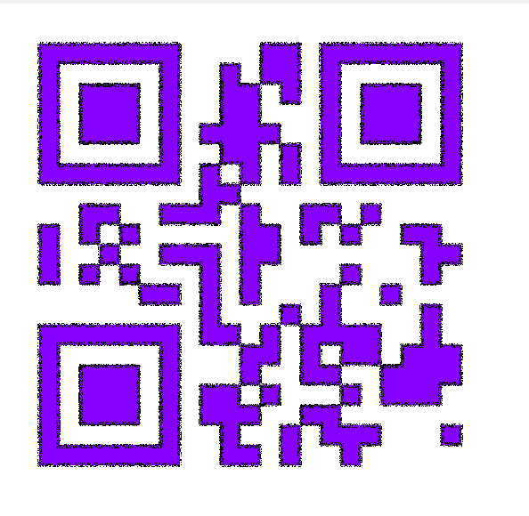
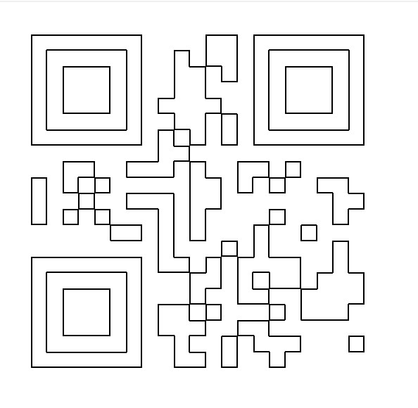
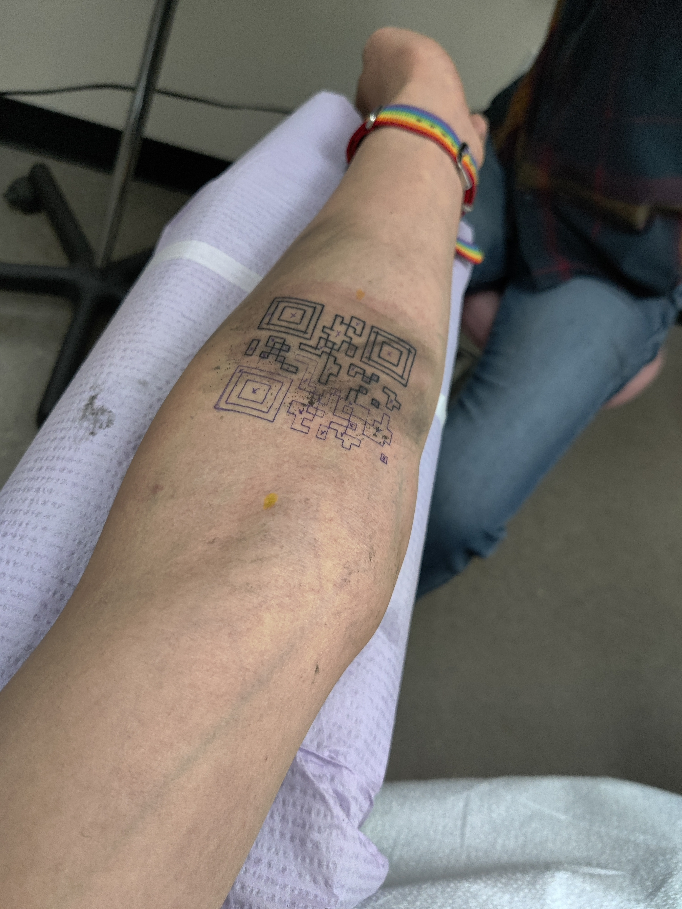
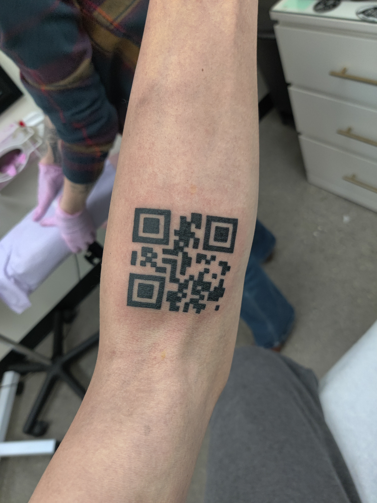
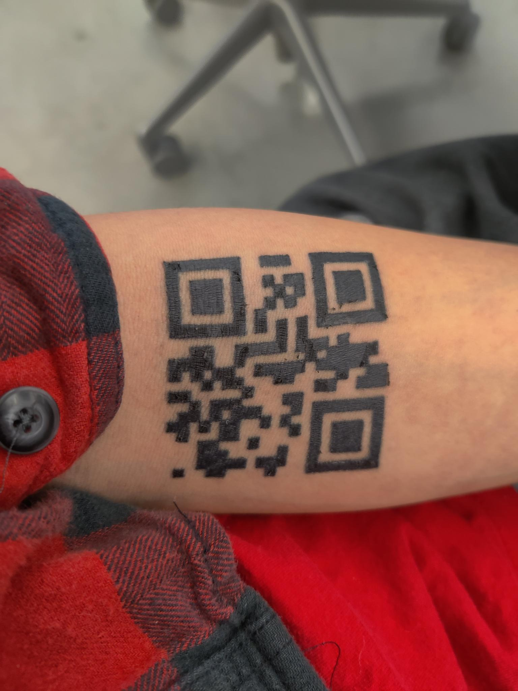

**Content warning: this post mentions tattooing and has a small amount of skin peeling.**

Following up from [my last post about temporary tattoos](https://astrid.tech/2021/10/03/0/temp-tattoo-results/), I finally got it permanently etched onto my skin! Thanks to Kelsey Kansas at [Crybaby Tattoo](https://crybabytattoo.square.site/) in San Luis Obispo!

And yes, *it can be scanned.*

## My tattooing experience

This was my first tattoo ever, so I suppose this post also doubles as a "my first tattoo experience" post. I wasn't completely sure of what to expect, so I did some research beforehand.

- There is pain, and lots of it.
- Don't consume any blood-thinning chemicals for 48 hours before the appointment. So, I essentially stopped drinking green and black tea for a few days.
- Stay hydrated in the 24 hours before the appointment, so that the skin absorbs the ink better. I grinded Factorio for too long the day before, so I shotgunned some water right before going to bed.

My appointment was on a warm Sunday afternoon, on February 27. I showed up to her studio, and we got started.

### The stencil

As it turns out, the tattoo artist doesn't just freedraw the entire tattoo onto your skin, which makes sense, since that seems like it would be very prone to errors. Instead, they draw a stencil first, kinda like a temporary tattoo, to mark where to draw.

Kelsey had a specialized stencil printer, but it didn't behave too well with plain QR codes, because they have very large dark regions. So, I pulled out GIMP and made a trace of it.

First, I tried selecting the black regions using the **Select By Color** tool, then and using **Select > Border**. However, I realized that this method made the outline go outside of the QR code's black sections. This isn't be very desirable.

To get the border to be on the *inside* of the shaded regions, I selected all white pixels, also using **Select by Color**. I used **Select > Grow** by 4 pixels to include the outermost black pixels. Finally, I subtracted all the white pixels, and created a useful result.

So, we printed out this result and the printer was happy with it.

### Actually tattooing!

The stencil was actually applied in a very similar way as [the temporary tattoos I made](https://astrid.tech/2021/10/03/0/temp-tattoo-results/), also by using water to make it stick to the skin. The only difference is that the temporary tattoos were more like a transparent sheet with stuff on it, while the stencil didn't have a transparent sheet, it just deposited ink on my skin.

Then, Kelsey started drawing the outline. Holy crap, it *hurt*. People were *not* lying about how much it hurt.

Once the outline was done, she shaded it in.

After two hours, the tattoo was complete! I gave it a quick scan, just to confirm, and it scanned!

### Aftercare

Kelsey placed a seram wrap thing on my arm, which theoretically would be placed on my arm for 7 days, and removed, and the tattoo would be fully healed. Unfortunately, because it was close to my elbow, my movements made it peel off. I asked Kelsey about it and she suggested I just take it off and go through the regular healing process, which she texted me.

> CRYBABY TATTOO AFTERCARE
> 
> Congratulations on your new tattoo! Though the hard part may be over proper aftercare is essential to living with a well-healed, attractive tattoo. I suggest that you:
> 1. Keep the bandage in place for 2-4 hours.
> 2. Then remove the bandage. With clean hands wash your tattoo with either: “Dr. Bronner’s Baby” castile soap or gold “Dial” liquid hand soap. (Please avoid using bar soap and scented soap) Wash all ink, blood, and ointment completely off. 
> 3. After washing, pat your tattoo dry carefully with a clean paper towel. Do not rub it or use an abrasive towel as you may remove the scab prematurely.
> 4. With clean hands apply a very thin layer of Aquaphor. Wipe away and excess.
> 5. Repeat washing your tattoo 2-3 times a day, and apply Aquaphor when it feels dry. Let your tattoo dry slightly in between the applications of Aquaphor.
> 6. Your tattoo should peel in 3-5 days and should be fully healed in 2-3 weeks. After your tattoo peels it will be very itchy! Please DO NOT scratch! Please DO NOT pick a tattoo scab, it can pull ink out and leave a spot. Allow the scab to fall off naturally. (I guarantee my work and offer free tattoo touch ups in the first year if anything should happen to it during the healing process. )
> 7. No swimming, hot tubs, or soaking your tattoo in water (showering is fine) for 2-3 weeks or until your tattoo is fully healed. No sunbathing or tanning of the tattoo until it heals. To ensure the longest life of your tattoo after it is healed use sunscreen with a SPF 30 or higher when you and your tattoo are in the sun:)
> Crybaby Tattoo is dedicated to helping all of my clients through the healing process. If you should have any questions or problems, please don’t hesitate to contact me!
> -Kelsey

I've been using Dial Gold soap and Aquaphor. I re-apply the Aquaphor during breaks at school, and wash the region with the soap in the morning and at night.

It is Day 4 after tattooing and it still scans. The skin is peeling, but that's expected during the healing process.

## Tattoo Controller Server

The tattoo actually points to a very basic web service that I wrote in Rust to perform the on-demand redirection. I actually completed it sometime in November 2021, well in advance of actually getting the tattoo.

It has a very barebones admin panel that lets me paste in a URL and select where I want it to go. I'll eventually write up more details about the implementation [on the project page](/projects/qr-tattoo).

Using this server, I was able to rickroll a few people with this tattoo, and immediately redirect them to a more sane link, such as my website.

## Final thoughts

I'm really glad I got this tattoo! Kelsey also did a great job drawing it. I feel very powerful being able to rickroll people just by rolling my sleeves up.
