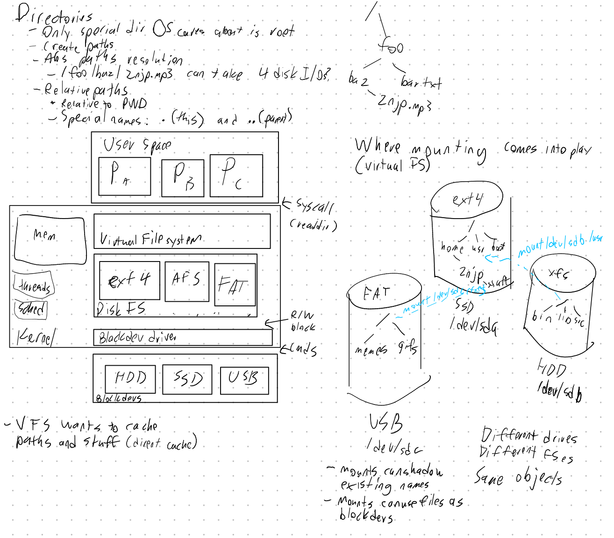
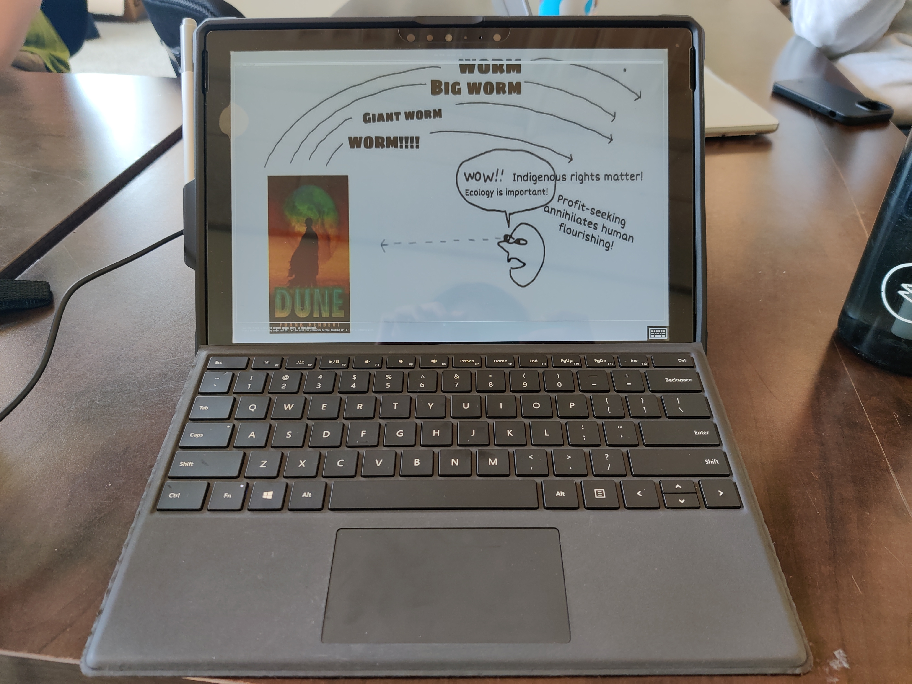

This post chronicles my experiences trying to get NixOS running on my new Surface Pro 6.

## Why I got it

My older travel laptop, `cracktop`, was kinda breaking down. The keyboard refused to send keystrokes unless you pressed down *really* hard on it. Additionally, my gaming laptop, `banana`, was really heavy to lug around, its battery barely lasted an hour, and it kept waking up from suspend while it was in my backpack. I kinda needed a new computer.

[Alia](https://alescoulie.github.io/) was getting rid of an x86 Macbook Pro with touch bar at the time, so I was considering buying it off of her. However, I really wanted to run Linux on my machine, and I also kinda wan`ed to take digital notes on it, so I wanted a tablet.

A friend of mine actually uses a Surface Pro 6 with Gentoo installed, so I thought, why not try it out with NixOS? So, I ordered a used Surface Pro 6 (with 128GB SSD, 8GB RAM, and i5) from eBay for about \$500, which included a pen, charger, keyboard cover, and arc touch mouse. 

## Installing the initial NixOS generation

The Surface had Windows 10 installed. It was either Professional or Home, I forget, but I promptly got rid of it with my NixOS stick. I simply booted into the stick, connected the machine to wifi using `wpa_supplicant`, and I continued installation over SSH from my more comfortable computer.

I had watched [Dune (the 2021 film with twink Atreides)](https://en.wikipedia.org/wiki/Dune_(2021_film)) the weekend before installing, so I decided to give it the name `shai-hulud`, which is what the Fremen call the big sandworms.

As usual, I used ZFS for the filesystem and enabled encryption and lz4 compression. When I ran `nixos-install`, it was able to successfully reboot!

## Linux patches

Unfortunately, there were several issues:

- The resolution was completely fucked
- The touchscreen was completely non-functional, even with the magic pen
- Tablet rotation didn't work, even on KDE

These were because the drivers for it weren't merged into the mainline Linux kernel, but in the form of a set of patches in the [linux-surfacce](https://github.com/linux-surface/linux-surface) repo.

I did some digging around, and I found [a user who had gotten NixOS on their surface already](https://git.polynom.me/PapaTutuWawa/nixos-config). Their flake imported another flake called [nixos-hardware](https://github.com/NixOS/nixos-hardware/tree/master/microsoft/surface)

Unfortunately, when I imported that into my system definition, I had to essentially compile the entire Linux kernel, patches and all, on that machine. That took about 4 hours. But once I got that done, everything pretty much just... worked. Like, everything. Tablet rotation didn't work, but once I switched over to Wayland, it did. I comfortably used it for a while, and everything was good. The screen is even pressure-sensitive!



I was able to use it for a good amount of time without issue. I even replaced the GRUB background with something more fitting:



## 32-core compilation go brrrrr

However, there were some issues a few weeks later, when I wanted to modify my system configs. It seemed that nixos-hardware config for the Surface got modified at some point, so I ended up having to recompile it, which is bad news and time-consuming on that tiny little device.

It turns out, Nix actually supports remote builds! For `nixos-rebuild` specifically, what you do is you add a `--build-host` flag to specify the SSH host to run the compilation on, a perfect job for my huge rack server `gfdesk`. I made some modifications to my config using `gfdesk` as a development machine, committed the changes, then essentially ran the following commands: 

```
# pre-build on gfdesk during development to ensure it works
astrid@gfdesk$ nixos-rebuild build --flake infra#shai-hulud

# copy the nix cache to the surface.
# it's already been pre-built so no actual building happens, only network transfers
astrid@shai-hulud$ nixos-rebuild build --flake infra --build-host gfdesk

# switch to the new config.
# root@shai-hulud can't SSH to gfdesk, which is why build and switch are separate steps.
# again, no buliding is needed because the binaries have been copied over.
astrid@shai-hulud$ sudo nixos-rebuild switch --flake infra
```

## Conclusions

Overall, I'm quite happy with this setup. It's been a good experience, being able to have very nice 2-in-1 functionality on Linux.

There are still a few small issues to sort out:

- In CI, the `shai-hulud` build actually runs out of disk space, because compiling Linux takes way more than 20GB. There's apparently ways around it, like deleting stuff from the builder instance, but I'll have to figure that out.
- I need to figure out how to make virtual keyboard work.
- I need to customize and rice it a lot more, but that's an issue across all my machines.

