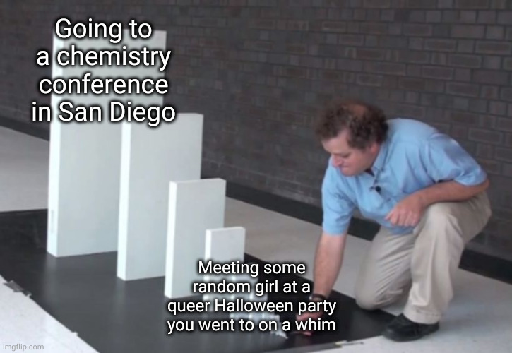
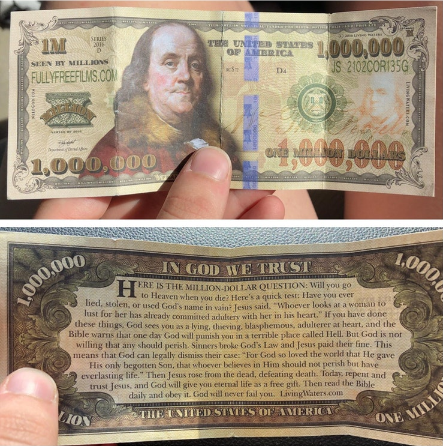
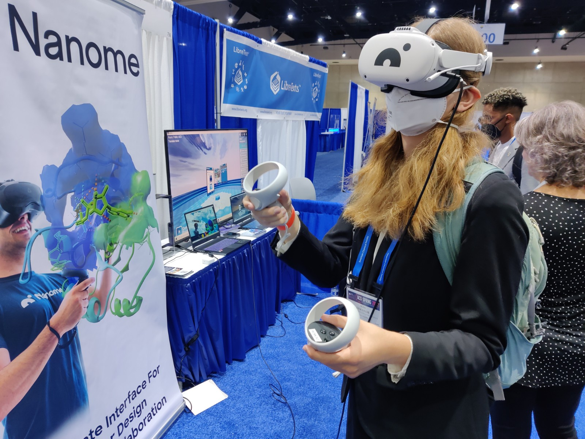
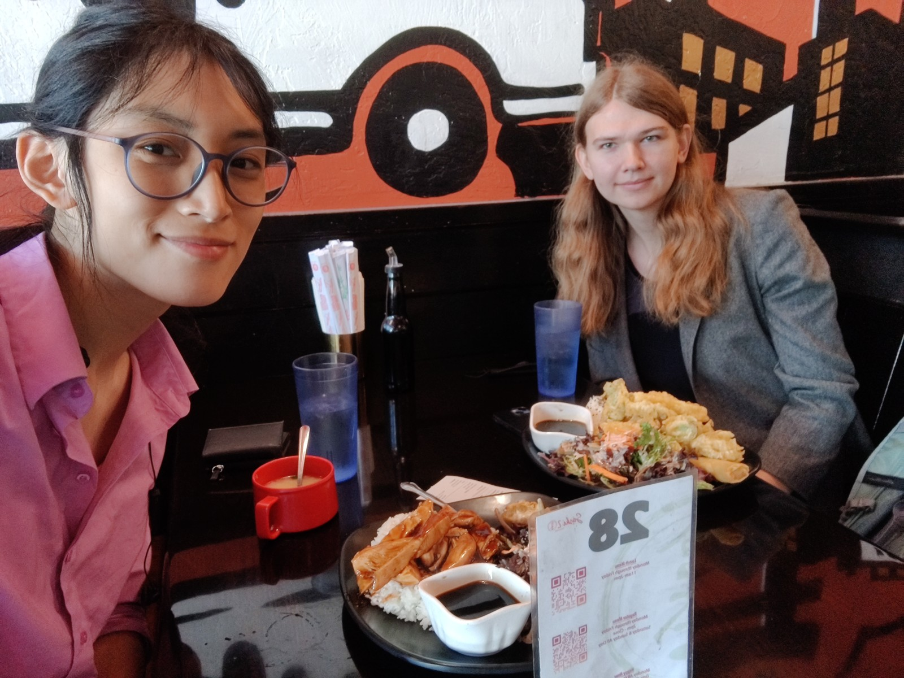

I guess I'm a travel blogger now.

## Context

So I met [this girl named Alia Lescoulie](https://alescoulie.github.io) at a queer Halloween party last fall and we kinda hit it off; we both used Linux, we both liked programming, and we both knew enough about urbanism to complain about [stroads](https://www.youtube.com/watch?v=ORzNZUeUHAM). Anyways, long story short, after getting past the useless lesbian phase, we started dating!

She was working on a research project called [MD-SAPT](/projects/mdsapt) and needed help setting up deployment-related stuff, like the CI/CD pipeline, documentation, package deployment, and other stuff. So, I joined [Dr. Ashley Ringer McDonald](https://armcdona.github.io/)'s computational chemistry lab and got those things done.

Since I contributed to those things and became a co-author on the poster, I went on a Cal Poly-funded vacation to San Diego to present MD-SAPT at the [American Chemical Society (ACS)](https://www.acs.org/) spring 2022 conference.

## Saturday

I woke up with a slightly sore throat on the day before the conference, likely due to allergies. I ate some spicy instant ramen, which made that sore throat worse. Oh well.

### The ride there

We left at 10AM from Cal Poly. On our trip from SLO to San Diego, Alia and I were arguing about how we would implement an organic chemistry problem solver, while I was getting her to crash-course me on the basic organic chemistry reactions.

Professor Bercovici was driving us. As we were in the middle of arguing, he asked, "how would I go about recruiting CS majors to my lab?" 

"Well, you could go to a queer halloween party, chat up a cute girl, and recruit her," said Alia.

"I legally cannot do that myself, and I'm pretty sure if I get my students to do it, that would count as pimping."

We stopped at a mall in Ventura for a lunch break. There were these old men giving out what were supposedly million-dollar bills. As expected, these were not legal tender, but an attempt at prosletyzing us. On the back, it said that if I had looked upon a woman in lust, then I was an adulterer that would go to hell.

There have been plenty of times where I woke up and thought my girlfriend was really cute, so I guess I'll be going to hell. I mean, I'm already going to hell for being gay, so I might as well make the most of it.

### Arriving in San Diego

In the evening, I went to [Sab Lai Thai Kitchen](https://www.sablaithaikitchen.com/) with Alia, and it had really delicious food with lots of vegan options. However, I chose a 7/10 spiciness despite my sore throat, which in retrospect was a bad idea. Oh well.

## Sunday

My sore throat worsened, so I spent most of the day shoving cough drops into my mouth.

### Symposia

I attended some presentations in computational chemistry (COMP) and chemical informatics (CINF). Most of the COMP ones went *way* over my head; they were mostly about using computers to solve chemistry problems, which I had basically zero context for. I did see some words such as "tensor core" and "PyTorch" and "Monte Carlo" and was like "yeah, I know what's happening!"

I did notice that when the presentation focused more on computational stuff, I understood it more. There was one that focused less on the chemistry, and more on optimizing an existing algorithm, and I actually knew what was going on. Otherwise, Alia had to explain to me, in a hushed voice, what free energy was and how it was calculated.

The CINF symposium I attended was super interesting and a lot more accessible for a CS person like me. There were presentations about how to represent molecules, based in graph theory, so that was super cool and actually quite relevant to our solver.

That afternoon, we went to the Undergrad COMP symposium, which Dr. McDonald presented at. At the end, there was a panel about computational chemistry in industry. Alia asked what kinds of roles there are to work in. It turns out that a lot of solutions aren't single-package end-to-end solutions; there's a lot of code needed to glue them all together, and people pay big bucks for that. That's great, because our project was literally just gluing MDAnalysis and Psi4 together.

### Evening

We wanted to try out the electric rental scooters (scattered around by Lyft and Lime) to get to a dinner place, but unfortunately, you need a driver's license to use those, and Alia didn't have one. We walked over instead. We ate at [Sushi 2](https://sushi2sd.com/), and just like the Thai place, it was also delicious and had a ton of vegan options. Like seriously, they had a whole section of the menu for vegan stuff, which I absolutely didn't expect for a *sushi* restaurant.

Sci-Mix was on Monday, so in order to make [our Jupyter notebook demo](https://mybinder.org/v2/gh/calpolyccg/MDSAPT_demo/master?labpath=MD-SAPT_demo.ipynb) look cooler, we picked out some more interesting interaction pairs to run on gfdesk (my rack server) overnight. We were fiddling with the 3D molecule views on our 2D screens and making comments about how cool it would be to have a VR viewer. 

## Monday

I didn't really attend any symposiums on Monday. Also, my sore throat got much worse, which was quite inconvenient because we were presenting at Sci-Mix that afternoon.

However, I did go to the Expo in Exhibit Hall A, where all the industry folks came down to advertise their super high-tech chemical hardware. This included the \$10,000 personal DNA printer, delta robot auto-pipetters, NMR machines, vaccum chambers...

One super cool company was [Nanome](https://nanome.ai/), which was a startup that made a VR molecule browser, which literally just so happened to be what we were talking about last night. We tried their software and it was very cool; they even let you view animated MD trajectories. Perhaps we can get Dr. McDonald to buy a Quest 2 for our new lab.

Another interesting thing we saw at the expo was Sigma Aldrich's recently-released graph theory-based organic synthesis solver, meaning our idea has been done before. However, we'd release whatever we make as an open source thing, so perhaps we can put theirs out of business eventually.

### Sci-Mix!

That evening, we ate leftover Thai food from Saturday and headed out to present our poster at Sci-Mix in Exhibit Hall C. It was a somewhat-intense 2 hours of standing around and getting asked questions by passerbys; we probably talked with 30 people that night.

<blockquote class="twitter-tweet">
Come check out our poster on sci mix <a href="https://twitter.com/hashtag/ACSSpring2022?src=hash&amp;ref_src=twsrc%5Etfw">#ACSSpring2022</a> <a href="https://twitter.com/hashtag/ACSCOMP?src=hash&amp;ref_src=twsrc%5Etfw">#ACSCOMP</a> <a href="https://t.co/hfLOq5Zb7N">pic.twitter.com/hfLOq5Zb7N</a>
&mdash; Alia Lescoulie🏳️‍🌈 (@AliaLescoulie) <a href="https://twitter.com/AliaLescoulie/status/1506101533179473924?ref_src=twsrc%5Etfw">March 22, 2022</a></blockquote> 

We presented close to a Sigma Aldrich table giving out free t-shirts or tote bags, so there was a huge wall of people in front of us. As soon as they ran out of free stuff, the line completely vaporized.

It was interesting to see all the different kinds of people there. There were academics from big-name universities, industry people, students, and more. Some of the academics were quite intense; they interrogated us on some weird stuff, and on how SAPT worked. On the other hand, most industry people were like "this is super cool!"

You could definitely tell who was more interested in the software and who was more interested in the chemistry. Unfortunately, there were more people interested in the chemistry, so I didn't get many chances to deliver my spiel about my amazing CI/CD pipeline that tests our 95% coverage test suite on Linux and MacOS and Python 3.7, 3.8, and 3.9.

Our poster had a QR code linking to our documentation website at [mdsapt.readthedocs.io](https://mdsapt.readthedocs.io/), but I also linked my QR tattoo to that link. It was admittedly a bit of a silly gimmick, but it did get a lot of people to scan my arm and see the poster.

## Tuesday

<blockquote class="twitter-tweet">
Finally got our photo with the sign, we’re basically software engineers except the software does chemistry <a href="https://twitter.com/hashtag/ACSCOMP?src=hash&amp;ref_src=twsrc%5Etfw">#ACSCOMP</a> <a href="https://twitter.com/hashtag/ACSsandiego?src=hash&amp;ref_src=twsrc%5Etfw">#ACSsandiego</a> <a href="https://t.co/cLrJRpkUzk">pic.twitter.com/cLrJRpkUzk</a>
&mdash; Alia Lescoulie🏳️‍🌈 (@AliaLescoulie) <a href="https://twitter.com/AliaLescoulie/status/1506405983219642371?ref_src=twsrc%5Etfw">March 22, 2022</a></blockquote> 

My throat was once again sore, but I had to soldier on because we were presenting our poster again at the COMP poster session.

Dr. McDonald's postdoc advisor, [Alexander Mackerell](https://twitter.com/alex_mackerell), won a major ACS award for computational drug design or something like that, so we planned to go to that symposium. Unfortunately, it was scheduled to end 1 hour before the poster session, so we planned ahead by eating lunch at Sushi 2 and bringing home some sushi to-go for dinner.

### Mackerell Symposium

At an award symposium, the winner usually invites their former postdocs and graduate students, so you get to see a lot of similar research. Alia had heard of some of their work, while I had absolutely none of the context and all of them went over my head. It was apparently on biophysical simulations using MD, so I got that part, but I completely didn't know what the heck Yoda-1 or a force field was.

Dr. McDonald gave her talk on our project, MD-SAPT, and her work with the [Molecular Sciences Software Institute (MolSSI)](https://molssi.org/). It was almost entirely accurate except for the part where she said that she didn't contribute a single line of code to our project. She actually did, it was just [updating a singular line of our README to include our NSF grant number](https://github.com/calpolyccg/MDSAPT/commit/ccf3682650ad5075b91515e9a3f84c64f0b336fc).

Interestingly, a lot of his postdocs went into industry, but went into competing biotech companies developing competing drugs. They're still friends with each other, but their presentations gave no information other than "here's a blurred image of the drug we made because I'm under NDA and the legal department told me to blur it and plus a lot of my competitors are in my room so I don't want to give them ideas either."

At the intermission, Dr. McDonald told us to leave and get ready for our poster session. This was an extremely good call; Dr. Mackerell presented last and went 30 minutes over his allotted time, and no one could really do anything about it because it's his symposium and he gets to do whatever he wants. He went over his entire career, *publication by publication*. At the end, he put up the lyrics of a cheesy parody he wrote of a Beatles song (instead of "Hey Jude," it was "Hey Drude" because he made a force field called Drude) and he made everyone stand up and sing it.

<blockquote class="twitter-tweet">
The fantastic <a href="https://twitter.com/alex_mackerell?ref_src=twsrc%5Etfw">@alex_mackerell</a>, leading the audience in a rendition of &quot;Hey Drude&quot; <a href="https://twitter.com/hashtag/ACSSpring2022?src=hash&amp;ref_src=twsrc%5Etfw">#ACSSpring2022</a> <a href="https://twitter.com/ACSCOMP?ref_src=twsrc%5Etfw">@ACSCOMP</a> <a href="https://t.co/fMXAWU2vFp">pic.twitter.com/fMXAWU2vFp</a>
&mdash; Adrian Roitberg (@adrian_roitberg) <a href="https://twitter.com/adrian_roitberg/status/1506447604929863688?ref_src=twsrc%5Etfw">March 23, 2022</a></blockquote> 

### Poster session

<blockquote class="twitter-tweet">
<a href="https://twitter.com/AliaLescoulie?ref_src=twsrc%5Etfw">@AliaLescoulie</a> and I are here for round 2! Come see us at the <a href="https://twitter.com/hashtag/ACSCOMP?src=hash&amp;ref_src=twsrc%5Etfw">#ACSCOMP</a> poster session!  (we totally didn&#39;t swap blazers between Sci-Mix and now) <a href="https://twitter.com/hashtag/ACSSpring2022?src=hash&amp;ref_src=twsrc%5Etfw">#ACSSpring2022</a> <a href="https://t.co/ak4KamkRuf">pic.twitter.com/ak4KamkRuf</a>
&mdash; Astrid Yu 💙 💛 🏳️‍🌈 (@astralbijection) <a href="https://twitter.com/astralbijection/status/1506456949491048450?ref_src=twsrc%5Etfw">March 23, 2022</a></blockquote>  

The COMP poster session was another 2 hours of presenting that went similarly to Sci-Mix. This time, there were less people passing by (maybe only 20) but 2 guys came over to judge us. A lot of people seemed impressed that we were undergrads; most of the posters seemed to be by graduates or postdocs. A guy on the admissions board for the Carnegie Mellon chemistry department was even there.

Surprisingly, we got to the second round of the judging, where it was narrowed down to seven posters. We didn't get the grand prize, which was a free Nvidia GPU, but we did get the sense of pride and accomplishment that came with presenting our poster at our first ACS.

## Wednesday

We left San Diego at 10AM. We had Taco Bell for lunch somewhere in car-dependent Orange County, and got back to SLO by 4:30.

Overall, it was a really fun trip and I learned a lot about chemistry. Even if I didn't understand most of it, it was fun to get all this exposure to different fields.

