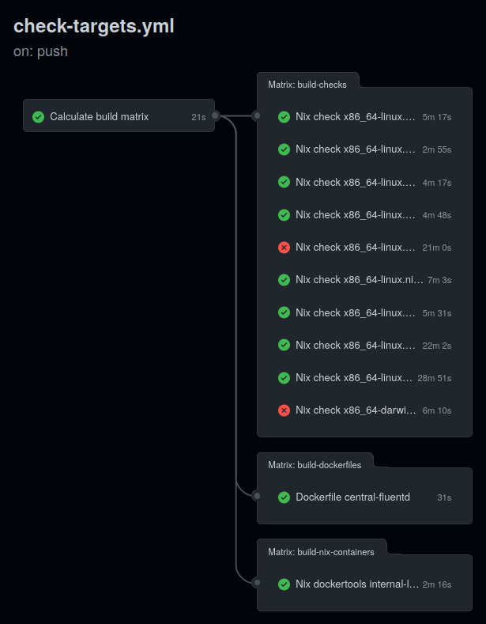
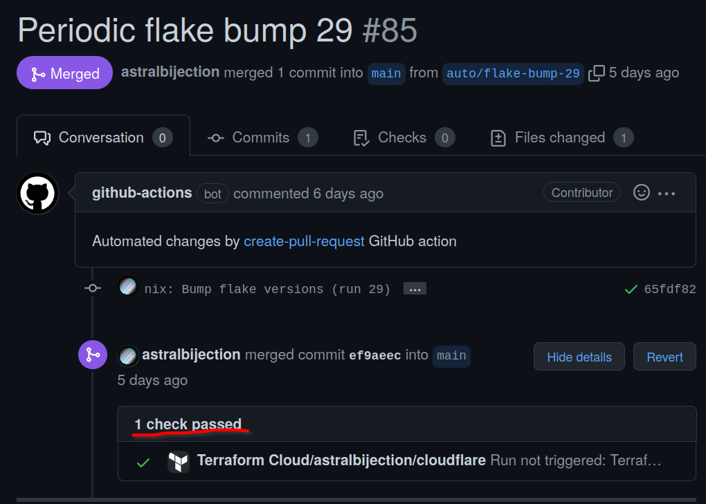
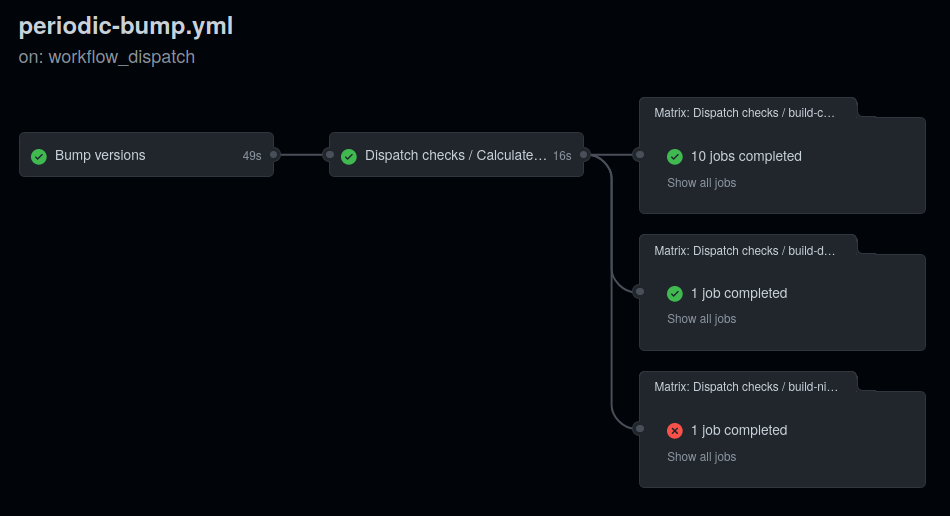
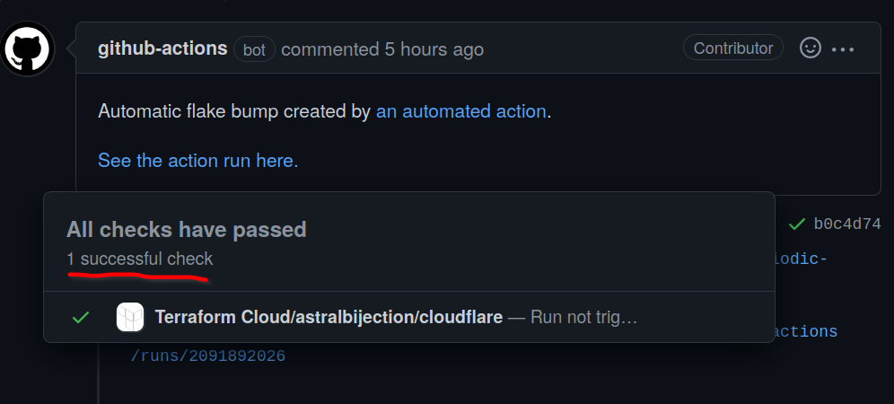
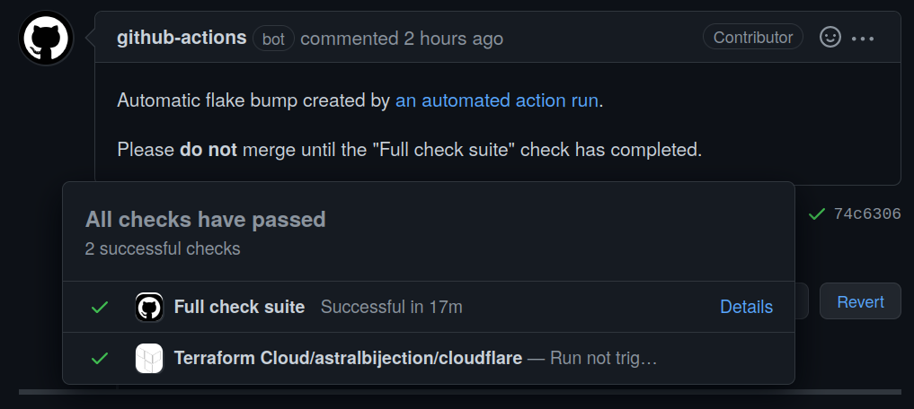
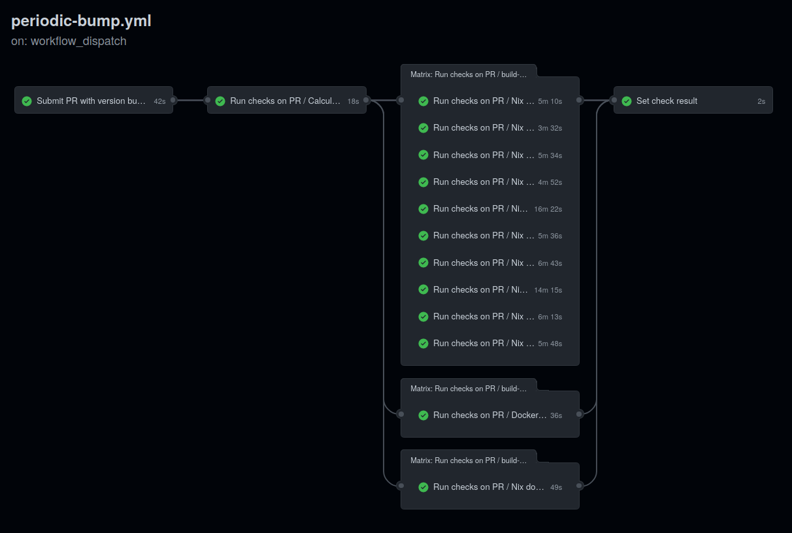

Github Actions is like the free cup of beer you get at chemistry conferences; it
sucks, but hey, it's free. That's why I use it to build the configs for
[my homelab](/projects/infrastructure).

I had some decent CI pipelines set up for it, but unfortunately they weren't very reliable. So I spent the weekend trying to improve it. Here is a summary of all
the horrible hacks I ended up using along the way.
[For reference, here is a permalink to my workflows directory at the time of writing.](https://github.com/ifd3f/infra/tree/ccc968dc1d8e494b64b6f2a3827d712f2a259812/.github/workflows)

## 1. Dynamic job matrices for dynamic amounts of fun


Here is a job spec from my
[original pipeline](https://github.com/ifd3f/infra/blob/70007f6d9b67f817dfa36249fdd53333ed5dd819/.github/workflows/nix-flake-check.yml):

```yaml
nixos-build:
  name: Build NixOS configurations
  runs-on: ubuntu-latest

  needs:
    - flake-check

  strategy:
    fail-fast: false
    matrix:
      target:
        - banana
        - donkey
        - gfdesk
        # TODO: - shai-hulud
        - thonkpad
        # TODO: - jonathan-js

  steps:
    - uses: actions/checkout@v2

    - uses: cachix/install-nix-action@v13
      with:
        nix_path: nixpkgs=channel:nixos-unstable
        extra_nix_config: |
          experimental-features = nix-command flakes
          access-tokens = github.com=${{ secrets.GITHUB_TOKEN }}
    - uses: cachix/cachix-action@v10
      with:
        name: astralbijection
        authToken: "${{ secrets.CACHIX_AUTH_TOKEN }}"

    - name: Install nixos-rebuild
      run: GC_DONT_GC=1 nix-env -i nixos-rebuild -f '<nixpkgs>'

    - name: Build NixOS expression
      run: GC_DONT_GC=1 nixos-rebuild build --flake ".#${{ matrix.target }}"
```

The `strategy.matrix` attribute lets me parameterize this job over multiple
different build targets.

However, did you know that the `matrix` attribute _doesn't even have to be
statically defined?_ For example, I can define a job like this:

```yaml
calculate-matrix:
  name: Calculate build matrix
  runs-on: ubuntu-latest
  outputs:
    # 1.
    matrix: ${{ steps.set-matrix.outputs.matrix }}
  steps:
    # 2.
    - name: Calculate build matrix
      run: <some code to generate an arbitrary matrix file at matrix.json>

    # 3.
    - name: Set matrix output
      id: set-matrix
      run: |
        jq . matrix.json
        matrix=$(cat matrix.json)
        echo "::set-output name=matrix::$matrix"
```

1. We declare an output called `outputs.matrix`, which will be a string.
2. This command generates some arbitrary JSON file. Doesn't matter what it is;
   it just does that.
3. Then, we use `jq` to pretty-print that JSON for debugging, and write its
   contents to `outputs.matrix`.

In my own pipeline, that JSON file looks something like this:

```json
{
  "checks": {
    "target": [
      {
        "name": "Nix check x86_64-linux.home-manager-astrid@Discovery",
        "os": "ubuntu-latest",
        "target": "checks.x86_64-linux.home-manager-astrid@Discovery"
      },
      {
        "name": "Nix check x86_64-linux.home-manager-astrid@aliaconda",
        "os": "ubuntu-latest",
        "target": "checks.x86_64-linux.home-manager-astrid@aliaconda"
      },
      ...
  },
  "nix-docker-images": {
    "target": [
      {
        "name": "Nix dockertools internal-lxd-simplestreams",
        "os": "ubuntu-latest",
        "target": "packages.x86_64-linux.internal-lxd-simplestreams"
      },
      ...
    ]
  },
  "dockerfiles": {
    "image": [
      "central-fluentd"
    ],
    ...
  }
}
```

Essentially, each top-level attribute corresponds to a different kind of job,
and their values are what I have in the `strategy.matrix` field.

I can then use those properties in dependent jobs like so:

```yaml
build-checks:
  name: ${{ matrix.target.name }}
  needs: calculate-matrix
  runs-on: "${{ matrix.target.os }}"
  strategy:
    fail-fast: false
    matrix: "${{ fromJson(needs.calculate-matrix.outputs.matrix).checks }}"
  steps:
    # -snip-

build-nix-containers:
  name: ${{ matrix.target.name }}
  needs: calculate-matrix
  runs-on: "${{ matrix.target.os }}"
  strategy:
    fail-fast: false
    matrix:
      ${{ fromJson(needs.calculate-matrix.outputs.matrix).nix-docker-images }}
  steps:
    # -snip-

build-dockerfiles:
  runs-on: ubuntu-latest
  name: Dockerfile ${{ matrix.image }}
  needs: calculate-matrix
  strategy:
    fail-fast: false
    matrix: "${{ fromJson(needs.calculate-matrix.outputs.matrix).dockerfiles }}"
  steps:
    # -snip-
```

Each individual target ends up running in parallel, and it's super cool and
good. Paired with Cachix, all of my NixOS configurations and packages can be
built at once. That makes my pipeline look like this.



### The actual matrix generation code

I generate the `matrix.json` using
[the Nix derivation shown here](https://github.com/ifd3f/infra/blob/ccc968dc1d8e494b64b6f2a3827d712f2a259812/pkgs/gh-ci-matrix/default.nix).
The reason why I chose to generate it in Nix rather than with some convoluted
CLI command involving `nix flake show --json` and `jq` is because it's obviously
a lot easier to test.

So, the command that I conveniently omitted above is

```bash
GC_DONT_GC=1 nix build -o matrix.json ${{ env.target_flake }}#gh-ci-matrix
```

## 2. Solving "out of space" errors... _by force_

Do you remember how
[last month, I complained about being unable to compile the Linux kernel on the GHA runners because it runs out of space](https://astrid.tech/2022/03/05/0/nixos-sp6/)?

I mean, maybe you don't, because you've never read any of my blogs before.
Whatever. The point is, that's what happens, and it sucks, and I needed to do
something about it.

```txt
building '/nix/store/1n7247i9d1ch2yvifs5wqmw6ma91izpz-none+i3-xsession.drv'...
building '/nix/store/0ssg789m7bbhxx2a10m8jl92nsnjaxk6-desktops.drv'...
building '/nix/store/lr7bp75v7n3jmj6l54mqlbw2mib5njml-etc-environment.drv'...
building '/nix/store/4faqbsnk8915sllgibqxj9caw9ha537d-set-environment.drv'...
building '/nix/store/gnf6pmf12fcg0qmndif1cjwf8h38x9qw-unit-display-manager.service.drv'...
building '/nix/store/g040b2wkc6wqpd0c8vhm1ws3lkfbm6ck-etc-profile.drv'...
building '/nix/store/m22wgvmlkmn2jjpg4s1r7kcq0znnlr0x-etc-zshenv.drv'...
building '/nix/store/xk7kr8gwgc2m106s7n8hk3aw873rlq8l-system-units.drv'...
building '/nix/store/z6h068y6psic0qkgq2zs0jvinj1hrwpg-xserver-wrapper.drv'...
building '/nix/store/xpyx38ij9srvyf59q69zpcm2a144dgrl-lightdm.conf.drv'...
error: writing to file: No space left on device
Error: Process completed with exit code 1.
```

I discovered
[this cool action that someone else made](https://github.com/easimon/maximize-build-space)
that, as it says on the tin, "Maximize(s) available disk space for build tasks".
Unfortunately, it not only does that, but it also makes this LVM partition that
gets mounted into the directory that people usually use for building, which is
like, `/home/runner/something`. This is bad, because Nix mostly uses `/nix` and
`/tmp`.

I peeked inside this guy's action, and saw this line here:

```bash
echo "Removing unwanted software... "
if [[ ${{ inputs.remove-dotnet }} == 'true' ]]; then
  sudo rm -rf /usr/share/dotnet
fi
if [[ ${{ inputs.remove-android }} == 'true' ]]; then
  sudo rm -rf /usr/local/lib/android
fi
if [[ ${{ inputs.remove-haskell }} == 'true' ]]; then
  sudo rm -rf /opt/ghc
fi
echo "... done"
```

So, I stole his code and put it inside my workflow (with credit, of course).

```yaml
- name: Remove unnecessary packages
  run: | # stolen from https://github.com/easimon/maximize-build-space
    echo "=== Before pruning ==="
    df -h
    sudo rm -rf /usr/share/dotnet
    sudo rm -rf /usr/local/lib/android
    sudo rm -rf /opt/ghc
    echo
    echo "=== After pruning ==="
    df -h
```

Here is some output:

```txt
=== Before pruning ===
Filesystem      Size  Used Avail Use% Mounted on
/dev/root        84G   52G   32G  63% /
-snip-

=== After pruning ===
Filesystem      Size  Used Avail Use% Mounted on
/dev/root        84G   35G   49G  42% /
-snip-
```

Pretty good - I liberated an extra 17G with that. Sadly, that job still ran out
of space while compiling Linux.

But wait a moment - I'm not using any of those preinstalled tools, I'm using
Nix! Instead, I could just[^1]

[^1]:
    The `|| true` is because I don't have permission to delete all files :( so I
    just make it succeed no matter what.

```bash
sudo rm -rf /usr/share /usr/local /opt || true
```

and

```txt
 === Before pruning ===
Filesystem      Size  Used Avail Use% Mounted on
/dev/root        84G   52G   32G  63% /
-snip-

=== After pruning ===
Filesystem      Size  Used Avail Use% Mounted on
/dev/root        84G   17G   67G  20% /
-snip-
```

and with this whopping **35G** of extra space, it works!


Don't worry, it doesn't always take 2 hours to build; once the Linux kernel is
stored in Cachix, it only takes 15 minutes.

## 3. Using `workflow_call` to fix some stupid quirks about Github Actions

I had a very simple automated version bump action that ran every Tuesday at
06:00 PST. It:

1. checks out the infra repo
2. runs `nix flake bump`
3. pushes the change
4. submits a PR

Here's an example of a PR it made:


Look at this cute little PR here with a cute green checkmark next to it. Isn't
it just begging to be merged in? The green checkmark means that my battery of
tests that I wrote above that went through successfully, and that it's safe to
deploy on my machines!



Nope! Just Terraform. None of my automated tests. That green checkmark was
_lying_ to you.

See, you'd _think_ that because this code was pushed to the repo, that the
`on.push` trigger would fire in the checking action, and it would, y'know,
_actually run the checks._ Turns out, Github doesn't fire events on when code is
pushed by an automated runner,
[and that's something they do on purpose to prevent you from accidentally creating an infinite loop](https://github.community/t/triggering-a-new-workflow-from-another-workflow/16250).

The workaround was to convert my pipeline into a reusable workflow by specifying
`on.workflow_call`.

```yaml
name: Build and check all targets

on:
  schedule:
    - cron: "0 6 * * 6"
  push: {}
  workflow_dispatch: {}
  workflow_call:
    inputs:
      sha:
        required: true
        type: string
```

However, now there's some ambiguity in what sha to use - sometimes I'll run it
on a just-pushed sha, other times I'll run it on a different sha, when it's
being invoked separately. As such, I had to replace every reference to
`$GITHUB_SHA` with these `env` attributes.

```yaml
env:
  target_sha: ${{ inputs.sha || github.sha }}
  target_flake: github:astralbijection/infra/${{ inputs.sha || github.sha }}
```

Github Actions uses truthiness, so `${{ inputs.sha || github.sha }}` essentially
means "use `inputs.sha` if it exists, but if it doesn't exist, use
`github.sha`". Janky, but hey, it works.

Finally, I actually invoked the "build everything" workflow from the "version
bump" workflow by adding this job:

```yaml
trigger-checks:
  name: "Dispatch checks"
  needs: version-bump
  uses: astralbijection/infra/.github/workflows/check-targets.yml@main
  with:
    sha: ${{ needs.version-bump.outputs.sha }}
```

[Here is the flake bump workflow after all these changes.](https://github.com/ifd3f/infra/blob/01ac0240072e3e40515f0b2882aa6ffc273ebbe2/.github/workflows/periodic-bump.yml)



## 4. Using the Checks API to display things that frankly _should_ be there but aren't

You'd think that after _all this trouble_, with building on the specific sha and
all, the checkmark on the PR would finally be correct, yes?


Well turns out, although the build is *running* now, it's still not *showing up* in the PR.



Thankfully, I can manually add the check to that sha with another action:

```yaml
version-bump:
  name: Submit PR with version bumps
  runs-on: ubuntu-latest
  outputs:
    sha: ${{ steps.create-pr.pull-request-head-sha }}
    check_id: ${{ steps.create-check.outputs.check_id }}

  steps:
    ...
    - name: Annotate SHA with check
      id: create-check
      uses: LouisBrunner/checks-action@v1.1.1
      if: always()
      with:
        name: Full check suite
        token: ${{ secrets.GITHUB_TOKEN }}
        sha: ${{ steps.create-pr.outputs.pull-request-head-sha }}
        details_url: ${{ env.action_url }}
        status: in_progress
```

and after all my checks have run successfully, mark that check as a success or
fail:

```yaml
run-checks:
  name: Run checks on PR
  needs: version-bump
  uses: astralbijection/infra/.github/workflows/check-targets.yml@main
  with:
    sha: ${{ needs.version-bump.outputs.sha }}

set-check-result:
  name: Set check result
  needs:
    - version-bump
    - run-checks
  if: ${{ always() }}
  runs-on: ubuntu-latest
  steps:
    - name: Update check status
      uses: LouisBrunner/checks-action@v1.1.1
      with:
        check_id: ${{ needs.version-bump.outputs.check_id }}
        token: ${{ secrets.GITHUB_TOKEN }}
        details_url: ${{ env.action_url }}
        conclusion: ${{ needs.run-checks.result }}
```

With this, the check shows up on my workflow:



## Conclusion

Whew! That was a lot of stuff and it was the result of 3.5 days of continuous
hacking. Github Actions honestly really sucks, but it's not like there's
anything better I can use.

I suppose on the bright side, my CI pipeline looks extremely complicated and
intimidating now, which is always a good thing.



