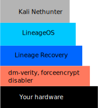

---
title:
  How I became a l33t h4x0r by installing Kali Nethunter on LineageOS on a Pixel
  3
date: 2022-04-25 16:21:52-07:00
ordinal: 0
tags:
  - android
  - kali-linux
  - cybersecurity
  - incompetency
---

Do you want to hack your neighbors and disable their Wi-Fi because they're
blasting too much loud music? Don't, because this is highly illegal and you'll
get into trouble. As my Network Security professor says, "please don't get
arrested."

But if you want to _theoretically_ have the _capability_ to do it _from your
phone_, you might want to install Kali Nethunter on it. This guide is the fruit
of a few hours of labor trying to get it installed on my girlfriend's
no-longer-needed Pixel 3.

## Amazingly detailed illustration of the system

Your system may or may not look something like this at the end.

## Caveat emptor

These instructions will completely wipe your phone's data.

Additionally, I have no fucking clue what I'm doing. I've never done anything
related to Android ROMs before. If you brick your phone then it's your fault,
not mine. Go Google how to fix it.

## Assumptions about you

- You know how to use ADB
- You know how to activate Android developer mode
- You actually know what you need Kali for and you're not just installing it to
  look cool. Only I get to install it just to look cool.

## What you should do

### Download these things first

- Android SDK. That should be installed on your computer.
- [The appropriate TWRP image for your device](https://twrp.me/Devices/)
- [DM-Verity, ForceEncrypt, Disk Quota Disabler](https://zackptg5.com/android.php#disverfe).
  The forum link is
  [here](https://forum.xda-developers.com/t/deprecated-universal-dm-verity-forceencrypt-disk-quota-disabler-11-2-2020.3817389/),
  and although it says deprecated it did still work, even on Android 12. Ensure
  the filename has the substrings `dm-verity` and `forceencrypt`, because that's
  how it knows what to do.
- [The latest Magisk release](https://github.com/topjohnwu/Magisk/releases).
  Make a copy of the APK with a `.zip` file extension instead.
- [Magisk Magic ToolFlash](https://github.com/Magisk-Modules-Alt-Repo/magic-flash/releases).
  Make a copy of the APK with a `.zip` file extension instead.
- [The latest LineageOS release for your device](https://download.lineageos.org/)
- And, of course, [Kali Nethunter](https://www.kali.org/get-kali/#kali-mobile).
  Pick the correct version for your phone, or the generic ones if there is none.

#### Recommended downloads

- [F-droid](https://f-droid.org/) so you can install other apps

### Steps

1. On your phone, enable developer tools and USB debugging, and your unlock your
   bootloader in developer tools.
2. Reboot your phone into fastboot mode with `adb reboot fastboot`
3. From your computer, boot your phone into TWRP with
   `fastboot boot <your-twrp.img>`
4. In TWRP, wipe your phone's data cache.
5. From your computer, push some ROMs with
   `adb push <your-dm-verity-forceencrypt.zip> <your-lineageos.zip> /sdcard`.
   Then, use TWRP to install those ROMs in that order. There may be a warning
   about TWRP being overwritten. You can ignore that.
6. From your computer, push `<your-magisk.zip>` to `/sdcard`. Then, use TWRP to
   install it.[^1]
7. Reboot your phone and go through the LineageOS setup. Note that internet,
   etc. can be skipped if you want.
8. From your computer, push `<your-magic-flash.zip>` to your phone. Install it
   in Magisk's modules, and reboot.
9. From your computer, push `<your-nethunter.zip>` to your phone. Install it in
   Magisk's modules, and reboot.

[^1]:
    This step comes after installing LineageOS because installing LineageOS will
    wipe your entire system.

And you're done!

Optionally, to install F-Droid, you can run `adb install <your-fdroid.apk>`.

## Summary of how I figured it out

It was with much _pain_ and these steps only barely go into detail about my
_pain_.

- I think what I did first was unlock the bootloader.
- Then, I installed Magisk, patched some `system.img` I downloaded somewhere,
  and flashed that. It worked, thankfully enough.
- I believe I then tried to install magic-flash, then I did `adb shell`, `su`,
  and `flash <nethunter>` but that caused me to bootloop.
- I started over again, I believe with TWRP. I tried installing the TWRP
  RAMDisk, I believe, which broke. I had to flash the original system on it
  again.
- Installing Nethunter via TWRP failed, but the system wasn't affected when I
  did that.
- I tried installing the dm-verity-forceencrypt thing. Unfortunately for me, I
  installed it on _top_ of the stock ROM, rather than _below_, which caused Kali
  to bootloop the system again.
- The next day, I thought "lmao what if I put it on top of Lineage" and I did
  basically these steps and it worked. ¯\\\_(ツ)\_/¯
