Strap in kids, this post is about me physically hacking apart Amazon's
[Blink Mini](https://www.amazon.com/Blink-Mini-White/dp/B07X6C9RMF) to get
access to its firmware! No firmware was harmed or modified in the making of this
post... yet.

Big thanks to [Ada](https://twitter.com/lacecard) and
[Erin](https://twitter.com/e_er1n) for helping me figure this stuff out!

## Background

I attended the [2022 Cybertruck Challenge](https://www.cybertruckchallenge.org/)
a couple of weeks ago, in which I learned about hacking, then proceeded to hack
trucks and truck accessories. It was super fun, and I made lots of cool friends.
Unfortunately, 70% of the things that I did are covered under NDA, so I can't
talk about the ▇▇▇▇▇▇▇▇▇▇▇▇▇▇▇▇▇▇▇▇▇▇▇▇▇▇▇▇▇▇▇▇▇ that I
▇▇▇▇▇▇▇▇▇▇▇▇▇▇▇▇▇▇▇▇▇▇▇▇▇▇▇▇▇▇▇▇▇▇▇▇▇▇▇▇▇▇ using
▇▇▇▇▇▇▇▇▇▇▇▇▇▇▇▇▇▇▇▇▇▇▇▇▇▇▇▇▇▇▇▇▇▇▇▇▇▇▇▇▇▇▇▇▇▇▇▇▇▇▇▇▇ by
▇▇▇▇▇▇▇▇▇▇▇▇▇▇▇▇▇▇▇▇▇▇▇▇▇▇▇▇▇▇▇▇▇▇▇▇▇▇▇▇▇▇▇▇▇▇▇▇▇▇▇▇▇▇ and
▇▇▇▇▇▇▇▇▇▇▇▇▇▇▇▇▇▇▇▇▇▇▇▇ with the help of ▇▇▇▇▇▇▇▇▇▇▇▇▇▇▇▇▇▇▇▇▇▇▇▇▇▇▇. After
three years though, the NDA will expire, so stay tuned for June 26, 2025, when
you can read all about it, assuming I'm still blogging around then!


Anyways, with what I gleaned from the 20 hours of instruction and 20 hours of
hacking, I decided that I should apply what I learned to a real device! These
\$20 Blink Mini cameras that I bought a few months ago seemed like perfect
victims to fuck around with!


## About the Blink cameras

These cameras are cute little things that have a surprising number of
capabilities:

- A video camera that can see visible and infrared light
- Motion detection
- An infrared floodlight
- Microphone
- Speaker
- Wi-Fi connectivity with Wi-Fi Direct capability

Unfortunately, you need to use the Blink app to do _anything_ with this camera.
It's free, but it's only a phone app (thye don't have a web app) and if you want
to record videos, you need to subscribe to their
[Blink Premium](https://support.blinkforhome.com/en_US/subscriptions/purchasing-a-blink-subscription-plan-through-amazon)
service, which costs \$30/year for one device and a whopping \$100/year for more
devices! It's also probably why the hardware is so cheap -- they made it a
[loss leader](https://www.investopedia.com/terms/l/lossleader.asp) for that
service.

## Hypotheses before breaking into it

- There is a ROM on this device that I can dump.
- This device runs an embedded Linux system.
- Because the device supports over-the-air firmware updates, I should be able to
  write my own firwmare to the ROM.

## Teardown!

I have 3 of these guys, and they're relatively cheap anyways, so I didn't mind
having one sacrificial lamb. I basically just started savagely pulling it apart
and cutting things up and hoping that I could reach the PCB.

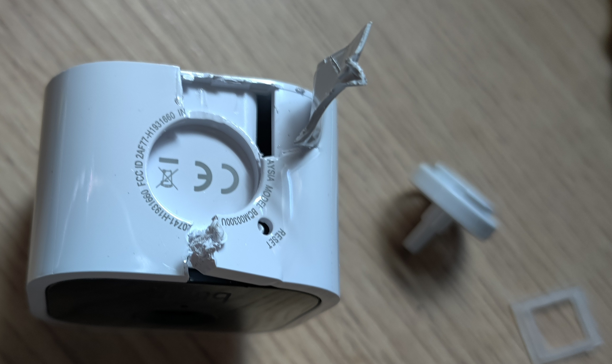

But then I realized that maybe, this isn't the correct way of opening it up.
Perhaps, someone else has done a teardown of it. In fact, I found this YouTube
video where someone did just that.

https://youtu.be/U5VEM2ZKYfI?t=342

Wow, that was so much easier than I thought it was!

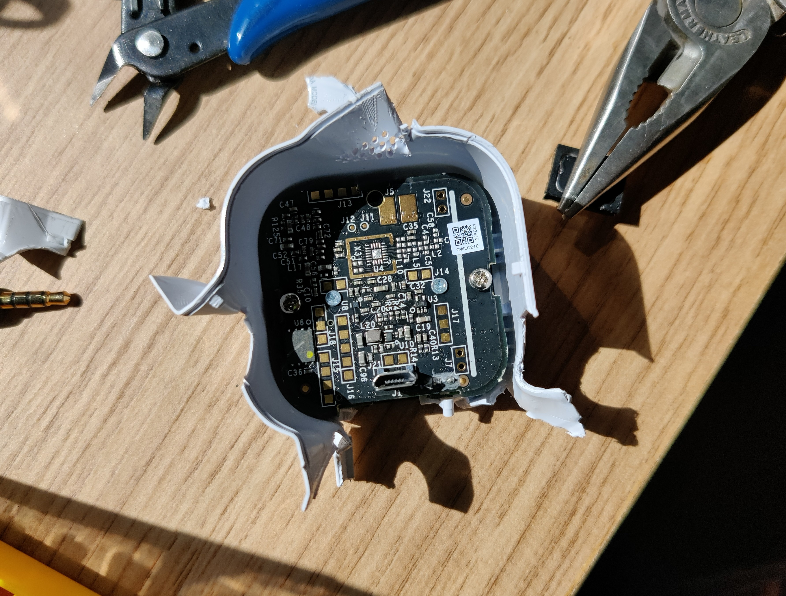

## Staring at the circuit board

There are actually two PCBs here, with a 26-pin header for talking between the two boards. One is the wifi/antenna board, and the other seems to have everything else.

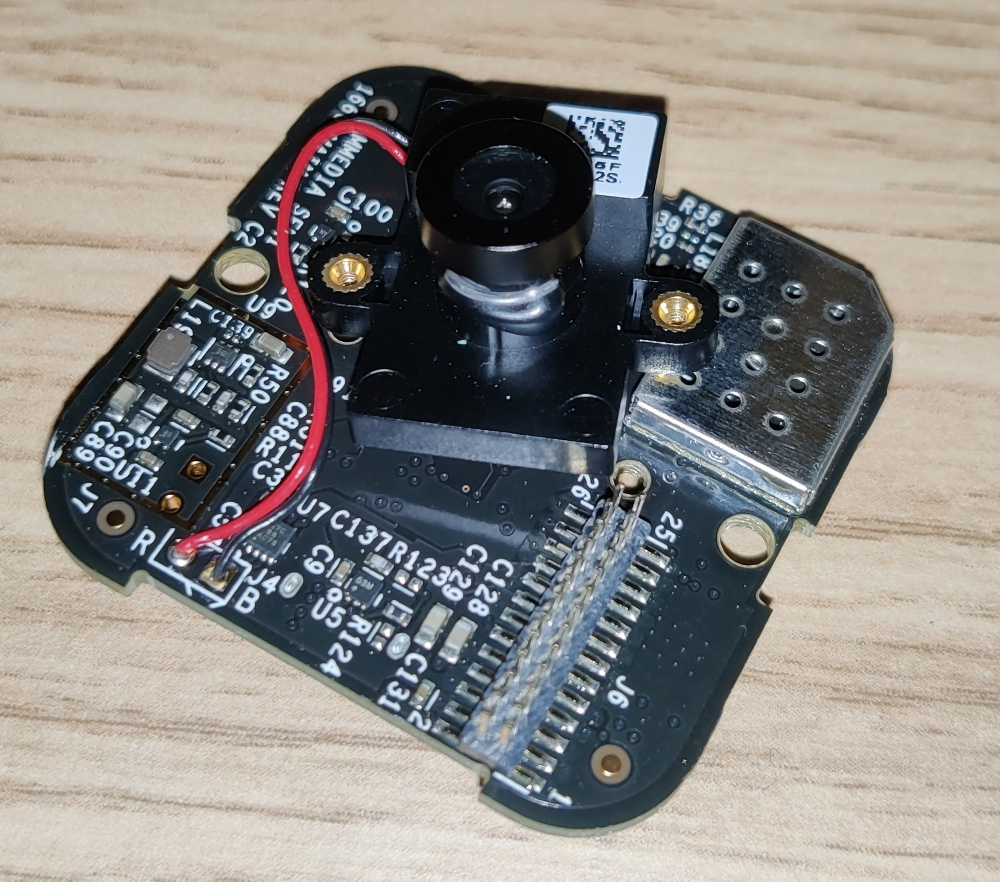

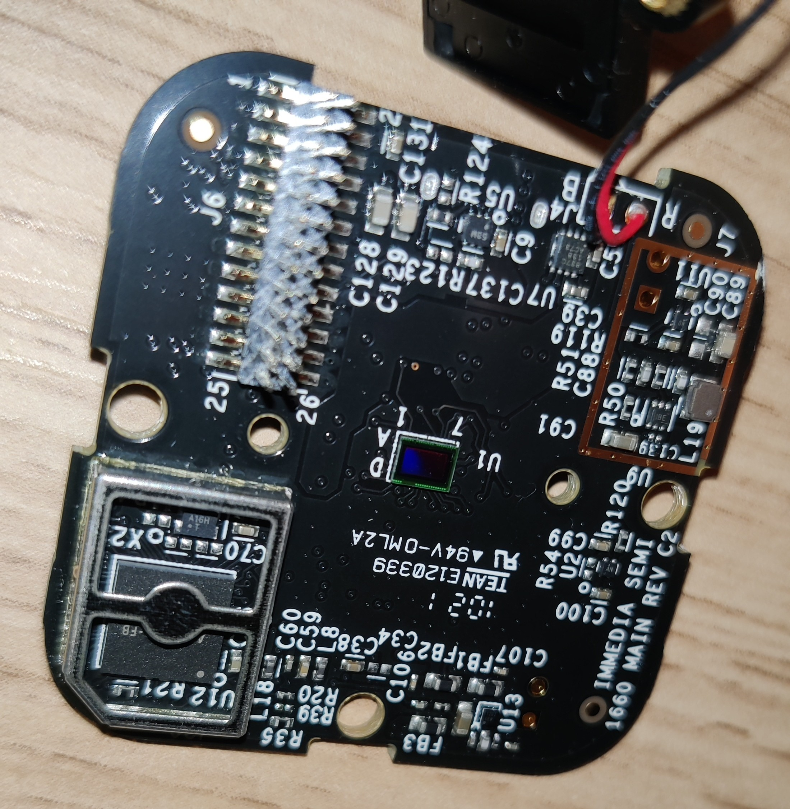

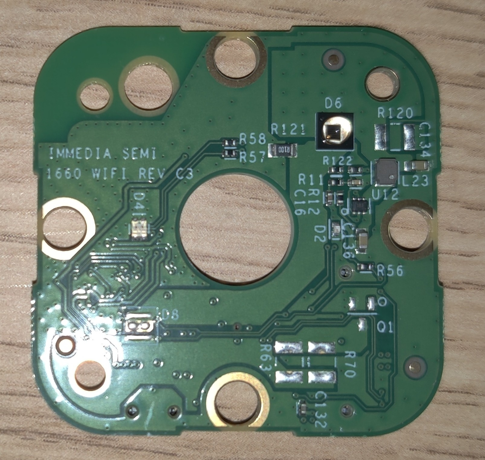

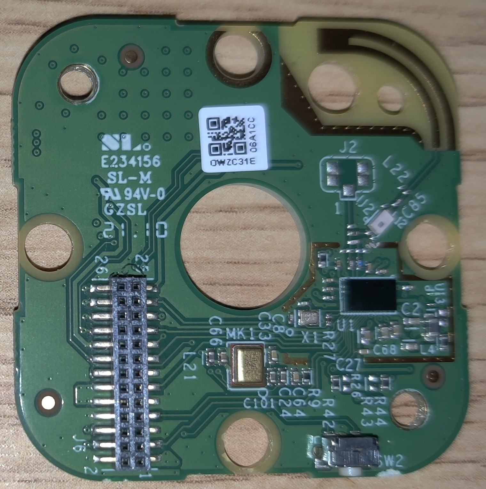

I looked around the two boards for some ICs with markings. Here are some
interesting things I found.

### Immedia Semi(conductor)

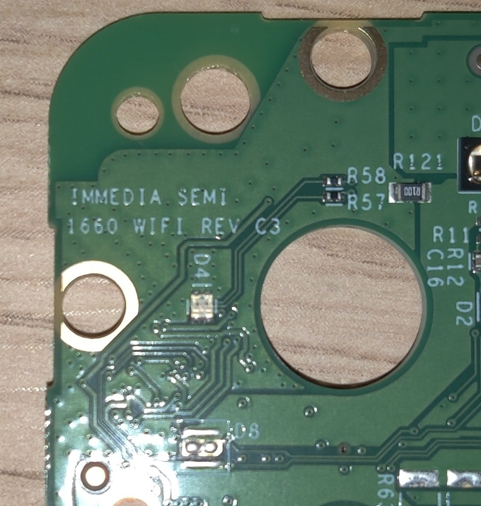

[Their LinkedIn](https://www.linkedin.com/company/immedia-semiconductor/) says
that they are "a leading provider of video and image processing chips for
connected camera applications." Hey, that's what I have!

There's
[another article](https://www.securityinformed.com/companies/immedia-semiconductor-llc-blink.html)
that associates them with Blink.

Finally, I found
[this Reuters article](https://www.reuters.com/article/us-amazon-com-m-a-chips/exclusive-amazon-paid-90-million-for-camera-makers-chip-technology-sources-idUSKBN1FW0BI)
that says that Amazon bought Blink and Immedia for \$90 million. Vertical
integration, of course.

### AC1002B2... microcontroller? microprocessor?

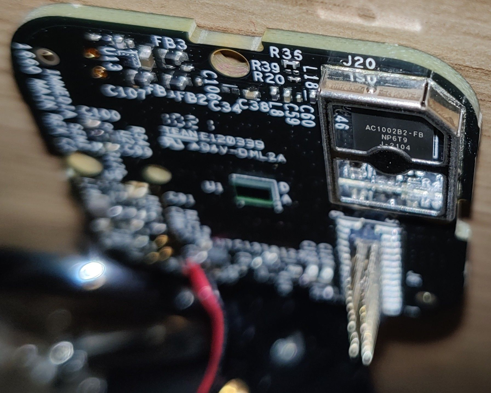

Underneath this shield is this interesting little BGA chip. The markings say:

```text
AC1002B2-FB
NP6T9
J-2104
```

Searching for AC1002B2-FB, I found a bunch of weird international sites with
[ordering pages](https://www.ariat-tech.com/parts/Broadcom%20Corporation./AC1002B2-FB)
for the chip. They imply that Broadcom makes these?

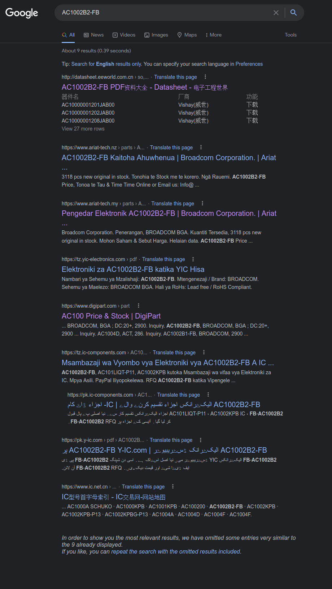

Dropping a few letters off the end, though, I found a couple of results for
**AC1002B**, but they are mostly just
[reviews for a different Blink camera](https://techaeris.com/2019/10/10/blink-xt2-review-an-outstanding-small-outdoor-security-camera-system/).
On the bright side, this confirms that this unit is indeed the CPU.

From that review, they say that the AC1002B is Immedia Proprietary, and has 4
cores and 200MHz, which means it packs some serious power for what it is!

Searching for NP6T9 gives, uh...


And searching for J-2104 yields nothing either.


#### The quest for AC1002B2-FB

Google is not giving me _any_ results for this stupid chip besides marketing
materials and Blink-related advertising. The closest I got to a datasheet is
[this CPU](http://www.ascendchip.com/English/SoC/AC1002/), but it seems to be
QFN rather than BGA, plus the performance specs are all completely wrong. I'll
just email those sketchy sites to see if they'll give me anything.

### W25Q32JW NOR Flash

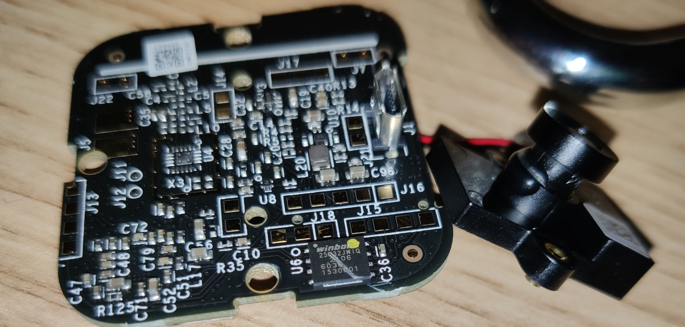

This is the juiciest part that I found. The markings say:

```text
winbond
25Q32JWIQ
2105
1530001
```

The chip says WinBond 25Q32JWIQ. Looking it up, I found
[this Winbond datasheet for W25Q32JW](https://www.mouser.com/datasheet/2/949/w25q32jw_spi_revf_09042018-1489621.pdf)
flash ROMs, with a table that says that 25Q32JWIQ is the WSON-8 package version
of it.

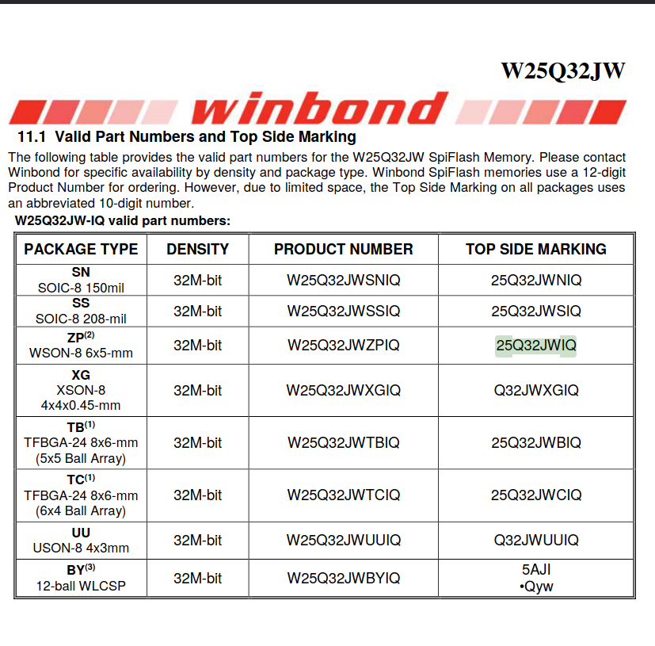

There seem to be traces leading from the ROM to the CPU, which further supports
my hypothesis that this ROM contains the firmware that we want.

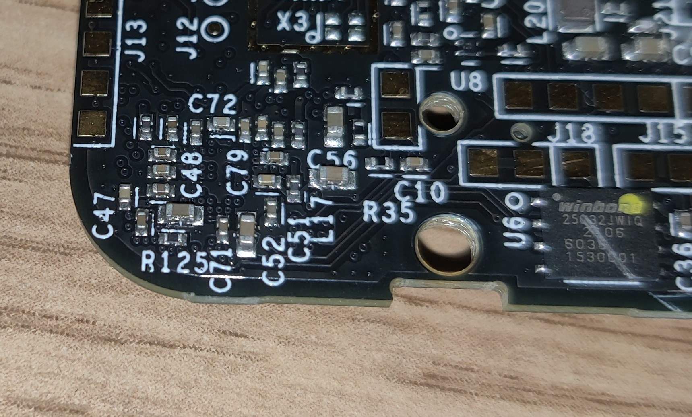

The W25Q32JW datasheet says that it is a 1.8V 4MiB SPI NOR-flash chip.
Unfortunately, it also says that it is possible for you to make some blocks of
memory permanently read-only. If we can get a dump from this fucker, we will
find out! And that's the hard part, because I don't know shit about that!

## The Flash Chip Rabbit Hole

Please note that I have no idea what I'm doing after this point.

My first thought was to desolder it, then stare at the datasheet and interact
with it using an Arduino. However, it seems that every SPI flash chip has has
the same pinout, and their instruction sets share similar commands for basic
things, like reading and writing.[^1] Also, Ada suggested that the NOR flash
would probably tolerate being dumped in-circuit with a test clip.

[^1]:
    I figured this out by googling a random other flash chip and seeing that
    they're extremely similar to each other.

    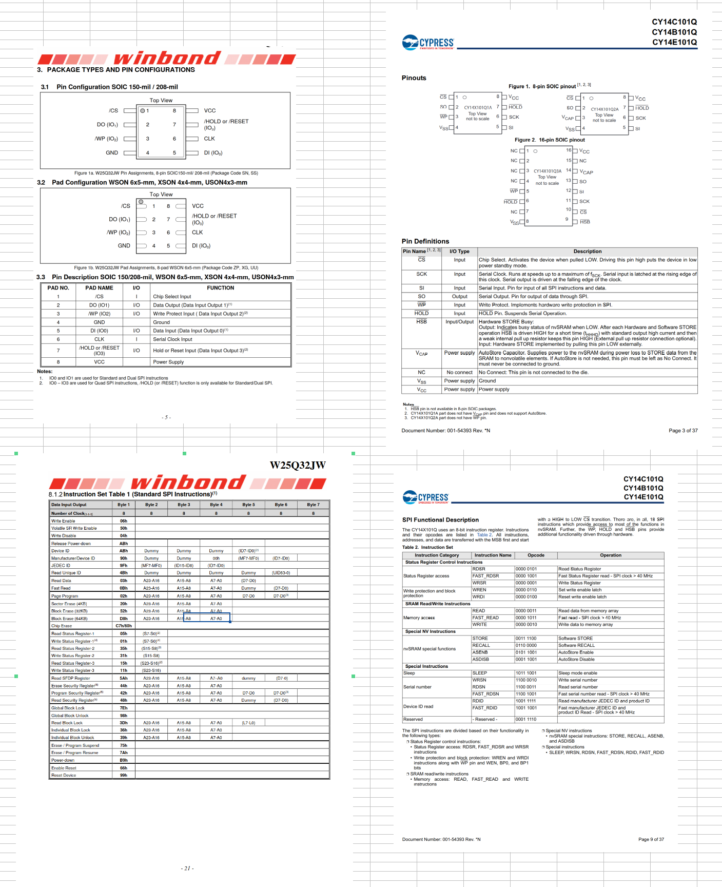

Thankfully, there's a million cheap SOIC-8 kits on Amazon that come with
everything I'd need: SOIC-8 clip[^2], USB programmer, and a bunch of other
adapters. Unfortunately, the USB dongle thing was like, 3.3V and 5V only? But I
looked around a bit harder and found some kits with 1.8V adapters.
[This Indian guy on YouTube](https://www.youtube.com/watch?v=-bE2mpoB5mQ)
explained how everything fits together, and how that weird slot-machine-looking
adapter worked, making me a bit more confident that I was buying the right tool.

[^2]:
    And because I'm extra paranoid, just to confirm that this clip works with
    WSON-8, I found [this video](https://www.youtube.com/watch?v=jbJCxQUr2FQ)
    from some guy in Tembisa, South Africa demonstrating that it works!

    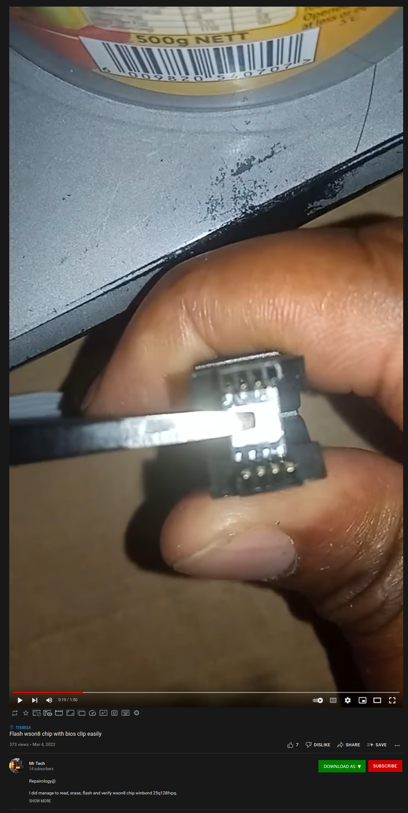

## Hypotheses now, as I wait for the programmer to arrive

- The AC1002B2-FB has no on-chip flash, and all the firmware is on the ROM.
- We will be able to dump the ROM in-circuit and no desoldering is necessary.
- It might _not_ be Linux, because it's 4MiB and that's really small. But at the
  same time, I have seen OpenWRT firmwares that are ~800kiB, so it's not out of
  the realm of possibility.
- Not _all_ of the ROM is write-locked, because otherwise, you can't do OTA
  updates. However, parts of the ROM _may_ be locked. Specifically, I worry that
  the entrypoint code is locked, and that it performs digital firmware signature
  validation.
- The chipset is a fairly standard one, so decompiling the machine code it is
  not impossible. They didn't just make a whole new exotic proprietary
  instruction set just for this chip.

I'm probably overthinking. I should just be patient and wait for the flash dump.
