This is a continuation from [the post where I disassembled the lil guy](https://astrid.tech/2022/07/07/0/blink-mini-disassembly/).

Last time, I couldn't do anything about this chip because I was waiting for my SPI flash programmer kit to arrive.

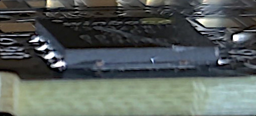

On Saturday, though, it arrived!

## Trying to use the programmer kit on Saturday

The programmer kit came with a bunch of parts for a bunch of different scenarios. Of course, it included the SOIC-8 clip that I wanted.

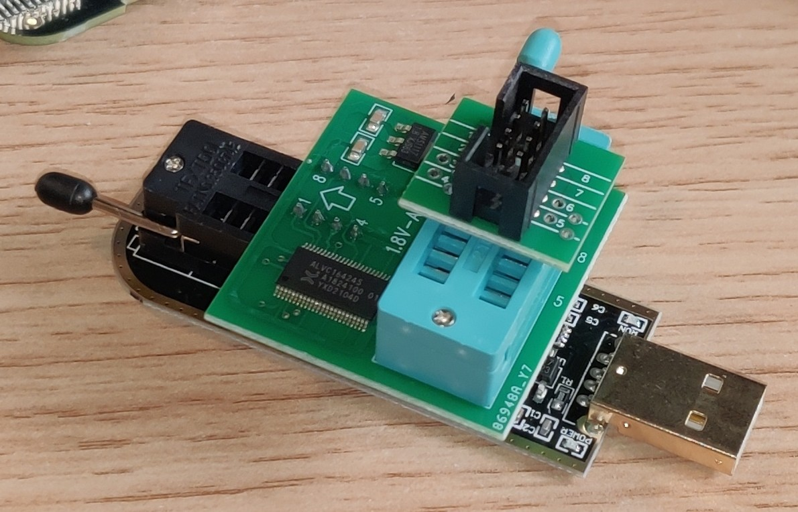

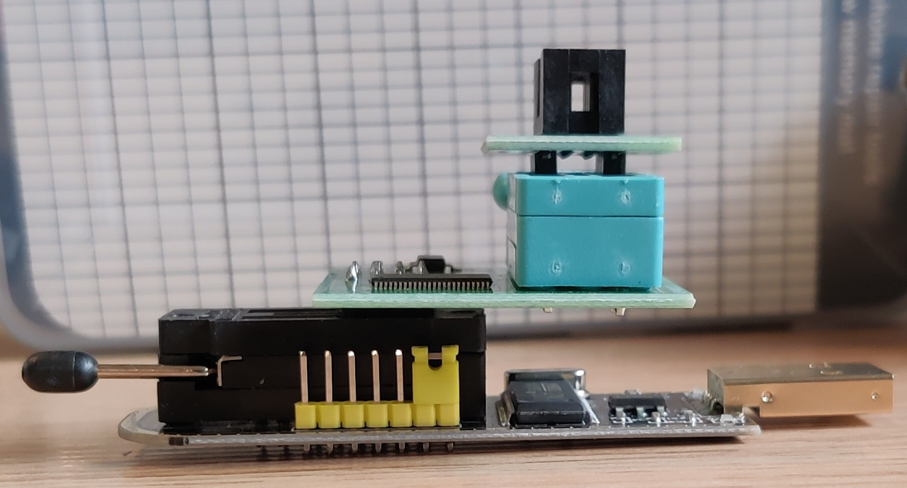

From bottom to top, these are the components shown here, assembled together:

1. The SPI programmer, a USB dongle with a ZIF connector on it.
2. A 1.8V adapter, because the programmer is 5V/3.3V, but the flash is 1.8V according to the datasheet.
3. The adapter for the SOIC clip.

### Clipping onto the ROM, peacefully

I put the SOIC clip in the slot at the top, and tried sticking it on the chip. Sadly though, running `flashrom` to dump the firmware, I got

```text
# flashrom --programmer ch341a_spi -r flash.bin
flashrom v1.2 on Linux 5.15.49 (x86_64)
flashrom is free software, get the source code at https://flashrom.org

Using clock_gettime for delay loops (clk_id: 1, resolution: 1ns).
No EEPROM/flash device found.
Note: flashrom can never write if the flash chip isn't found automatically.
```

Turns out, the clip leads were *way* too far away from the flash leads, as you can see with the circled parts of this image.

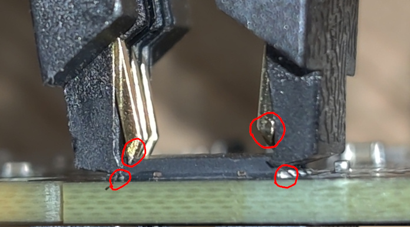

This was unfortunate, but it made sense; this ROM is in a WSON-8 package rather than a SOIC-8 package, which the clip was designed for. You can see from the image that there's even little plastic guards that are there to protect or space out the leads.

### Clipping onto the ROM, with great violence

As such, I decided to make some "special modifications" to the clip using a wire cutter.

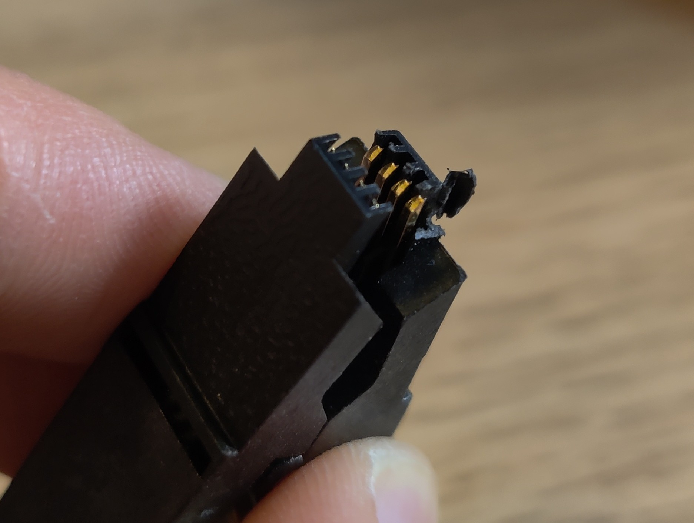

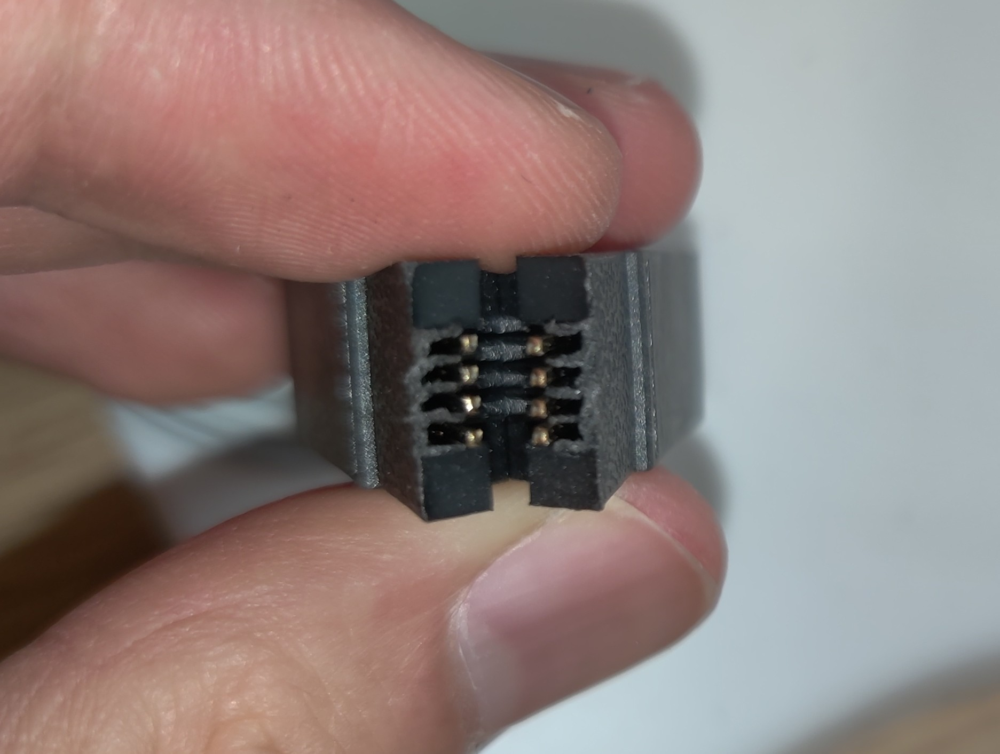

This still wasn't enough!

```text
# flashrom --programmer ch341a_spi -r flash.bin
flashrom v1.2 on Linux 5.15.49 (x86_64)
flashrom is free software, get the source code at https://flashrom.org

Using clock_gettime for delay loops (clk_id: 1, resolution: 1ns).
No EEPROM/flash device found.
Note: flashrom can never write if the flash chip isn't found automatically.
```

My solution? I trimmed even more off! Additionally, the spring was too strong, so I experimented with putting a pen spring inside.

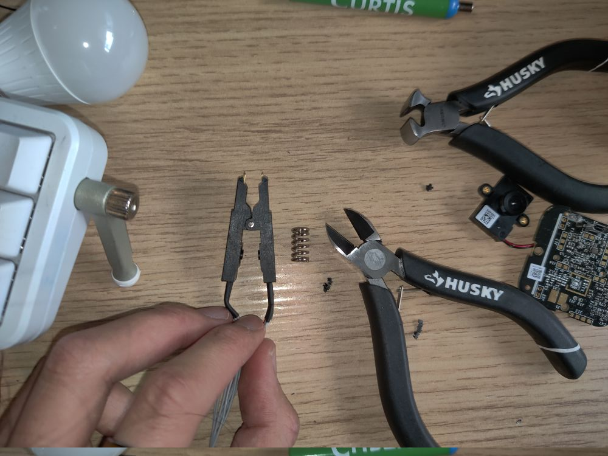

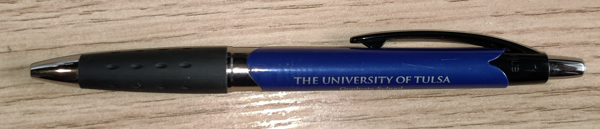

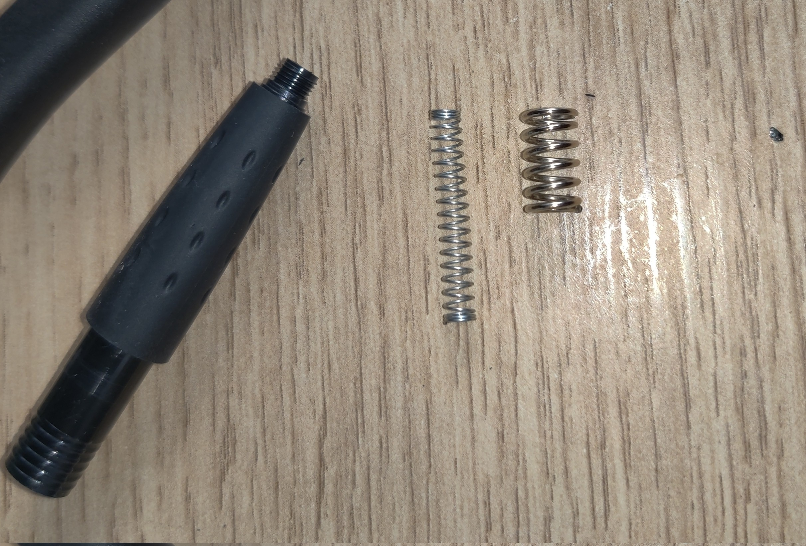

Unfortunately, that pen spring was way too long, but on the bright side, having the spring be partially placed in provided just enough force for it to stay there.

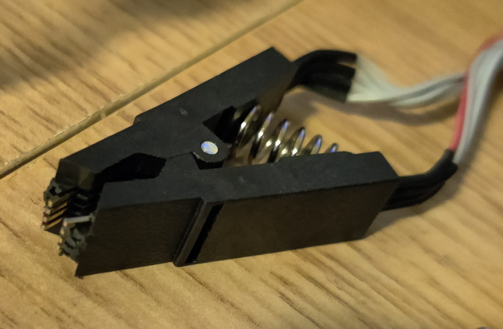

Still, even with these modifications, nothing worked, I just couldn't maintain continuity for long enough to allow the programmer dongle to find the chip, probably because my janky solution was just too janky.

### Ordering *yet another* clip 😔

I couldn't figure out anything else I could do that Saturday night. There are proper probes for programming WSON-8, essentially based on pogo pins. Unfortunately, they were expensive and [only available on AliExpress](https://www.aliexpress.com/item/3256804113101513.html), and I didn't want to wait a month for it to arrive. I still put in an order for them though, because I was optimistic that I'd be able to reverse engineer it and reprogram my other Blink cameras with my own firmware.

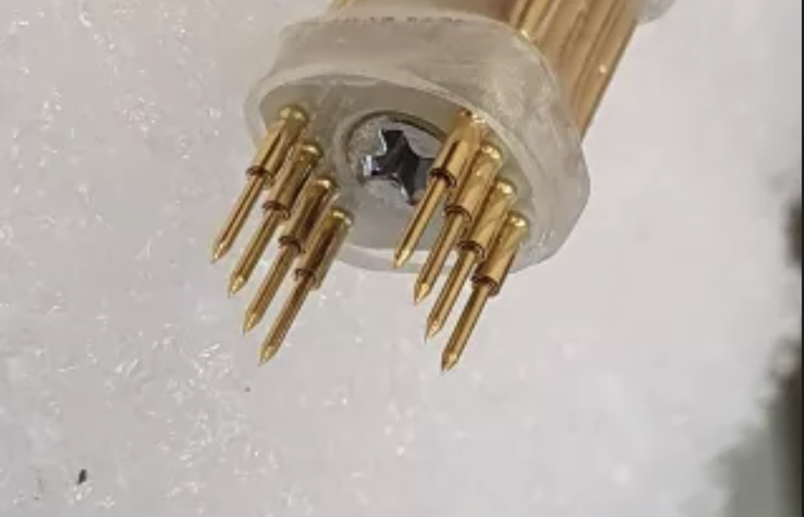

I wanted to avoid it, but this stupid SMD part has forced my hand; I'd have to go to the EE lab and desolder it.

## Sunday Soldering Fun

I was extremely excited to desolder that ROM. However, on the Lord's day, you're supposed to rest. Fortunately, I'm not religious at all, so I actually got up early to get dressed, eat breakfast, and bike over to campus. (I never do this!)

The EE department, however, seemed to disagree with my disagreement; the doors to the EE building and student project lab were locked, because it was a Sunday, and in the middle of the summer. Thankfully, I had a passcode to the [ham radio](https://www.w6bhz.org/) clubroom, which did have a reflow station that I could borrow.

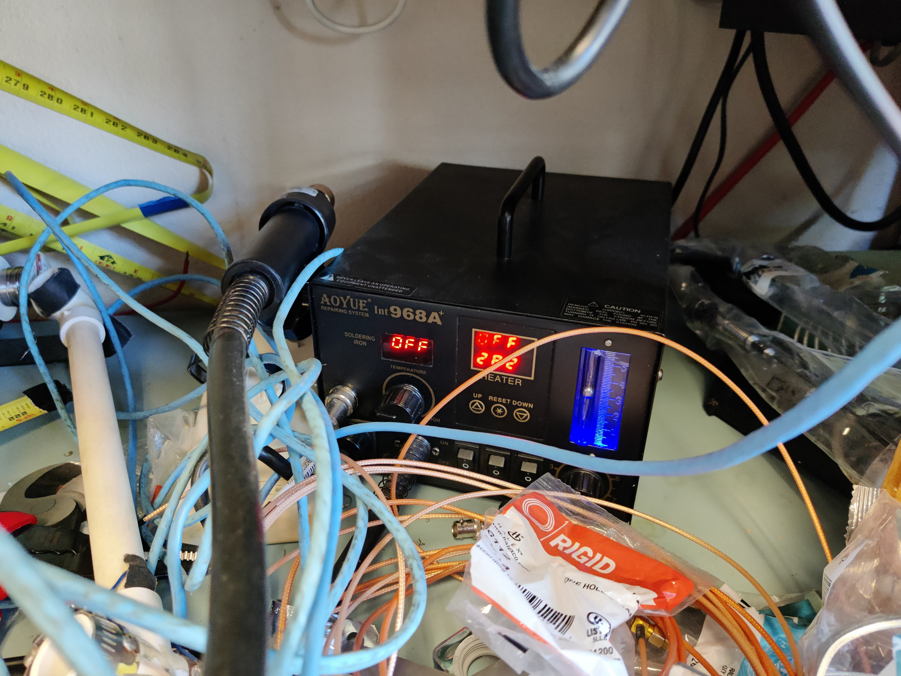

Pulling the chip off was trivially easy with the hot air gun and tweezers.

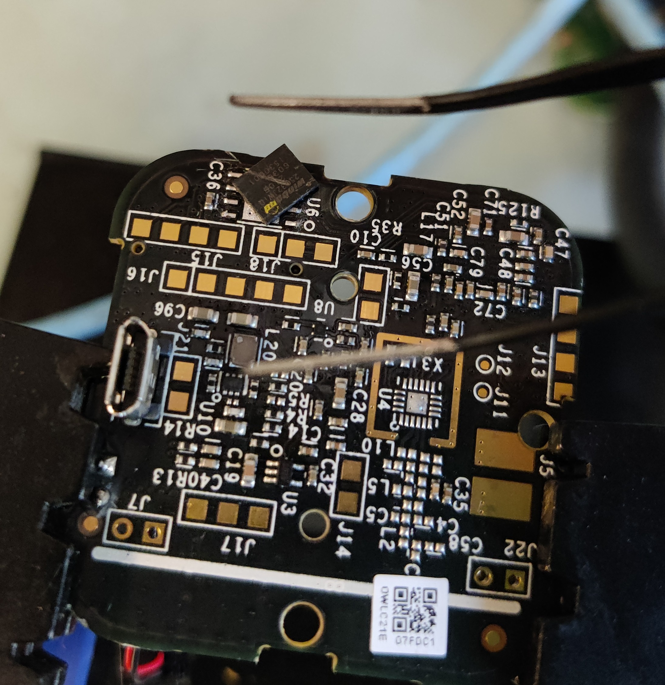

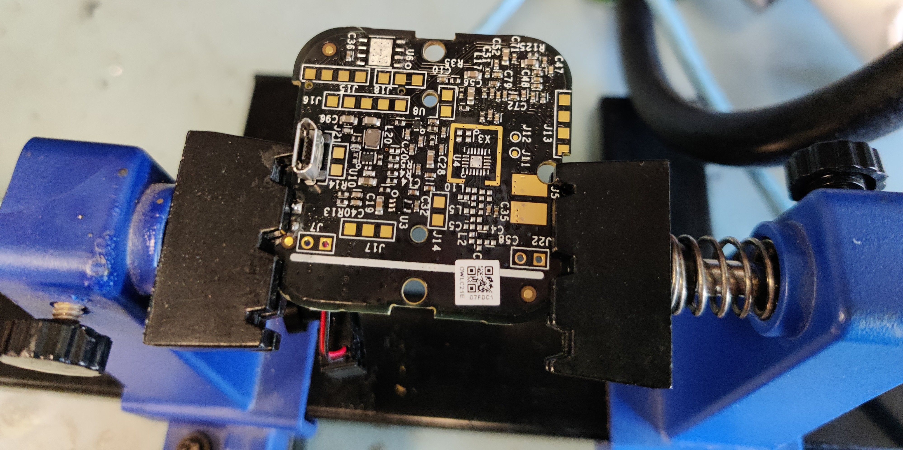

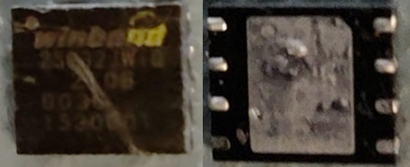

The programmer kit was very nice, and it came with this little breakout-board/adapter jig that I could solder my SMD part onto so that it would fit in the ZIF connector.

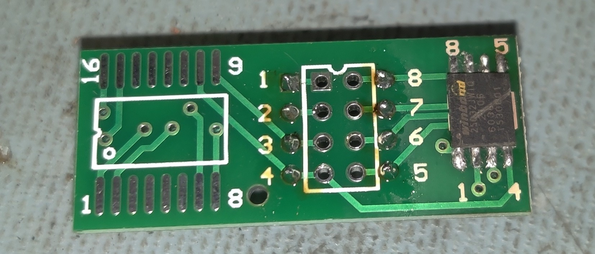

Well, the headers were a bit slanted, but that's okay, it didn't matter, it fit into the ZIF anyways.

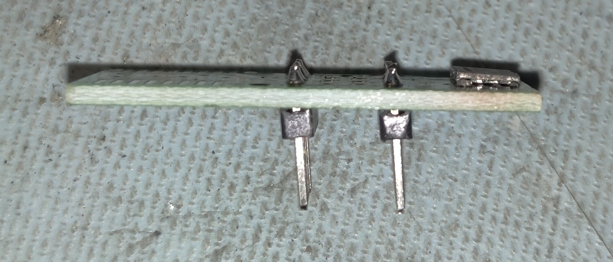

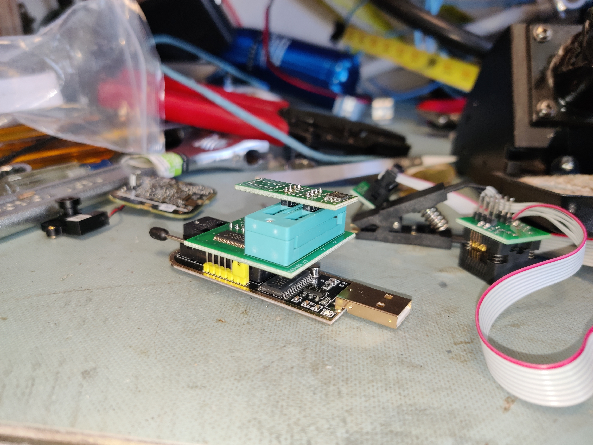

I plugged it into my computer, and...

```text
# flashrom --programmer ch341a_spi -r flash.bin
flashrom v1.2 on Linux 5.15.49 (x86_64)
flashrom is free software, get the source code at https://flashrom.org

Using clock_gettime for delay loops (clk_id: 1, resolution: 1ns).
No EEPROM/flash device found.
Note: flashrom can never write if the flash chip isn't found automatically.
```

Uh oh. I tried again.

```text
# flashrom --programmer ch341a_spi -r flash.bin
flashrom v1.2 on Linux 5.15.49 (x86_64)
flashrom is free software, get the source code at https://flashrom.org

Using clock_gettime for delay loops (clk_id: 1, resolution: 1ns).
No EEPROM/flash device found.
Note: flashrom can never write if the flash chip isn't found automatically.
```

### Panic!

It was at this point that I started panicking a little, trying to think what could have gone wrong.

**Hypothesis 1 -- I electrically fried it.** I do remember, when I was finagling with the SOIC-8 clip earlier, that I tried flipping the clip around. And, as you can see from this pinout, the VCC and GND pins are rotationally opposite from each other. In other words, I may have accidentally put it under the wrong polarity.

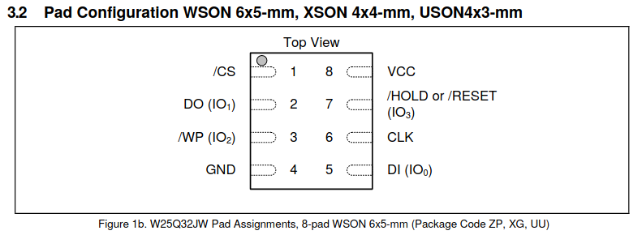

**Hypothesis 2 -- I thermally fried it.** The datasheet stated that the chip's lead/package temperature is "compliant with JEDEC Standard J-STD-20C for small body Sn-Pb or Pb-free (Green) assembly and the European directive on restrictions on hazardous substances (RoHS) 2002/95/EU." [^1] This means that it is rated for a maximum package temperature that is somewhere between 240C and 260C, and probably unflashed, too. I had subjected it to 360C, because I usually solder at 325-375F, and my brain forgot that units were a thing.

[^1]: [W25Q32JW datasheet](https://www.mouser.com/datasheet/2/949/w25q32jw_spi_revf_09042018-1489621.pdf) section 9.1 (page 57, PDF page 58)

At this point, I was a bit sad, but I did have more ~~potential victims~~ subjects that I could dump the ROM off of. I thought I should solder it back onto the board and power it, just for *final* final confirmation that it was broken.

But then, Erin suggested that I should probably double check that my IC had continuity with each pad. At this point, I had already taken it off and was tinning the original Blink board, but then I was suddenly like "hold up, what if it was just a shitty connection that was causing it?"


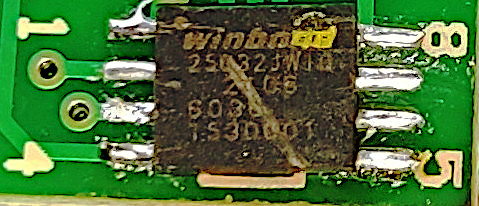

Thus, on Sunday, June 10, 2022, at 11:07 AM PST, once I had reflowed the solder joints and put my ROM chip back on, I had learned the value of disconnecting and reconnecting things.


```text
# flashrom --programmer ch341a_spi -r flash.bin
flashrom v1.2 on Linux 5.15.49 (x86_64)
flashrom is free software, get the source code at https://flashrom.org

Using clock_gettime for delay loops (clk_id: 1, resolution: 1ns).
Found Winbond flash chip "W25Q32.W" (4096 kB, SPI) on ch341a_spi.
Reading flash... done.

# ls -lh flash.bin
-rw-r--r-- 1 root root 4.0M Jul 12 17:21 flash.bin
```

I ran it over with `strings` and `binwalk`, and there was a lot of good output, too! This was the real deal!

```text
$ strings flash.bin # output truncated for brevity
usbssphy_sleep3=0x%x
leddc=0x%04x
mcs32po=0x%x
rssisav2g=%d
opo=%d
itt2ga1=0x%x
rxpo5g=%d
extpagain5g=0x%x
Blink1
admin@immediasemi.com0
u033
UWl1P-rXREldiicyWs61P0g
2866E200CBEA8F7D34FA6C288F236ABD91A601AF77BC170D662C3BC8873F0596WAP: Wireless Access Point
WAP: Wireless Access Point
Blink thread
../../src/blink/blink.c
G8V190001173FW7G
OWZC31E06A1CC
OWLC21E07FDC1

$ binwalk flash.bin
DECIMAL       HEXADECIMAL     DESCRIPTION
--------------------------------------------------------------------------------
325424        0x4F730         Base64 standard index table
325868        0x4F8EC         SHA256 hash constants, big endian
332080        0x51130         AES S-Box
332336        0x51230         AES Inverse S-Box
332604        0x5133C         DES SP1, big endian
332860        0x5143C         DES SP2, big endian
368048        0x59DB0         SHA256 hash constants, big endian
387744        0x5EAA0         Copyright string: "Copyright (c) 1996-2018 Express Logic Inc. * NetX Duo ARC600/MetaWare Version G5.11.5.0 SN: Amaxon_Eval_10-18-18 *"
797085        0xC299D         Certificate in DER format (x509 v3), header length: 4, sequence length: 101
888232        0xD8DA8         Certificate in DER format (x509 v3), header length: 4, sequence length: 1033
889272        0xD91B8         Certificate in DER format (x509 v3), header length: 4, sequence length: 1033
890312        0xD95C8         Certificate in DER format (x509 v3), header length: 4, sequence length: 1033
891352        0xD99D8         Certificate in DER format (x509 v3), header length: 4, sequence length: 1033
892392        0xD9DE8         Certificate in DER format (x509 v3), header length: 4, sequence length: 1033
893432        0xDA1F8         Certificate in DER format (x509 v3), header length: 4, sequence length: 1033
894472        0xDA608         Certificate in DER format (x509 v3), header length: 4, sequence length: 1033
895512        0xDAA18         Certificate in DER format (x509 v3), header length: 4, sequence length: 1033
896552        0xDAE28         Certificate in DER format (x509 v3), header length: 4, sequence length: 1033
897592        0xDB238         Certificate in DER format (x509 v3), header length: 4, sequence length: 1033
1203868       0x125E9C        Base64 standard index table
1204312       0x126058        SHA256 hash constants, big endian
1209308       0x1273DC        AES S-Box
1209564       0x1274DC        AES Inverse S-Box
1209832       0x1275E8        DES SP1, big endian
1210088       0x1276E8        DES SP2, big endian
1212316       0x127F9C        SHA256 hash constants, big endian
1231620       0x12CB04        Copyright string: "Copyright (c) 1996-2018 Express Logic Inc. * NetX Duo ARC600/MetaWare Version G5.11.5.0 SN: Amaxon_Eval_10-18-18 *"
1671037       0x197F7D        Certificate in DER format (x509 v3), header length: 4, sequence length: 101
1762184       0x1AE388        Certificate in DER format (x509 v3), header length: 4, sequence length: 1033
1763224       0x1AE798        Certificate in DER format (x509 v3), header length: 4, sequence length: 1033
1764264       0x1AEBA8        Certificate in DER format (x509 v3), header length: 4, sequence length: 1033
1765304       0x1AEFB8        Certificate in DER format (x509 v3), header length: 4, sequence length: 1033
1766344       0x1AF3C8        Certificate in DER format (x509 v3), header length: 4, sequence length: 1033
1767384       0x1AF7D8        Certificate in DER format (x509 v3), header length: 4, sequence length: 1033
1768424       0x1AFBE8        Certificate in DER format (x509 v3), header length: 4, sequence length: 1033
1769464       0x1AFFF8        Certificate in DER format (x509 v3), header length: 4, sequence length: 1033
1770504       0x1B0408        Certificate in DER format (x509 v3), header length: 4, sequence length: 1033
1771544       0x1B0818        Certificate in DER format (x509 v3), header length: 4, sequence length: 1033
```

I was so happy that stopped by at the grocery store and bought some chips and salsa to celebrate my glorious victory. My roommates have eaten most of it by now.

## Beginning to analyze our binary!

Here's what the first 2MiB of the binary looks like in [binvis](http://binvis.io/):


I haven't had much time to analyze this binary, but here's a few things I've found so far from poking around with Python scripts and Ghidra:

- There are lots of empty/erased sectors on this flash; in fact, is true size seems to only be `0x1f0070`, or nearly 2MiB. The rest of the sectors are filled with the byte `0xFF`.
- Little-endian ARMv8 seems to have the best results with decompiling the image. I've found a function located at `0x7d664` that is almost definitely `memcpy(3)`, and is referenced by a ton of other functions nearby (thanks, relative jumps!)
- The WAP name is located at `0x1e02aa`
- It seems to have 2 slightly different copies of the firmware stored on board, implying they use a sort of A/B booting scheme so that they can fall back to a working copy in case of issues.
- There's some extremely rich logging here, even including source code paths (such as `../../src/asic/video_enc/h264_fw/enc_command.c`)

Sadly, there is a lot of strange memory mapping going on, so I have no idea where the text and data is *supposed* to go, and I don't even know what functions are writing these logs!

I'll likely go into detail on how I figured these out in a next post. There are so many possible next steps in terms of reverse engineering it, and it makes me extremely excited! Unfortunately, there is also so much schoolwork for me to do in the next two weeks, so I probably won't make any progress until I finally complete these last GE classes and get my full CS degree.

## TL;DR of this post

I did it, I dumped it, I'm super smart, I'm super cool, I have a 2MiB firmware image and it's ARM but I don't know what most of it means yet.

