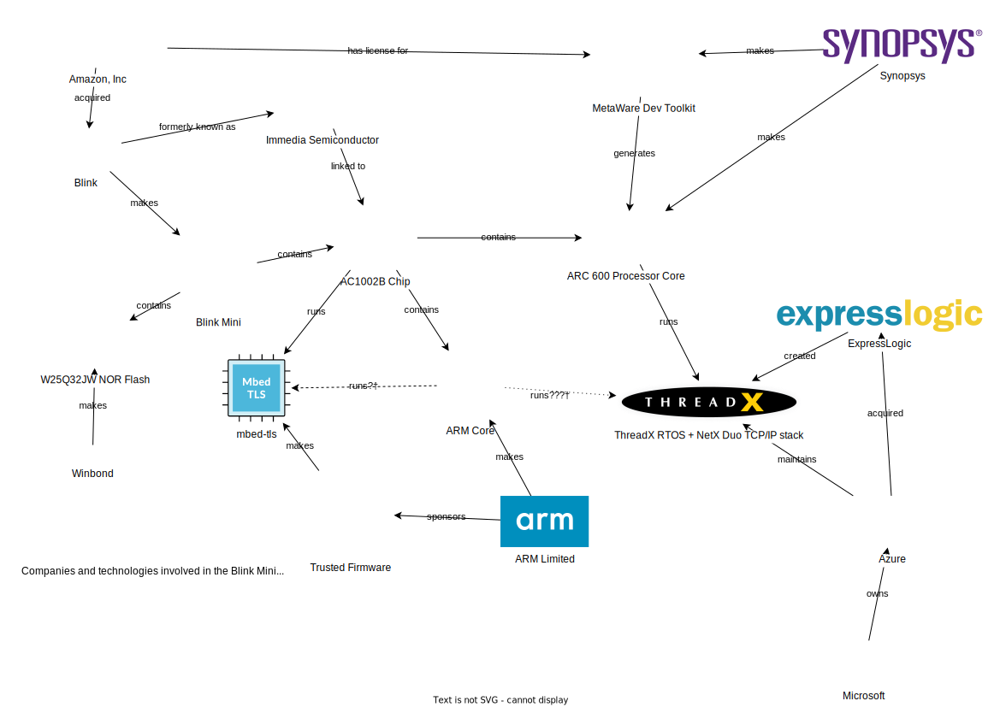

This is a continuation of
[the last post, where I desoldered and dumped the ROM](https://astrid.tech/2022/07/13/0/blink-mini-dumping/).
In this post, I will discuss some of my initial findings from the firmware. I'll
write about more juicy findings in the next post because this one is getting
quite long, and the next one deserves a Jupyter notebook.

Last time, I got a 2MiB ROM! I discussed a few findings from the firmware, but
nothing about how I found them. That was because I was way too busy with
classes. Taking 12 units of classes in 5 weeks sucked, and I cried several
times, but it's fine! I passed all the classes, I'm basically graduated, and I
can just spend my summer having less responsibilities!

## Just stick it into Ghidra 4head

It was Sunday 7/10, the evening after I dumped the firmware.

From initial investigations, Erin suspected it was a CK core, and Ada suspected
it was an ARM core. Well, I gave it to Ghidra, and the only one of those two
that it supported was ARM. I tried a couple of the variants, and I found that it
decompiled well on little-endian ARMv8.

However, there was a big problem. I got the architecture right, but I didn't
know anything else about the ROM. Here are the first 256 bytes of the image:

```xxd
00000000: 204a 0000 240a 3f80 2000 2100 220a 3f80   J..$.?. .!.".?.
00000010: 0008 4084 234a 3000 2022 0f80 0008 4020  ..@.#J0. "....@
00000020: c5e1 75eb d900 1e00 7060 0000 0884 26ab  ..u.....p`....&.
00000030: 7044 0000 0002 26ab 7084 ffff ffff 26ab  pD....&.p.....&.
00000040: 7004 0000 0000 240a 0f80 0008 4100 250a  p.....$.....A.%.
00000050: 0f80 2000 0000 70cf 0000 1b00 b822 e080  .. ...p......"..
00000060: 24ca 700d 23ca 014d 20e8 01ad 1404 0c02  $.p.#..M .......
00000070: 1b04 00b0 2022 0140 d800 75fb 2021 07c0  .... ".@..u. !..
00000080: c5c1 78e0 0000 0000 0000 0000 0000 0000  ..x.............
00000090: 0000 0000 0000 0000 0000 0000 0000 0000  ................
000000a0: 0000 0000 0000 0000 0000 0000 0000 0000  ................
000000b0: 0000 0000 0000 0000 0000 0000 0000 0000  ................
000000c0: 0000 0000 0000 0000 0000 0000 0000 0000  ................
000000d0: 0000 0000 0000 0000 0000 0000 0000 0000  ................
000000e0: 0000 0000 0000 0000 0000 0000 0000 0000  ................
000000f0: 0000 0000 0000 0000 0000 0000 0000 0000  ................
```

Based on my understanding from a cursory scan of ARM's documentation, the
**reset vector** (where the entrypoint of the program is stored) is located at
`0x00000000`. That should be `0x00004a20` here.

I decompiled the code in that area and it looked... somewhat coherent? Kinda?
Ghidra was refusing to disassemble it, unless I chose the "Disassemble - Thumb"
option.

But then, I learned about the difference between standard ARM and the **Thumb**
instruction set. So Thumb is essentially compressed ARM instructions (haha very
funny); where ARM is 32 bits wide, Thumb is 16 bits wide. The issue, however, is
that it's so compressed that almost _anything_ passes for a bona fide
instruction. I read the decompilation a little bit further and decided that it
was, indeed, just hot garbage.

It seems that the reset vector location must be a bit more complicated than I
would have hoped.

## Finding the entrypoint, with the power of statistics!

Sure, I may not know where the entrypoint is, but there's other interesting
things I could do. Here are some selected strings with offsets that I found in
the binary:

```
 126158 flash
 12615e ../../src/driver/spi_flash/spi_flash.c
 12618c ../../src/driver/video_sensor/video_sensor.c
 1261bc shutter timer
 1261ca ../../src/driver/ir/ir.c
 1261e3 INFO
 1261e9 IR %d
 126238 ledbutton
 126242 ../../src/driver/ledbutton/ledbutton.c
 126269 FATAL
 12626f FATAL SEM %d %d
 126280 2nd assert hit ... just reboot
 1262a0   %s:%d 0x%02x
 126336 INFO
 12633c WD %s %d%c %d %d.%d %d %d
 126357 VER %s %d.%d %s
 126368 mainline:7f155d19
 12637a UTC: %04d/%02d/%02d %02d:%02d:%02d
 12639e FATAL
 1263a4 No watchdog touch
 1263c0 ../../src/os/os_thread.c
 1263d9 INFO
 1263df FATAL: invalid state %d for start on thread %s
 126410 ../../src/os/os_timer.c
 126428 ../../src/os/os_queue.c
 126440 INFO
 126446 invalid width %d (mod 4) on %s
 126466 invalid width %d (>64) on %s
 126484 ../../src/os/os_simpleq.c
 1264a0 System Timer Thread
 1264b4 ../../src/os/threadx/threadx/txe_thread_create.c
 126580 TLS mutex
 12658c client finished
 12659c server finished
 1265ac ../../src/app/network/nx_secure511_sp2/nx_secure_tls_process_record.c
 1265f2 INFO
 1265f8 Alert received: alert level %d, alert value %d
 12663c server finished
 12664c client finished
```

These are logging strings, using printf formatting! So, if I could correlate
where the `ldr`s point to with where the strings are physically located relative
to each other, then that might just be the jackpot. So I began writing a Jupyter
notebook that does just that.


And then, Erin showed me a tool called
[rbasefind](https://github.com/sgayou/rbasefind) that does, well, pretty much
what I was trying to do.

```text
$ ./rbasefind firmware.bin
Located 3024 strings
Located 211212 pointers
Scanning with 8 threads...
0x461b5000: 50
0x460e7000: 42
0x461b4000: 41
0x461b3000: 35
0x460ed000: 35
0x4606f000: 35
0x461c3000: 33
0x460ee000: 33
0x460ec000: 32
0x461c2000: 31
```

Okay, these results were dogshit. This clearly didn't work.

## Confirming that it was ARM

I stared at the decompilation in Ghidra for a while. The code was really messy,
and hard to sort through.

But I found this one function that was called by tons of other functions, that
didn't call any functions itself. Once labeled and properly typed, it resembled
a C stdlib function that we all know and love:

```c
byte * memcpy(byte *dst, byte *src, uint nbytes) {
  uint i;
  int *base;
  uint nbytes';
  int *dst';
  int iVar1;
  int iVar2;
  int iVar3;
  int iVar4;
  int iVar5;
  int iVar6;
  int iVar7;
  int iVar8;

  dst' = (int *)dst;
  if ((3 < nbytes) && (i = ((uint)dst ^ (uint)src) & 3, i == 0)) {
    nbytes' = nbytes - (-(int)src & 3U);
    for (; i != (-(int)src & 3U); i = i + 1) {
      dst[i] = src[i];
    }
    dst' = (int *)(dst + i);
    src = src + i;
    if (0x1f < nbytes') {
      base = (int *)((int)src + (nbytes' & 0xffffffe0));
      do {
        iVar1 = *(int *)src;
        iVar2 = *(int *)((int)src + 4);
        iVar3 = *(int *)((int)src + 8);
        iVar4 = *(int *)((int)src + 0xc);
        iVar5 = *(int *)((int)src + 0x10);
        iVar6 = *(int *)((int)src + 0x14);
        iVar7 = *(int *)((int)src + 0x18);
        iVar8 = *(int *)((int)src + 0x1c);
        src = (byte *)((int)src + 0x20);
        *dst' = iVar1;
        dst'[1] = iVar2;
        dst'[2] = iVar3;
        dst'[3] = iVar4;
        dst'[4] = iVar5;
        dst'[5] = iVar6;
        dst'[6] = iVar7;
        dst'[7] = iVar8;
        dst' = dst' + 8;
      } while (src < base);
      nbytes' = nbytes' & 0x1f;
    }
    switch(nbytes' >> 2) {
    case 1:
      *dst' = *(int *)src;
      src = (byte *)((int)src + 4);
      dst' = dst' + 1;
      break;
    case 2:
      iVar1 = *(int *)src;
      iVar2 = *(int *)((int)src + 4);
      src = (byte *)((int)src + 8);
      *dst' = iVar1;
      dst'[1] = iVar2;
      dst' = dst' + 2;
      break;
    case 3:
      iVar1 = *(int *)src;
      iVar2 = *(int *)((int)src + 4);
      iVar3 = *(int *)((int)src + 8);
      src = (byte *)((int)src + 0xc);
      *dst' = iVar1;
      dst'[1] = iVar2;
      dst'[2] = iVar3;
      dst' = dst' + 3;
      break;
    case 4:
      iVar1 = *(int *)src;
      iVar2 = *(int *)((int)src + 4);
      iVar3 = *(int *)((int)src + 8);
      iVar4 = *(int *)((int)src + 0xc);
      src = (byte *)((int)src + 0x10);
      *dst' = iVar1;
      dst'[1] = iVar2;
      dst'[2] = iVar3;
      dst'[3] = iVar4;
      dst' = dst' + 4;
      break;
    case 5:
      iVar1 = *(int *)src;
      iVar2 = *(int *)((int)src + 4);
      iVar3 = *(int *)((int)src + 8);
      iVar4 = *(int *)((int)src + 0xc);
      iVar5 = *(int *)((int)src + 0x10);
      src = (byte *)((int)src + 0x14);
      *dst' = iVar1;
      dst'[1] = iVar2;
      dst'[2] = iVar3;
      dst'[3] = iVar4;
      dst'[4] = iVar5;
      dst' = dst' + 5;
      break;
    case 6:
      iVar1 = *(int *)src;
      iVar2 = *(int *)((int)src + 4);
      iVar3 = *(int *)((int)src + 8);
      iVar4 = *(int *)((int)src + 0xc);
      iVar5 = *(int *)((int)src + 0x10);
      iVar6 = *(int *)((int)src + 0x14);
      src = (byte *)((int)src + 0x18);
      *dst' = iVar1;
      dst'[1] = iVar2;
      dst'[2] = iVar3;
      dst'[3] = iVar4;
      dst'[4] = iVar5;
      dst'[5] = iVar6;
      dst' = dst' + 6;
      break;
    case 7:
      iVar1 = *(int *)src;
      iVar2 = *(int *)((int)src + 4);
      iVar3 = *(int *)((int)src + 8);
      iVar4 = *(int *)((int)src + 0xc);
      iVar5 = *(int *)((int)src + 0x10);
      iVar6 = *(int *)((int)src + 0x14);
      iVar7 = *(int *)((int)src + 0x18);
      src = (byte *)((int)src + 0x1c);
      *dst' = iVar1;
      dst'[1] = iVar2;
      dst'[2] = iVar3;
      dst'[3] = iVar4;
      dst'[4] = iVar5;
      dst'[5] = iVar6;
      dst'[6] = iVar7;
      dst' = dst' + 7;
    }
    nbytes = nbytes' & 3;
  }
  for (i = 0; i != nbytes; i = i + 1) {
    *(byte *)((int)dst' + i) = *(byte *)((int)src + i);
  }
  return dst;
}
```

It looks extremely messy, but it seems to be a highly-optimized word-aligned
copy. You can see the essence of that code from that for-loop at the end.

```c
  for (i = 0; i != nbytes; i = i + 1) {
    *(byte *)((int)dst' + i) = *(byte *)((int)src + i);
  }
```

Weeks later, I found `memcmp()`, right above it, also having similar
characteristics.

```c
int memcmp(byte *as,byte *bs,int len) {
  int i;
  byte *a;
  byte *b;

  i = 0;
  while( true ) {
    if (i == len) {
      return 0;
    }
    a = as + i;
    b = bs + i;
    if (*a < *b) break;
    i = i + 1;
    if (*b < *a) {
      return 1;
    }
  }
  return -1;
}
```

So the code is indeed ARM, and it was not just a fluke that it decompiled well.
Unfortunately, I haven't had much luck with Ghidra-ing the other parts of the
code, but it will come eventually.

## Strange duplicated things

The next day, on Monday 7/11, I began to notice something strange about the
image.


A lot of strings were duplicated. Their distances to each other seemed to be
around `0xd52ba` on average. In fact, if you'll notice from the scrollbar
minimap, the pattern of code placement is also repeated!

What this means is that they probably use an A/B update system,
[a lot like modern Android phones](https://source.android.com/devices/tech/ota/ab).
You store 2 versions of your code on the ROM, and if one version fails, you can
easily fallback to the other version.

Although I've identified that there _are_ 2 firmwares, I didn't know where their
border lay. I tried my best to figure _something_ out, but I honestly have no
idea what I was thinking.


Sadly, it was at this point that I realized that a million school deadlines were
coming up on me, and I had to put my project on hiatus.

## Acquiring fresh firmwares!

As the days passed by, and I waited for my sweet release from the scholarly
prisons, I noticed that Blink Minis were on sale, \$30 for a pack of 2. I bought
them because I held onto hope that I would be able to crack the code eventually.

On Saturday 7/23, after finishing all my classwork, I was ready to just halt and
work on the project again. My AliExpress packages coincidentally arrived. This
included the pogo probe that I had been waiting for, so I used that probe to
lift the ROMs from those new ones.


It was a bit finnicky, but I got it, and I ended up with 2 fresh images,
straight out of the factory, triple-checked to have been read correctly! That
will be covered next time.

## Interlude: Investigating the copyright string

That night I was restless, because my mind was abuzz with ideas. I suddenly
remembered that copyright string from earlier.

```
Copyright (c) 1996-2018 Express Logic Inc. * NetX Duo ARC600/MetaWare Version G5.11.5.0 SN: Amaxon_Eval_10-18-18 *
```

I dug into it a bit more.

- [`ARC600` is a CPU core, made by Synopsys](https://www.synopsys.com/designware-ip/processor-solutions/arc-600-family.html).
  It runs the unique ARC architecture.
- In the code, there is a
  [NetX Duo TCP/IP stack](https://www.synopsys.com/dw/ipdir.php?ds=arc-access-member-express-logic)
  that was originally made by Express Logic, but it is well-supported for ARC
  cores.
- When you google "NetX Duo," you get Azure stuff. That's because
  [Microsoft bought Express Logic in 2019, after the Blink was designed](https://blogs.microsoft.com/blog/2019/04/18/microsoft-acquires-express-logic-accelerating-iot-development-for-billions-of-devices-at-scale/).
- [MetaWare is their IDE for ARC devices](https://www.synopsys.com/dw/ipdir.php?ds=sw_metaware),
  and the serial number of the MetaWare license is `Amaxon_Eval_10-18-18`.

I compiled this really big and complicated diagram that explains how all of the
groups fit together.



But that's not all. I know for a fact that there is ARM code on the flash. The
existence of the copyright string implies that there are ARC segments as well,
perhaps around the copyright string. If I had to guess, they're using an ARM
processor for most regular things, and an ARC processor for the network, given
the copyright string. Also, because they seem to have made their own silicon,
they likely added some coprocessors for image or audio on board.

Unfortunately, I couldn't find a readily-available ARC decompiler that
integrates with Ghidra or anything like that, only
[the open source ARC disassembler that comes with their GCC](https://github.com/foss-for-synopsys-dwc-arc-processors/binutils-gdb).
Still, I don't think hacking the ARC core will be necessary to make the Blink
camera do cool tricks.

## Conclusion

Despite not having that much information on the chip, I've been able to learn a
lot about the firmware image! Next post, I'll talk about more things I learned,
and present some pretty graphs. Here's a sneak peek :)


