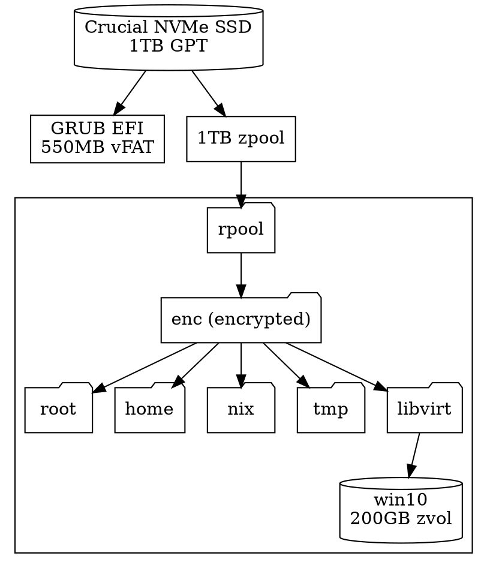
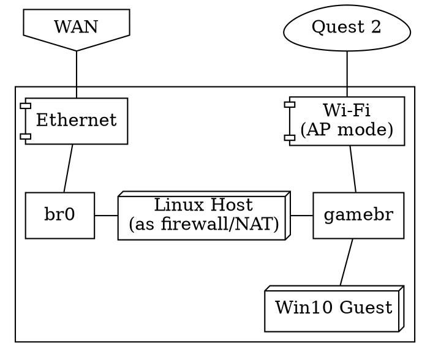

This week, I built a new gaming PC and got GPU passthrough set up on it! In this
article I'll talk about how I got it working, and stuff I learned about
virtualization along the way.


## Why VFIO?

A good chunk of it is that hate Windows and I like the features of Linux a lot
more. Windows doesn't have xmonad or ZFS, and all of my workflows are highly
Linux-centric. I'd rather have a Windows guest that I can switch data into and
out of rather than having a hard separation between the two.

There's a lot of security issues around kernel anti-cheat software, which is
becoming more and more common in games these days. Just last month, there was
[a high-profile ransomware incident involving Genshin Impact's KAC](https://www.pcgamer.com/ransomware-abuses-genshin-impacts-kernel-mode-anti-cheat-to-bypass-antivirus-protection/).
I'll go into detail about the security later, but basically, I'd rather reduce
the amount of hardware and data that someone can pwn.

## The build

It's a cute MicroATX build packing tons of power! Here is the
[PCPartPicker Part List](https://pcpartpicker.com/list/Hvx6mr).

| Type                         | Item                                                                                                                                                                                                                 | Price                 |
| :--------------------------- | :------------------------------------------------------------------------------------------------------------------------------------------------------------------------------------------------------------------- | :-------------------- |
| **CPU**                      | [AMD Ryzen 7 5700X 3.4 GHz 8-Core Processor](https://pcpartpicker.com/product/JmhFf7/amd-ryzen-7-5700x-34-ghz-8-core-processor-100-100000926wof)                                                                     | $239.99 @ Newegg      |
| **CPU Cooler**               | [Thermaltake UX100 38.82 CFM CPU Cooler](https://pcpartpicker.com/product/QFtKHx/thermaltake-ux100-3882-cfm-cpu-cooler-cl-p064-al12sw-a)                                                                             | $17.98 @ Amazon       |
| **Thermal Compound**         | [StarTech HeatGrease 20 g Thermal Paste](https://pcpartpicker.com/product/LPw323/startech-thermal-paste-heatgrease20)                                                                                                | $5.48 @ Amazon        |
| **Motherboard**              | [ASRock B550M PG RIPTIDE Micro ATX AM4 Motherboard](https://pcpartpicker.com/product/jrbTwP/asrock-b550m-pg-riptide-micro-atx-am4-motherboard-b550m-pg-riptide)                                                      | -                     |
| **Memory**                   | [Mushkin Redline Lumina 32 GB (2 x 16 GB) DDR4-3200 CL16 Memory](https://pcpartpicker.com/product/kFZ9TW/mushkin-enhanced-redline-32-gb-2-x-16-gb-ddr4-3200-cl16-memory-mla4c320gjjm16gx2)                           | $91.99 @ Newegg       |
| **Storage**                  | [Crucial P2 1 TB M.2-2280 NVME Solid State Drive](https://pcpartpicker.com/product/KMkgXL/crucial-p2-1-tb-m2-2280-nvme-solid-state-drive-ct1000p2ssd8)                                                               | $76.75 @ Amazon       |
| **Video Card**               | [Asus GeForce GTX 750 Ti 2 GB Video Card](https://pcpartpicker.com/product/LZkD4D/asus-video-card-gtx750tioc2gd5)                                                                                                    | Purchased For $0.00   |
| **Video Card**               | [Asus GeForce RTX 3070 Ti 8 GB TUF GAMING OC Video Card](https://pcpartpicker.com/product/CqPQzy/asus-geforce-rtx-3070-ti-8-gb-tuf-gaming-oc-video-card-tuf-rtx3070ti-o8g-gaming)                                    | Purchased For $460.00 |
| **Case**                     | [BitFenix Prodigy M 2022 MicroATX Mini Tower Case](https://pcpartpicker.com/product/Gk8bt6/bitfenix-prodigy-m-2022-microatx-mini-tower-case-bfc-pm2-300-kkgsk-rp)                                                    | $89.90 @ Amazon       |
| **Power Supply**             | [EVGA SuperNOVA P5 750 W 80+ Platinum Certified Fully Modular ATX Power Supply](https://pcpartpicker.com/product/qY7G3C/evga-supernova-p5-750-w-80-platinum-certified-fully-modular-atx-power-supply-220-p5-0750-x1) | $89.99 @ EVGA         |
| **Wireless Network Adapter** | [Intel AX200 802.11a/b/g/n/ac/ax M.2 (E) Wi-Fi Adapter](https://pcpartpicker.com/product/MMjBD3/intel-ax200-80211abgnacax-m2-e-wi-fi-adapter-ax200ngwgdtk)                                                           | $21.94 @ Amazon       |
| **Operating System**         | [NixOS Unstable](https://nixos.org/)                                                                                                                                                                                 | $0.00                 |
| **Total**                    |                                                                                                                                                                                                                      | **$1094.02**          |

I got the RTX 3070 Ti from eBay used for about \$100 below MSRP. Not included in
this part list are the 4 120mm ARGB fans, adding an additional \$35.

### Build justification

The crown jewel of the build is the used RTX 3070 Ti GPU. I chose the Ryzen 7
5700X CPU because AMD CPUs are fairly cheap, and that one is supposed to be a
good match, reducing the likelihood of bottlenecking.

However, I need 2 GPUs in order to comfortably do VFIO, and I forgot that the
CPU does not have an integrated graphics card. That's where my girlfriend's
dad's old GTX 750 Ti comes in.

I chose the motherboard because it was MicroATX, AM4, and seemed to have a
comfortable amount of I/O.

I was very tempted to buy 64gb of RAM just to be overkill, but I stuck with 32gb
because really, 64gb is overkill. 16gb _might_ be enough but it's on the low
end, and as someone who often works with large Jupyter notebooks and works in
VMs often, having 32gb is just _nice_.

NixOS Unstable is there because, well, NixOS Unstable.

### Assembly

This wasn't my first rodeo, as I had built and repaired PCs in the past, but
working with the MicroATX case has been a bit challenging simply due to how
small it is. With enough luck and elbow grease, however, anything can be done.


There's more parts on the way, namely fans, so those aren't even final pictures!

## Host disk topology

I performed the standard installation procedure for an encrypted ZFS root and a
couple of folders mounted out. Here's what the topology ended up looking like.



Putting the Windows hard drive inside a zvol means I can very easily encrypt and
resize it.

## Isolating the GPU from the host using VFIO

I followed a ton of stuff from the
[PCI passthrough via OVMF](https://wiki.archlinux.org/title/PCI_passthrough_via_OVMF)
on the Arch Linux wiki. I just had to adapt it to NixOS, but this stuff is so
low-level it's not too different.

Essentially, IOMMU is a technology that allows you to perform PCI passthrough to
virtual devices more safely and securely. You may need to enable it in your
BIOS, or maybe not. Quoting from that article, "an IOMMU group is the smallest
set of physical devices that can be passed to a virtual machine." Passthrough is
based on groups of PCI devices; it's an all-or-nothing deal.

First, I had to enable IOMMU on my machine by going into the BIOS and enabling
it, setting `boot.kernelParams = [ "amd_iommu=on" ]` in my NixOS config, and
rebooting. That flag, as you might imagine, tells the Linux kernel to enable
IOMMU.

### Finding my GPU's IOMMU groups

There's a script in that article that lets you look at your machine's IOMMU
groups:

```bash
#!/bin/bash
shopt -s nullglob
for g in $(find /sys/kernel/iommu_groups/* -maxdepth 0 -type d | sort -V); do
    echo "IOMMU Group ${g##*/}:"
    for d in $g/devices/*; do
        echo -e "\t$(lspci -nns ${d##*/})"
    done;
done;
```

Here's the results for mine:

```
IOMMU Group 0:
	00:01.0 Host bridge [0600]: Advanced Micro Devices, Inc. [AMD] Starship/Matisse PCIe Dummy Host Bridge [1022:1482]
	00:01.1 PCI bridge [0604]: Advanced Micro Devices, Inc. [AMD] Starship/Matisse GPP Bridge [1022:1483]
	00:01.2 PCI bridge [0604]: Advanced Micro Devices, Inc. [AMD] Starship/Matisse GPP Bridge [1022:1483]
	01:00.0 Non-Volatile memory controller [0108]: Micron/Crucial Technology P2 NVMe PCIe SSD [c0a9:540a] (rev 01)
	02:00.0 USB controller [0c03]: Advanced Micro Devices, Inc. [AMD] 500 Series Chipset USB 3.1 XHCI Controller [1022:43ee]
	02:00.1 SATA controller [0106]: Advanced Micro Devices, Inc. [AMD] 500 Series Chipset SATA Controller [1022:43eb]
	02:00.2 PCI bridge [0604]: Advanced Micro Devices, Inc. [AMD] 500 Series Chipset Switch Upstream Port [1022:43e9]
	03:00.0 PCI bridge [0604]: Advanced Micro Devices, Inc. [AMD] Device [1022:43ea]
	03:08.0 PCI bridge [0604]: Advanced Micro Devices, Inc. [AMD] Device [1022:43ea]
	03:09.0 PCI bridge [0604]: Advanced Micro Devices, Inc. [AMD] Device [1022:43ea]
	04:00.0 VGA compatible controller [0300]: NVIDIA Corporation GM107 [GeForce GTX 750 Ti] [10de:1380] (rev a2)
	04:00.1 Audio device [0403]: NVIDIA Corporation GM107 High Definition Audio Controller [GeForce 940MX] [10de:0fbc] (rev a1)
	05:00.0 Ethernet controller [0200]: Realtek Semiconductor Co., Ltd. RTL8125 2.5GbE Controller [10ec:8125] (rev 05)
	06:00.0 Network controller [0280]: Intel Corporation Wireless-AC 9260 [8086:2526] (rev 29)
IOMMU Group 1:
	00:02.0 Host bridge [0600]: Advanced Micro Devices, Inc. [AMD] Starship/Matisse PCIe Dummy Host Bridge [1022:1482]
IOMMU Group 2:
	00:03.0 Host bridge [0600]: Advanced Micro Devices, Inc. [AMD] Starship/Matisse PCIe Dummy Host Bridge [1022:1482]
	00:03.1 PCI bridge [0604]: Advanced Micro Devices, Inc. [AMD] Starship/Matisse GPP Bridge [1022:1483]
	07:00.0 VGA compatible controller [0300]: NVIDIA Corporation GA104 [GeForce RTX 3070 Ti] [10de:2482] (rev a1)
	07:00.1 Audio device [0403]: NVIDIA Corporation GA104 High Definition Audio Controller [10de:228b] (rev a1)
IOMMU Group 3:
	00:04.0 Host bridge [0600]: Advanced Micro Devices, Inc. [AMD] Starship/Matisse PCIe Dummy Host Bridge [1022:1482]
IOMMU Group 4:
	00:05.0 Host bridge [0600]: Advanced Micro Devices, Inc. [AMD] Starship/Matisse PCIe Dummy Host Bridge [1022:1482]
IOMMU Group 5:
	00:07.0 Host bridge [0600]: Advanced Micro Devices, Inc. [AMD] Starship/Matisse PCIe Dummy Host Bridge [1022:1482]
IOMMU Group 6:
	00:07.1 PCI bridge [0604]: Advanced Micro Devices, Inc. [AMD] Starship/Matisse Internal PCIe GPP Bridge 0 to bus[E:B] [1022:1484]
IOMMU Group 7:
	00:08.0 Host bridge [0600]: Advanced Micro Devices, Inc. [AMD] Starship/Matisse PCIe Dummy Host Bridge [1022:1482]
IOMMU Group 8:
	00:08.1 PCI bridge [0604]: Advanced Micro Devices, Inc. [AMD] Starship/Matisse Internal PCIe GPP Bridge 0 to bus[E:B] [1022:1484]
IOMMU Group 9:
	00:14.0 SMBus [0c05]: Advanced Micro Devices, Inc. [AMD] FCH SMBus Controller [1022:790b] (rev 61)
	00:14.3 ISA bridge [0601]: Advanced Micro Devices, Inc. [AMD] FCH LPC Bridge [1022:790e] (rev 51)
IOMMU Group 10:
	00:18.0 Host bridge [0600]: Advanced Micro Devices, Inc. [AMD] Matisse/Vermeer Data Fabric: Device 18h; Function 0 [1022:1440]
	00:18.1 Host bridge [0600]: Advanced Micro Devices, Inc. [AMD] Matisse/Vermeer Data Fabric: Device 18h; Function 1 [1022:1441]
	00:18.2 Host bridge [0600]: Advanced Micro Devices, Inc. [AMD] Matisse/Vermeer Data Fabric: Device 18h; Function 2 [1022:1442]
	00:18.3 Host bridge [0600]: Advanced Micro Devices, Inc. [AMD] Matisse/Vermeer Data Fabric: Device 18h; Function 3 [1022:1443]
	00:18.4 Host bridge [0600]: Advanced Micro Devices, Inc. [AMD] Matisse/Vermeer Data Fabric: Device 18h; Function 4 [1022:1444]
	00:18.5 Host bridge [0600]: Advanced Micro Devices, Inc. [AMD] Matisse/Vermeer Data Fabric: Device 18h; Function 5 [1022:1445]
	00:18.6 Host bridge [0600]: Advanced Micro Devices, Inc. [AMD] Matisse/Vermeer Data Fabric: Device 18h; Function 6 [1022:1446]
	00:18.7 Host bridge [0600]: Advanced Micro Devices, Inc. [AMD] Matisse/Vermeer Data Fabric: Device 18h; Function 7 [1022:1447]
IOMMU Group 11:
	08:00.0 Non-Essential Instrumentation [1300]: Advanced Micro Devices, Inc. [AMD] Starship/Matisse PCIe Dummy Function [1022:148a]
IOMMU Group 12:
	09:00.0 Non-Essential Instrumentation [1300]: Advanced Micro Devices, Inc. [AMD] Starship/Matisse Reserved SPP [1022:1485]
IOMMU Group 13:
	09:00.1 Encryption controller [1080]: Advanced Micro Devices, Inc. [AMD] Starship/Matisse Cryptographic Coprocessor PSPCPP [1022:1486]
IOMMU Group 14:
	09:00.3 USB controller [0c03]: Advanced Micro Devices, Inc. [AMD] Matisse USB 3.0 Host Controller [1022:149c]
IOMMU Group 15:
	09:00.4 Audio device [0403]: Advanced Micro Devices, Inc. [AMD] Starship/Matisse HD Audio Controller [1022:1487]
```

As you can see, the following devices around the GPU get passed through
together:

```
IOMMU Group 2:
	00:03.0 Host bridge [0600]: Advanced Micro Devices, Inc. [AMD] Starship/Matisse PCIe Dummy Host Bridge [1022:1482]
	00:03.1 PCI bridge [0604]: Advanced Micro Devices, Inc. [AMD] Starship/Matisse GPP Bridge [1022:1483]
	07:00.0 VGA compatible controller [0300]: NVIDIA Corporation GA104 [GeForce RTX 3070 Ti] [10de:2482] (rev a1)
	07:00.1 Audio device [0403]: NVIDIA Corporation GA104 High Definition Audio Controller [10de:228b] (rev a1)
```

First and foremost, I needed to find the PCI ID of the GPU I wanted to isolate.
YThis is the `<vendor>:<product>` thing where both vendor and product are 4
digits long. It was listed by the above script, but you can also find it out
directly by using `lspci`:

```
$ lspci -nn | grep -i nvidia
04:00.0 VGA compatible controller [0300]: NVIDIA Corporation GM107 [GeForce GTX 750 Ti] [10de:1380] (rev a2)
04:00.1 Audio device [0403]: NVIDIA Corporation GM107 High Definition Audio Controller [GeForce 940MX] [10de:0fbc] (rev a1)
07:00.0 VGA compatible controller [0300]: NVIDIA Corporation GA104 [GeForce RTX 3070 Ti] [10de:2482] (rev a1)
07:00.1 Audio device [0403]: NVIDIA Corporation GA104 High Definition Audio Controller [10de:228b] (rev a1)
```

In my case, it was `10de:2482` for the VGA and `10de:228b` for the audio.

### NixOS configuration

Here is the full module that does the meat of the work. It sets up all the
kernel modules and services for VFIO and optionally attaches the GPU on boot.
I'll walk through it part by part.

```nix
let
  # RTX 3070 Ti
  gpuIDs = [
    "10de:2482" # Graphics
    "10de:228b" # Audio
  ];
in { pkgs, lib, config, ... }: {
  options.vfio.enable = with lib;
    mkEnableOption "Configure the machine for VFIO";

  config = let cfg = config.vfio;
  in {
    boot = {
      initrd.kernelModules = [
        "vfio_pci"
        "vfio"
        "vfio_iommu_type1"
        "vfio_virqfd"

        "nvidia"
        "nvidia_modeset"
        "nvidia_uvm"
        "nvidia_drm"
      ];

      kernelParams = [
        # enable IOMMU
        "amd_iommu=on"
      ] ++ lib.optional cfg.enable
        # isolate the GPU
        ("vfio-pci.ids=" + lib.concatStringsSep "," gpuIDs);
    };

    hardware.opengl.enable = true;
    virtualisation.spiceUSBRedirection.enable = true;
  };
}
```

#### Creating a custom option

While this is technically not 100% necessary, I made a custom option here for
attaching the GPU on boot. If set to `false`, the GPU does not get attached at
boot. If set to `true`, it is.

```nix
options.vfio.enable = with lib; mkEnableOption "Configure the machine for VFIO";
```

By default, it is set to `false`, so I created a specialisation in my root
config module like this that sets it to `true`. Essentially, that means 2 new
boot options get to show up in the GRUB menu for us to boot from.

```nix
specialisation."VFIO".configuration = {
  system.nixos.tags = [ "with-vfio" ];
  vfio.enable = true;
};
```

#### Boot options

This is where I load in my initrd kernel modules. These get loaded before
everything else, and it happens in this specific order! The vfio modules before
the nvidia modules is very intentional because it lets vfio claim my GPU before
nvidia does.

```nix
boot.initrd.kernelModules = [
  "vfio_pci"
  "vfio"
  "vfio_iommu_type1"
  "vfio_virqfd"

  "nvidia"
  "nvidia_modeset"
  "nvidia_uvm"
  "nvidia_drm"
];
```

Then, I set kernel parameters with this piece of code.

```nix
let
  # RTX 3070 Ti
  gpuIDs = [
    "10de:2482" # Graphics
    "10de:228b" # Audio
  ];
in

...

boot.kernelParams = [
  # enable IOMMU
  "amd_iommu=on"
] ++ lib.optional cfg.enable
  # isolate the GPU
  ("vfio-pci.ids=" + lib.concatStringsSep "," gpuIDs);
```

- `amd_iommu=on` turns IOMMU on, which is needed for GPU passthrough.
- `("vfio-pci.ids=" + lib.concatStringsSep "," gpuIDs)` ends up evaluating to
  `vfio-pci.ids=10de:2482,10de:228b`, I just separated it out like that in case
  I want to isolate more PCI devices down the line.

#### Enabling miscellaneous switches

This section enables OpenGL (on the host) and SPICE redirects. OpenGL is
obvious, and SPICE redirection lets you essentially hotplug USB keyboards, mice,
storage, etc. from the host into the guest which is always nice and fun.

```nix
hardware.opengl.enable = true;
virtualisation.spiceUSBRedirection.enable = true;
```

### Rebooting the machine with these configs

Once I rebooted the machine with these settings, the 3070 could no longer be
used by the host. This is why I plugged my secondary monitor into the secondary
GPU. You can see the kernel logs showing it getting attached:

```
Sep 21 16:42:55 chungus stage-1-init: [Wed Sep 21 23:42:44 UTC 2022] loading module vfio_pci...
Sep 21 16:42:55 chungus kernel: VFIO - User Level meta-driver version: 0.3
Sep 21 16:42:55 chungus kernel: vfio-pci 0000:07:00.0: vgaarb: changed VGA decodes: olddecodes=io+mem,decodes=io+mem:owns=none
Sep 21 16:42:55 chungus kernel: vfio_pci: add [10de:2482[ffffffff:ffffffff]] class 0x000000/00000000
Sep 21 16:42:55 chungus kernel: vfio_pci: add [10de:228b[ffffffff:ffffffff]] class 0x000000/00000000
Sep 21 16:42:55 chungus stage-1-init: [Wed Sep 21 23:42:44 UTC 2022] loading module vfio...
Sep 21 16:42:55 chungus stage-1-init: [Wed Sep 21 23:42:44 UTC 2022] loading module vfio_iommu_type1...
Sep 21 16:42:55 chungus stage-1-init: [Wed Sep 21 23:42:44 UTC 2022] loading module vfio_virqfd...
Sep 21 16:42:55 chungus stage-1-init: [Wed Sep 21 23:42:44 UTC 2022] loading module nvidia...
```

## First run of the VM

I created a standard Windows VM in Libvirt, with the following modifications:

- I enabled EFI on the VM. I forget if that was required or not, but I guess EFI
  works with passthrough and EFI is loads better than legacy, anyways.
- I attached the `rpool/enc/libvirt/win10` zvol to my VM.
- I attached the PCIe devices corresponding to the 3070's VGA and audio
  controllers.

Finally, I booted it with the Windows 10 installer ISO and ran through the
installation process. The 3070 did not display anything until that process was
finished, but when it was finished, I got a big beautiful 4K view of my VM!


### Performance testing

I installed Apex Legends, VRChat, and Genshin Impact on the VM as some games to
test out first. All three were games with kernel-level (ewww) anti-cheats
program that often yell at you for running VMs.

However, it seemed like Apex's anti-cheat completely ignored the fact that I was
in a VM and it actually ran really good! At least the main menu did.


Okay, there was a small caveat -- it was sporadically lagging every 5 or so
seconds. I opened the task manager... and it was immediately obvious why.


Feeding it more cores appears to have fixed the issue.


The other two games, unfortunately, refused to launch because of anti-cheat
systems. So, I needed to figure out how to dodge that.

## Anti-Anti-Cheat Aktion

VRChat
[only added Easy Anti-Cheat recently](https://hello.vrchat.com/blog/vrchat-security-update),
but the really funny thing is that despite their program complaining about it,
they also have
[an article on their website that tells you how to bypass it in a VM](https://docs.vrchat.com/docs/using-vrchat-in-a-virtual-machine).
I consulted that article and
[this Superuser article](https://superuser.com/questions/1606898/hiding-qemu-virtualization-in-guest-windows-10)
to figure out how to hide my VM's power level.

Normally, if you look at your BIOS/board information in a VM, you see an entry
that essentially screams "I am running inside QEMU." We want to hide that, so we
can
[adjust SMBIOS information in our VMs](https://libvirt.org/formatdomain.html#smbios-system-information)
with a small amount of XML editing.

I acquired my BIOS information by running the following three commands:

```bash
dmidecode --type bios
dmidecode --type baseboard
dmidecode --type system
```

Then, I added these fields into my XML.

```xml
<os>
  ...
  <smbios mode="sysinfo"/>
  ...
</os>

...

<sysinfo type="smbios">
  <bios>
    <entry name="vendor">American Megatrends Inc.</entry>
    <entry name="version">F31o</entry>
    <entry name="date">12/03/2020</entry>
  </bios>
  <system>
    <entry name="manufacturer">ASRock</entry>
    <entry name="product">B550M PG Riptide</entry>
    <entry name="version">x.x</entry>
    <entry name="serial">M80-F3003700605</entry>
    <entry name="uuid">9a63135a-fe23-4ff0-a3f6-d281951f19c2</entry>
    <entry name="family">X570 MB</entry>
  </system>
</sysinfo>
```

Then, it seems we
[enable more features to hide the VMs](https://libvirt.org/formatdomain.html#hypervisor-features).

```xml
  <features>
    ...
    <hyperv mode="passthrough">
      <relaxed state="on"/>
      <vapic state="on"/>
      <spinlocks state="on" retries="8191"/>
      <vendor_id state="on" value="0123756792CD"/>
    </hyperv>
    <kvm>
      <hidden state="on"/>
    </kvm>
    ...
  </features>
```

With these fixes, Apex, Genshin, and VRChat all ran completely fine without
detecting any VM stuff!

## Oculus Quest 2 Passthrough

This was a major feature I wanted to have. Oculus does not release Rift for
Linux, so if I want to do any high-performance VR stuff, I would either need
Windows or a Valve Index.

### Naive USB redirection

I tried this and it didn't work. The Rift software did detect the headset, but
it was not able to do anything else with it besides complain that it couldn't
run a connection test. Starting Quest Link from the headset end didn't work
either, there was just a black screen until I inevitably disconnected my
headset.

### Air Link

Air Link actually worked perfectly well! Unfortunately, it's also quite slow and
laggy, plus the router is in another room behind two walls. However, it's still
a really nice thing to be able to have, especially if I don't want to use a
cable. When my Wi-Fi card's antennas arrive, I might try it again by setting the
card into AP mode and doing a much-closer-range connection, perhaps with a
network topology like this:



### Redirect the whole damn USB host controller

Here's a script that associates USB buses to IOMMU groups (found on
StackOverflow I think):

```bash
#!/bin/bash
shopt -s nullglob
for usb_ctrl in /sys/bus/pci/devices/*/usb*; do
  pci_path=${usb_ctrl%/*}
  iommu_group=$(readlink $pci_path/iommu_group)
  echo "Bus $(cat $usb_ctrl/busnum) --> ${pci_path##*/} (IOMMU group ${iommu_group##*/})"
  lsusb -s ${usb_ctrl#*/usb}:
  echo
done
```

It gives this output for me:

```
Bus 1 --> 0000:02:00.0 (IOMMU group 0)
Bus 001 Device 004: ID 8087:0025 Intel Corp. Wireless-AC 9260 Bluetooth Adapter
Bus 001 Device 101: ID 12c9:2003 SOAI USB Gaming Mouse
Bus 001 Device 099: ID 0a05:7211 Unknown Manufacturer hub
Bus 001 Device 039: ID 3297:4976 ZSA Technology Labs ErgoDox EZ Glow
Bus 001 Device 005: ID 26ce:01a2 ASRock LED Controller
Bus 001 Device 001: ID 1d6b:0002 Linux Foundation 2.0 root hub

Bus 2 --> 0000:02:00.0 (IOMMU group 0)
Bus 002 Device 001: ID 1d6b:0003 Linux Foundation 3.0 root hub

Bus 3 --> 0000:09:00.3 (IOMMU group 14)
Bus 003 Device 002: ID 174c:2074 ASMedia Technology Inc. ASM1074 High-Speed hub
Bus 003 Device 001: ID 1d6b:0002 Linux Foundation 2.0 root hub

Bus 4 --> 0000:09:00.3 (IOMMU group 14)
Bus 004 Device 003: ID 2833:0137 Oculus VR, Inc. Quest Headset
Bus 004 Device 002: ID 174c:3074 ASMedia Technology Inc. ASM1074 SuperSpeed hub
Bus 004 Device 001: ID 1d6b:0003 Linux Foundation 3.0 root hub
```

Now, you can see that I've already tactically isolated out my devices to the
buses I want, with the Quest on its own bus.

From the output of that first script, IOMMU group 0 clearly cannot be isolated
because it's the one with the CPU, but the USB controller is the only one in
group 14 so it's safe to islate it.

```
IOMMU Group 0:
	00:01.0 Host bridge [0600]: Advanced Micro Devices, Inc. [AMD] Starship/Matisse PCIe Dummy Host Bridge [1022:1482]
	00:01.1 PCI bridge [0604]: Advanced Micro Devices, Inc. [AMD] Starship/Matisse GPP Bridge [1022:1483]
	00:01.2 PCI bridge [0604]: Advanced Micro Devices, Inc. [AMD] Starship/Matisse GPP Bridge [1022:1483]
	01:00.0 Non-Volatile memory controller [0108]: Micron/Crucial Technology P2 NVMe PCIe SSD [c0a9:540a] (rev 01)
	02:00.0 USB controller [0c03]: Advanced Micro Devices, Inc. [AMD] 500 Series Chipset USB 3.1 XHCI Controller [1022:43ee]
	02:00.1 SATA controller [0106]: Advanced Micro Devices, Inc. [AMD] 500 Series Chipset SATA Controller [1022:43eb]
	02:00.2 PCI bridge [0604]: Advanced Micro Devices, Inc. [AMD] 500 Series Chipset Switch Upstream Port [1022:43e9]
	03:00.0 PCI bridge [0604]: Advanced Micro Devices, Inc. [AMD] Device [1022:43ea]
	03:08.0 PCI bridge [0604]: Advanced Micro Devices, Inc. [AMD] Device [1022:43ea]
	03:09.0 PCI bridge [0604]: Advanced Micro Devices, Inc. [AMD] Device [1022:43ea]
	04:00.0 VGA compatible controller [0300]: NVIDIA Corporation GM107 [GeForce GTX 750 Ti] [10de:1380] (rev a2)
	04:00.1 Audio device [0403]: NVIDIA Corporation GM107 High Definition Audio Controller [GeForce 940MX] [10de:0fbc] (rev a1)
	05:00.0 Ethernet controller [0200]: Realtek Semiconductor Co., Ltd. RTL8125 2.5GbE Controller [10ec:8125] (rev 05)
	06:00.0 Network controller [0280]: Intel Corporation Wireless-AC 9260 [8086:2526] (rev 29)

...

IOMMU Group 14:
	09:00.3 USB controller [0c03]: Advanced Micro Devices, Inc. [AMD] Matisse USB 3.0 Host Controller [1022:149c]
```

With all of this information, we can safely passthrough the entire USB
controller device `1022:149c` at PCI address `09:00.3`.

There is just one problem... that controller represents most of my USB ports,
front _and_ back panel! Sadly, there's not really much getting around it, so
I'll have to bear with it in the name of virtual reality.


However, this method appears to have worked, and I was able to successfully pass
through my quest on a USB 3.0 port. The Rift software read 2.4 Gbps from it.


## Performance measurements

VRChat runs at 10-20 fps while loading avatars, before stabilizing at 20-40 fps
depending on the size of the lobby and the performance of the avatars. The CPU
seems to be limited somewhat, because I noticed it was very high, so I may
allocate more cores. On the other hand, running in a private lobby with a very
large map with only two people, the FPS was maxed out at 72. I will try doing
performance tests with larger resolution and higher refresh rates, because the
Quest's default maximums are quite low.

Apex Legends runs at 4K and 60 FPS consistently in a game. I tested out Genshin
Impact, but not during a larger fight with more particles, but it was also 4K
and 60 FPS.

This VM also rolled me a 5-star Kokomi!


As for heat management though, it leaves much to be desired right now. I think
it's because of how tiny my case is, and how the secondary GPU physically blocks
my primary GPU's fans. I ran a [FurMark](https://geeks3d.com/furmark/) test and
it looked like my GPU was gonna hit 90C.


## Hotplug script

I got tired of going into virt-manager and clicking through the menus to add and
remove the devices I wanted. So, I wrote a script that does that for me. It's a
small wrapper around the following commands:

```bash
virsh attach-device <vm-id> --file <your-device-here.xml>
virsh detach-device <vm-id> --file <your-device-here.xml>
```

where `<your-device-here.xml>` is a specification that looks like this:

```xml
<hostdev mode="subsystem" type="usb" managed="yes">
  <source>
    <vendor id="0x12c9" />
    <product id="0x2003" />
  </source>
</hostdev>
```

or this:

```xml
<hostdev mode="subsystem" type="pci" managed="yes">
  <source>
    <address domain="0x0000" bus="0x07" slot="0x00" function="0x0"/>
  </source>
</hostdev>
```

Here is the script.

```bash
#!/bin/sh

xmldir=${WIN10HOTPLUG_XMLDIR:-$(dirname $(readlink -f $0))}
connection="qemu:///system"
dom="win10"

case $1 in
    "attach" | "a")
        action="attach-device"
        ;;
    "detach" | "d")
        action="detach-device"
        ;;
    *)
        echo "Usage: [ a | d ] [ [ g | m | k | u ] ... ]"
        exit 1
esac
shift 1

for short in "$@"; do
    case $short in
        "m")
            name="mouse"
            files=("mouse.xml")
            ;;
        "k")
            name="keyboard"
            files=("ergodox.xml")
            ;;
        "u")
            name="USB controller"
            files=("usbctl.xml")
            ;;
        "g")
            name="GPU"
            files=("gpu-pcie.xml" "gpu-vga.xml" "gpu-audio.xml")
            ;;
        *)
            echo "=== Unknown device $d ==="
            continue
            ;;
    esac

    echo "=== $short - $name ==="

    for file in "${files[@]}"; do
        fullpath="$(readlink -f "$xmldir/$file")"
        echo "Using $fullpath"
        virsh -c "$connection" $action $dom --file "$fullpath" --persistent
    done
done
```


## Hypothetical attack surface

As I mentioned before, using kernel-level access (via anti-cheat) to pwn the
Windows machine was a large concern that I had, but this VFIO setup should
severely restrict that, and be way more secure than a plain dual boot setup.

The scenario I'd want to mitigate is the attacker acquiring kernel access to the
Windows VM. Of course, it's quite with a VM breakout exploit (this includes
vulns in QEMU, SPICE, virtio, and so on) but those tools are so common and core
to internet infrastructure that I imagine that any exploit would be patched
quite quickly. Plus, unless someone has a severe hate-boner for me, I don't
think they'd deploy it on me, but on AWS or Azure. So, I'm gonna exclude VM
breakouts from this scenario.

Now, suppose the attacker was on Windows on a dual-boot setup, and they wanted
to break into the Linux boot. The Linux drive _is_ encrypted, but you can easily
bypass that by just editing the EFI stuff and perhaps installing an SSH server
or keylogger in the GRUB installation. On the other hand, you can't do that to
the Linux host from a Windows VM wouldn't be able to touch those, because it can
only touch its own isolated virtual drive and virtual hardware.

However, not _all_ of the hardware it's attached to is virtual. For example, the
USB keyboard, mouse, joystick, or VR headset get directly attached. You could
reflash their firmware, or sideload some code onto the VR headset, and have them
do stuff when reattached to the Linux host. The mitigation for the keyboard,
mouse, and joystick would probably just be to forward the HID inputs through
SPICE rather than passing the USB in, but that's problematic because it would
increase latency.

Another attack surface is the proprietary, closed-source GPU and USB host
controller that I'm passing through. You might be able to update their firmware,
so when they're reattached to Linux, they can attack the host system. I think
there's a mitigation for that besides keeping the GPU and motherboard firmware
updated.

There actually is one case of an increased attack surface: the VM can directly
attack the live running host over the network. There's not really a way to
isolate their LANs, and in fact, I'd rather that they _aren't_ completely
disconnected from each other. Still that would mean that a compromised VM can
execute the standard battery of network attacks on my host. On the other hand,
that's a very well-known attack vector, and the solution is just to reduce open
ports on the host.

## Next steps

This was a long-ass blogpost and I didn't even cover everything! For the time
being, this is a super nice setup and I'm quite happy with it. I still need to
figure out a comfortable X server setup, but that'll go in the next article.
