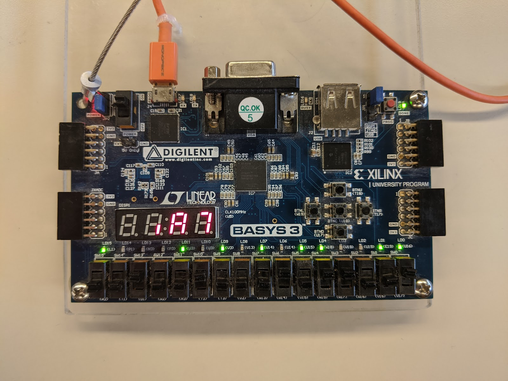
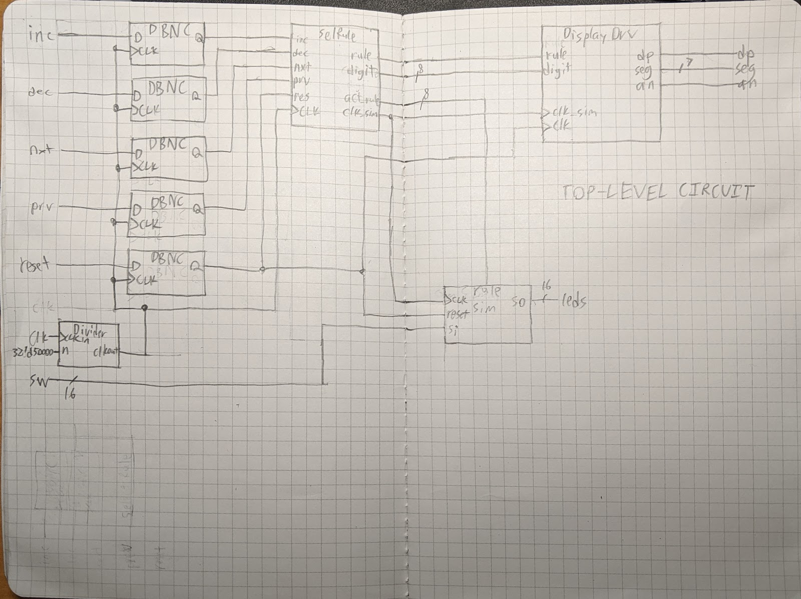

This is the report I submitted for the final project, transcribed into Markdown
by hand, transformed into HTML by the static site generator, and rendered into
pixels by your browser for your eyes to see.

## Description

### What is an elementary cellular automata?

An elementary cellular automata is a very simple model for computation. See
[this Wikipedia article](https://en.wikipedia.org/wiki/Elementary_cellular_automaton)
for more information, or read my explanation here.

There is an array of cells that can have one of 2 states: either dead or alive.
Every iteration, a rule is applied to every cell that looks somewhat like this:

|                               |     |     |     |     |     |     |     |     |
| :---------------------------- | :-: | :-: | :-: | :-: | :-: | :-: | :-: | :-: |
| **Current Pattern**           | 000 | 001 | 010 | 011 | 100 | 101 | 110 | 111 |
| **New state for center cell** |  1  |  0  |  0  |  1  |  0  |  0  |  0  |  1  |

where the current pattern is \[left]\[center]\[right]. Assuming that the
bordering cells are surrounded by 0, this is what will happen in one step of
this rule:

|             |        |
| :---------- | -----: |
| **State 0** | 110011 |
| **State 1** | 100010 |

### Purpose of this project

This project simulates a 1-dimensional cellular automata displayed on the LEDs.
It provides an interface for the user to configure the initial state using the
switches. Additionally, provides the user an interface to change the simulation
rule and adjust the simulation rate through the 7-segment display.

## Top-Level Black Box

![A schematic black box named top. Inputs: CLK, dec, dig_next, dig_prev, inc, reset, sw_IBUF[15:0], and toggle_BUFG. Outputs: an_OBUF[3:0], dp_OBUF, led_OBUF[15:0], seg_OBUF[6:0], and toggle_reg.](blackbox.png)

## Top-Level Structural Diagram

### Notes

- `DBNC` is the debouncing circuit found in `Debouncer.sv`
- `SelRule` is the submodule found in `SelectRule.sv`
- `Divider` is the variable clock divider circuit found in `ClockDivider.sv`
- `DisplayDrv` is the submodule found in `DisplayDriver.sv`

## Simulation Results

What this simulation does is:

- 0s to 10s: Set the rule to 16 by using `inc`, `dec`, and the digit cursor.
  - Rule is changed, but `active_rule` is not changed until `Reset` is pressed.
- 12s to 60s: Increase the speed.
  - The simulation clock accelerates during this time.
  - The simulation clock divider `N` decreases during this time.
- 65s to 120s: Decrease the speed.
  - The simulation clock decelerates during this time.
  - The simulation clock divider `N` increased during this time.

## Appendix A: Code

The code can be found on GitHub at
https://github.com/astralbijection/Basys3-1D-Cellular-Automata.

## Appendix B: Efficient, adder-only approximately constant-increment frequency selection

<iframe src="https://www.desmos.com/calculator/ehfsvq25rk?embed" width="500px" height="500px" style="border: 1px solid #ccc" frameborder=0></iframe>

### Motivation

I wanted to make it so that if you increment, you increase the frequency at a
constant rate. Say we started at a clock divider output period of $1000ms$, or
$1Hz$, and we wanted to increase the frequency by 0.1hz every time the increment
button is pressed. We would have to change the period to
$\frac{1}{1.1Hz} = 909ms$, then $\frac{1}{1.2Hz} = 833ms$, then
$\frac{1}{1.3Hz} = 769ms$, etc.

If I’m being completely honest, I didn’t need to do any of this, but I thought
it would be cool at the time.

### Implementation

Division is inefficient, so I decided to use an approximation to convert
frequency to period. In the graph, the black curve is the function
$T(f)=\frac{1}{f}$ on $f \in [14 Hz,2 Hz]$, the bounds I want to restrict the
simulator’s frequency to. The green curve is $T_1(t)$, which is the same
function, but rescaled to $[0,1]$ and centered on the origin.

### Approximation of $T(f)$

Let the third-order Taylor series approximation of $T_1(t)$ be the cubic
function $g(t)=at^3+bt^2+ct+d$. The blue function on the graph is the Taylor
series approximation of it. I decided that the simulator would have 16
increments, so the actual function used is $g(t)$ rescaled to $[0,16]$ centered
at 8:

$g_1(n)=g(\frac{n-8}{8})$

### Optimization of $g_1(n)$

Since multiplication is slow and exponentiation is even slower, I decided to
optimize the polynomial calculation using a third-order recursive sequence:

$$s_0(n)=s_0(n-1)+s_1(n-1) \text{ (period)}$$

$$s_1(n)=s_1(n-1)+s_2(n-1) \text{ (first-order difference)}$$

$$s_2(n)=s_2(n-1)+s_3 \text{ (second-order difference)}$$

$$s_3=Constant \text{ (third-order difference)}$$

A third-order recursive sequence like this creates a sequence of numbers that
lie on a cubic curve.

This allows us to calculate the result in a single clock cycle, and only using a
few adders when going forward, or doing a small amount of subtraction when going
backward.

I set $s_0(0)=g_1(\frac{1}{2})$ and found the formulas for the initial values
for these functions using a computer algebra system (specifically, a TI-92+):

$$s_0(0)=d$$

$$s_1(0)=\frac{a+b+c}{8}$$

$$s_2(0)=\frac{b}{4}$$

$$s_3=\frac{3a}{4}$$

The code that implements these formulas is in
[`SpeedControl.sv`](https://github.com/astralbijection/Basys3-1D-Cellular-Automata/blob/master/FinalProject.srcs/sources_1/new/SpeedControl.sv).
