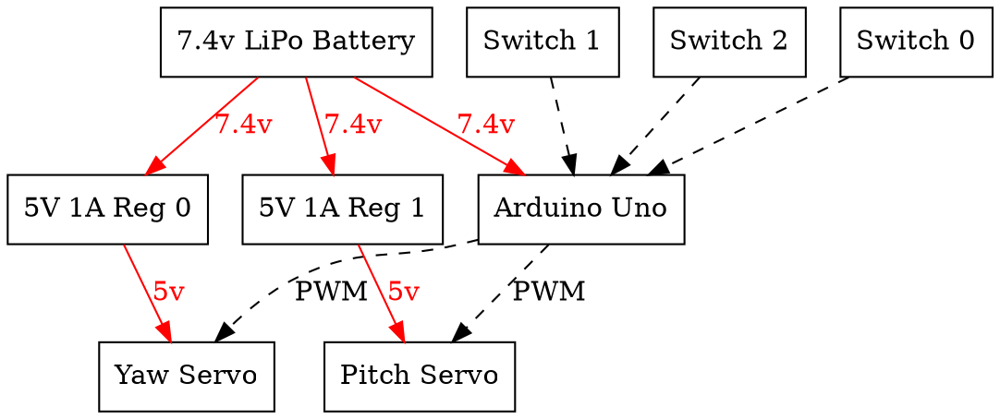

This project was a joke that went too far.

Please don't mind that horrible haircut, I had a tomboy phase back then.

## Motivation

You know how you're supposed to rotate your tassel once you've graduated? I
thought that was too basic, so I decided to make a robotic arm for my tassel
that rotated it for you. That would be simply one servo for yaw.

But even that's too basic. I wanted to make the tassel go spinny. However, I
didn't have any motors that could spin like I wanted, and I didn't really know
how I'd go about doing that.

Suddenly had a breakthrough: instead of one motor, you have 2 servos, one for
pitch and one for yaw. If $t$ is time, then you have the yaw servo doing a
$\cos(t)$ and the pitch servo doing a $\sin(t)$, so the arm goes in a circle,
and the tassel can go spinny!

There was one problem: Burlingame High School explicitly said that no
decorations are allowed on caps. So, I needed to design it in a way that would
allow it to be snuck in without attracting attention.

## Mechanical design

This is the Fusion 360 CAD model I made. It was designed to be easily 3D
printed, so in every part of the model, there is a flat surface to print off of.

<iframe src="https://myhub.autodesk360.com/ue28d9dcb/shares/public/SH56a43QTfd62c1cd96861e8d7f6f245ce0b?mode=embed" width="640" height="480" allowfullscreen="true" webkitallowfullscreen="true" mozallowfullscreen="true"  frameborder="0"></iframe>

To be snuck in, the robot was designed to easily hook onto a mortarboard without
physically modifying the underlying hat. The hooks meant it had an added bonus
of being able to hook onto the inside of my graduation gown, making it extra
easy to sneak in.

The mechanism made my mortarboard heavy, which is why I also ended up sewing
some straps to the side to tie the cap onto my skull. There was plausible
deniability with that one, because the mortarboards easily fell off people's
heads, especially in windy conditions.

## Electronics and firmware

The electronics were extremely simple. Here's a block diagram of the power and
data flows:

The code was written in C++ and using [Platform.io](https://platformio.org/)
because Arduino IDE sucks for anything bigger than a one-off experiment.

## Firmware and choreography

After the graduation rehearsal, I thought about my plan for putting on my little
show.

1. Prior to arrival at the site, I would hide the robot inside my gown, and
   bring E-tape to use to strap my tassel on the robot.
2. Being someone with a Y as her last name, I'm at the end of the line to
   graduate. So, halfway through the graduation as the M's are being called, I
   would pull out my gown to test that my robot works.
3. As the row in front of me is receiving their diplomas, I would pull out my
   robot and assemble the mechanism onto my mortarboard.
4. When they call my name, as I'm about to walk up the stairs, I toggle the
   switch. There will be a 3 second delay.
5. As I'm on the stage, the tassel will start spinning. It will continue
   spinning for 8 seconds, so I can shake hands with the people and receive my
   diploma during that time.
6. The tassel will finish spinning as I walk off stage.

## Mom's anxiety

My mom was afraid that I'd be violating the "no decorations" policy, which meant
the school admin would get angry, which meant they would take away my diploma,
which meant Cal Poly would rescind their offer, which meant that I would be
fucked. However, that was clearly excessive catastrophization, since:

- this seems too frivolous of a thing to take away a diploma over
- even if school admin is angry, public pressure would prevent them from taking
  away my diploma
- I've been a good student, this one barely-an-infraction wouldn't hurt anyone
- even if they did take away my diploma, Cal Poly would probably see this and be
  like "wow cool engineering" and keep the offer

## Result

It was a success! Everything went to plan, which rarely ever happens. I did not
get my diploma revoked either, and I went to Cal Poly the next fall without any
problems.
