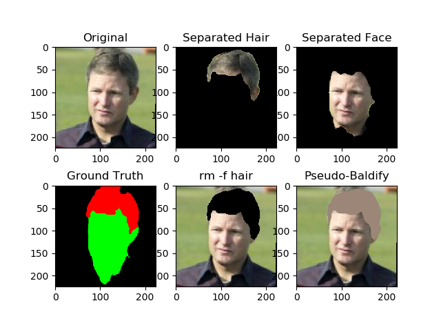

A convolutional neural network (CNN) that accomplishes an image segmentation task. It identifies people's faces as well as what part of their face is hair.

The dataset was synthetically expanded to improve accuracy by randomly applying the following distortions:

- Occlusions (randomly-sized rectangle at a random angle and offset)
- Blurring the image
- Translations, rotations, and zooms of the image

It could successfully detect a person's face in real time on a laptop webcam.

It was originally going to be a component in an image processing pipeline that would allow the user to simulate different hairstyles. The missing components for this were:

- Another neural network that determined face pose from images
- A thing that takes this hair detector's results, takes the face pose results, and replaces the user's hair with a 3D hair model.
