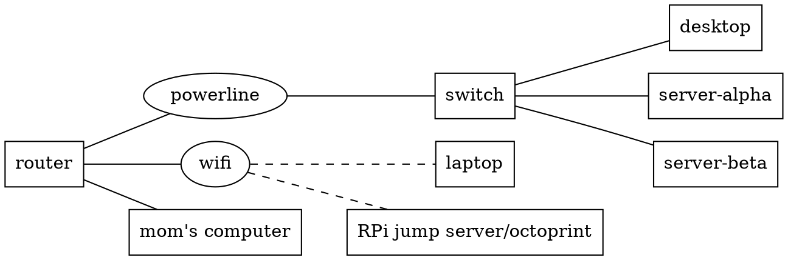
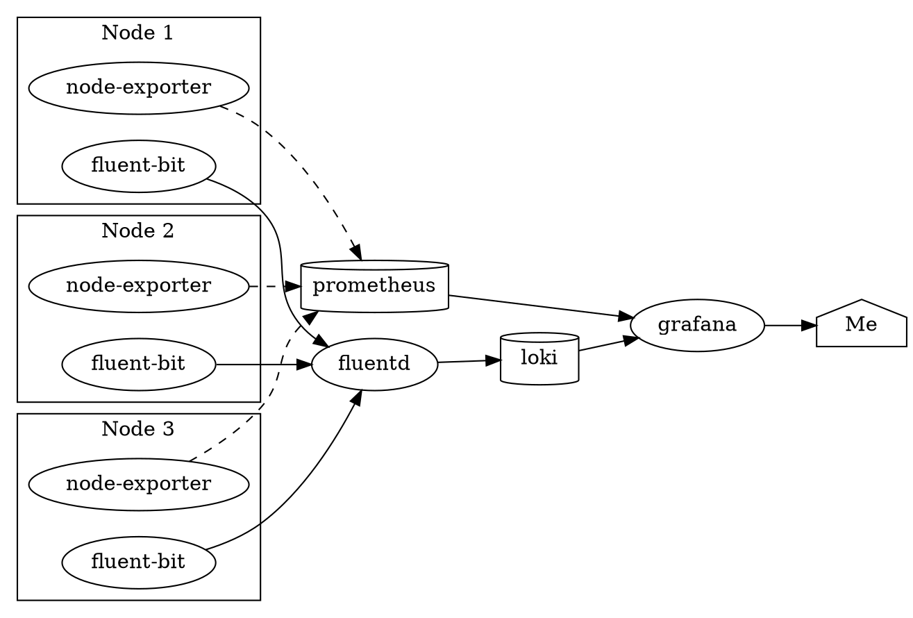

This project represents my unified efforts to manage all my software
configurations and deployments across all my machines.

## Configuration Management Tools

I use the following tools:

- NixOS to manage machines at the bottom layer of my infrastructure, whether
  it's a cloud-provided VPS or a bare metal machine at home.
- Ansible to deploy changes to the astrid.tech backend. I intend to migrate away
  from it to a pure NixOS setup, however.
- Cloudflare for DNS on my various domain names, and Terraform for configuring
  my DNS.

In the past, I used Kubernetes to deploy end-user services. I do intend on doing
this again, but I still need to do research on how I can declaratively integrate
the Kubernetes cluster into my setup.

## Current Infrastructure Setup

### Personal Computers

#### BANANA

This is my usually-stay-at-home laptop with the following specs:

- **Hostname:** banana.id.astrid.tech
- **Model:** Lenovo Legion Y530-15ICH-1060
- **OS:** Arch Linux/Windows 10 Dual Boot
- **CPU:** Intel i5-8300H
- **RAM:** 32GiB
- **GPU:** NVIDIA GeForce GTX 1060 Mobile
- **Monitors:** 1920x1080, 2560x1440, 3840x2160

The dotfiles in ~astrid are managed using
[Nix home-manager](https://github.com/nix-community/home-manager).

#### Cracktop

Cracktop is my travel laptop that I bring to and from school. It was my old
laptop from high school.

- **Hostname:** cracktop.id.astrid.tech
- **Model:** HP Pavilion 13 x360
- **OS:** NixOS Unstable
- **CPU:** Intel i5-6300U
- **RAM:** 8GiB
- **Monitors:** 1920x1080

There are a couple reasons why I use it despite its cracked screen:

- It's a lot lighter than BANANA, which reduces the load in my backpack.
- It's like a testing ground for managing the system over NixOS.
- Campus has a bike theft problem, so I wouldn't be surprised if it had a device
  theft problem as well. If I lose this machine, I won't be too sad, and with
  the cracked screen, no one would want to steal it.

### Workload Servers

Coming soon!

### Jump Servers

Jump servers are low-power SBCs that are always on, and can be used to send
Wake-on-LAN packets to other machines. However, I intend to get rid of those and
move to a Wireguard VPN-based way of connecting to my servers outside of LAN.

Currently, I have only one jump server, and that is jonathan-js, a Raspberry
Pi 3.

### Oracle Cloud

I have 2 Always Free VPSes in Oracle Cloud. I run the astrid.tech backend on
one, and I'm planning on using the other as a VPN lighthouse.

## History

### v0 - Early Forays

In late 2017, I was interested in trading Bitcoin. But not just going about it
in a boring way; I wanted to algorithmically trade it, and use computers to
calculate the optimal trading strategy. But I didn't just want to calculate that
strategy the normal way, either, I wanted to write a genetic algorithm to do it.
And it didn't just stop there, I wanted to run it on multiple computers to do
parallel processing.

So, I spent \$50 on a pair of Dell Optiplexes from eBay, hooked them into my
LAN, installed Ubuntu Server on them, and tried to set up
[Apache Spark](https://spark.apache.org/) on them. What could possibly go wrong?

The issue is, at the time, I was more of a programmer, and I saw deployment as
an implementation detail that could be sorted out later. So, I did it the very
quick and dirty way (wget the zip, call it via SSH) without really learning
about modern best practices.

Well, what ended up happening was I never got any of that working. I didn't know
about tools like Ansible, Docker, or Nix at the time, and deploying in the prod
environment over SSH was every bit as frustrating and tedious as I thought it
would be. Additionally, it turns out you can't just make a modern algotrader
only relying on technical indicators, so that failed too. However, this
experiment did set the stage for my future DevOps endeavors.

### v1 - VPS Deployment

In late December 2020, I was writing the backend for
[astrid.tech](/projects/astrid-tech), and I came across the problem of "how do I
deploy this?" And that's [when I learned Docker](/2020/12/27/0), and my VPS had
excess capacity, so I
[hosted some other stuff besides my backend using Docker](/2021/01/18/selfhost).

I consider this v1 of my homelab because it was something actually functional
for a while. Although the service declarations were in a sort of modular Docker
Compose architecture, they were all updated manually by SSHing in and
essentially running `git pull && docker-compose up`.
[Here are the last version of the configs before I modernized it](https://github.com/astralbijection/infra/tree/v1-final).

### v2 - On-Premises Cloud

Running a budgeting application like Firefly III in a public cloud alongside my
website backend (a prime target for hacking!) seemed like a bit of a liability.
So, I wanted to move that to a private, on-site cloud composed of multiple
computers. It seemed awkward to manually allocate services to specific ones,
[so that led me to learn Kubernetes](/2021/01/21/janky-kube-cluster).

It was mostly set up manually, with a few Ansible scripts to semi-automate tasks
like upgrading software, and a few Terraform configs to create databases.
[Here is what the infra repo looked like by the time I set up v2.](https://github.com/astralbijection/infra/tree/v2-final)

#### On-Site Hardware

Here is a listing of hardware I worked with:

| Name              | Model               | Arch  | Processor     | Cores  | RAM (GB) | Role                  |
| ----------------- | ------------------- | ----- | ------------- | ------ | -------- | --------------------- |
| crappertop[^fn-1] | Acer Aspire E1-510  | amd64 | Pentium N3520 | 4      | 4        | Proxmox: k3s, nfs     |
| cracktop[^fn-2]   | HP Pavilion x360 13 | amd64 | i5-2520M      | 4      | 8        | Proxmox: k3s          |
| thonkpad[^fn-3]   | Thinkpad T420       | amd64 | i5-6200U      | 4      | 8        | Proxmox: k3s, db, nfs |
| zerg-1[^fn-4]     | Raspberry Pi 3B+    | arm   | BCM2837B0     | 4      | 1        | k3s                   |
| zerg-2[^fn-4]     | Raspberry Pi 3B     | arm   | BCM2837       | 4      | 1        | k3s                   |
| zerg-3[^fn-4]     | Raspberry Pi 2B+    | arm   | BCM2836       | 4      | 1        | k3s                   |
| zerg-4[^fn-4]     | Orange Pi One       | arm   | sun8iw7p1     | 4      | 0.5      | k3s                   |
| **Total**         | ---                 | ---   | ---           | **28** | **23.5** | **Wasting my Time**   |

#### Public Cloud

I continued to use public cloud resources. I ran a Minecraft server on Contabo
for a time, and I continued to run parts of v1 stack on oci-1.

| Name      | Provider | Price ($/mo) | Arch  | Processor      | Cores | RAM (GB) | Role                |
| --------- | -------- | ------------ | ----- | -------------- | ----- | -------- | ------------------- |
| contabo   | Contabo  | 7.90         | amd64 | Xeon something | 4     | 8        | Docker Compose      |
| oci-1     | Oracle   | 0            | amd64 | Xeon something | 1     | 1        | Docker Compose      |
| oci-2     | Oracle   | 0            | amd64 | Xeon something | 1     | 1        | Docker Compose      |
| **Total** | ---      | 7.90         | ---   | ---            | **6** | **8**    | **Wasting my Time** |

#### Infrastructure Services

These services were deployed on the on-site hardware.

| Name                                               | Description                                                                                                | Deployed on                  |
| -------------------------------------------------- | ---------------------------------------------------------------------------------------------------------- | ---------------------------- |
| [Proxmox](https://www.proxmox.com/en/)             | An open-source Type 1 Hypervisor OS                                                                        | Bare metal                   |
| [K3s](https://k3s.io/)                             | A lightweight Kubernetes distribution that won't eat up most of the resources on a Raspberry Pi or craptop | VM, bare metal Raspberry Pis |
| MySQL/MariaDB                                      | Database                                                                                                   | LXC                          |
| Postgres                                           | Database                                                                                                   | LXC                          |
| [Docker Compose](https://docs.docker.com/compose/) | Multi-container applications stack, useful for servers dedicated to a single purpose                       | Bare metal                   |
| NFS                                                | File storage                                                                                               | LXC                          |

#### End-User Services

These were the services I actually ran, and some I planned on running but never
ended up getting done in v2.

| Name                  | Status    | Deployed on    | Description                                                                   |
| --------------------- | --------- | -------------- | ----------------------------------------------------------------------------- |
| OctoPrint             | Deployed  | Bare Metal     | 3D Printer sender with web UI                                                 |
| Firefly III           | Deployed  | k3s            | Budgeting App                                                                 |
| Printer Image Snapper | Deployed  | k3s            | Periodically takes pictures of my 3D Printer and uploads them to the internet |
| DokuWiki, D&D         | Deployed  | Docker Compose | A wiki for worldbuilding my D&D campaign                                      |
| Trilium Notes         | Deployed  | k3s            | Personal wiki/note-taking for school and more                                 |
| Apache Spark          | _Planned_ | k3s            | Big Data processing engine                                                    |
| Jupyter Notebook      | _Planned_ | k3s            | Interactive code notebooks                                                    |
| Bookstack             | _Planned_ | k3s            | "Internal" wiki for documenting this thing                                    |
| ELabFTW               | _Planned_ | k3s            | Lab notes                                                                     |
| NextCloud             | _Planned_ | k3s            | Personal cloud                                                                |

[^fn-1]:
    My mom complained about it being really slow, and even with Linux, it's
    still slow. Thus, it's worse than crap.

[^fn-2]:
    This is my old laptop. I pulled it out of my backpack one day and saw the
    screen completely cracked for no good reason whatsoever.

[^fn-3]: :thinking: https://emoji.gg/assets/emoji/thonk.png
[^fn-4]:
    Zerg rushing is essentially the "quantity-over-quality" tactic in strategy
    games: you send many expendable units against the enemy to hopefully
    overwhelm them.

#### Monitoring Services

And finally, these were the services I used to monitor all of the above.

| Name       | Type          | Description                            | Deployed on         |
| ---------- | ------------- | -------------------------------------- | ------------------- |
| Fluent-bit | Logs          | Reads logs from each node's containers | k3s, Docker Compose |
| Fluentd    | Logs          | Centrally parses and processes logs    | k3s                 |
| Loki       | Logs          | Stores and indexes logs                | k3s                 |
| Prometheus | Metrics       | Stores and indexes logs                | k3s                 |
| Loki       | Visualization | Stores and indexes logs                | k3s                 |

### v3 - Kubernetes-Focused Cloud

There were a couple of issues with v2, however.

- **Ephemeral Kubernetes volumes.** I didn't have any centralized storage, or
  some kind of sane storage management, so whenever a Kubernetes pod died, it
  would lose all its data.
- **Mixed-architecture clustering is hard.** You may notice I had both ARM and
  x86 machines. It's very hard to do this. I do not recommend it.
- **Low-end machines could not support virtualization.** It was a stupid idea to
  run Proxmox on badtop with its Pentium and 4GB RAM.
- **No domain controller.** I wanted to set up FreeIPA, but I didn't have the
  resources to do it.

For this and a variety of other erasons, I decided to wipe clean my homelab and
start anew.

This time, I had a similar stack, but with a few critical differences, making my
Kubernetes setup less painful.

#### On-Site Hardware

| Name     | Model               | Arch  | Processor     | Cores | RAM (GB) | Role                  |
| -------- | ------------------- | ----- | ------------- | ----- | -------- | --------------------- |
| badtop   | Acer Aspire E1-510  | amd64 | Pentium N3520 | 4     | 4        | Bare Metal: k3s       |
| cracktop | HP Pavilion x360 13 | amd64 | i5-2520M      | 4     | 8        | Proxmox: k3s          |
| thonkpad | Thinkpad T420       | amd64 | i5-6200U      | 4     | 8        | Proxmox: k3s, FreeIPA |

#### Infrastructure Services

| Name                                               | Description                                           | Deployed on    |
| -------------------------------------------------- | ----------------------------------------------------- | -------------- |
| [Proxmox](https://www.proxmox.com/)                | An open-source Type 1 Hypervisor OS                   | Bare metal     |
| [K3s](https://k3s.io/)                             | A lightweight Kubernetes distribution                 | VM, bare metal |
| [FreeIPA](https://www.freeipa.org/)                | An all-in-one package for Identity, Policy, and Audit | VM             |
| [Longhorn](https://rancher.com/products/longhorn/) | A distributed storage solution for Kubernetes         | Kubernetes     |
| [KubeDB](https://kubedb.com/)                      | A Kubernetes operator that manages databases          | Kubernetes     |

#### End-User Services

Coming soon!

### Experiments with Ansible-based automated infrastructure bootstrapping

Coming soon!

### Current NixOS Deployment

Coming soon!
