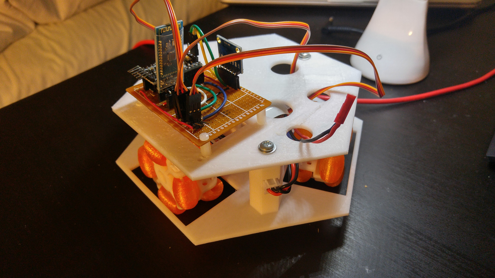
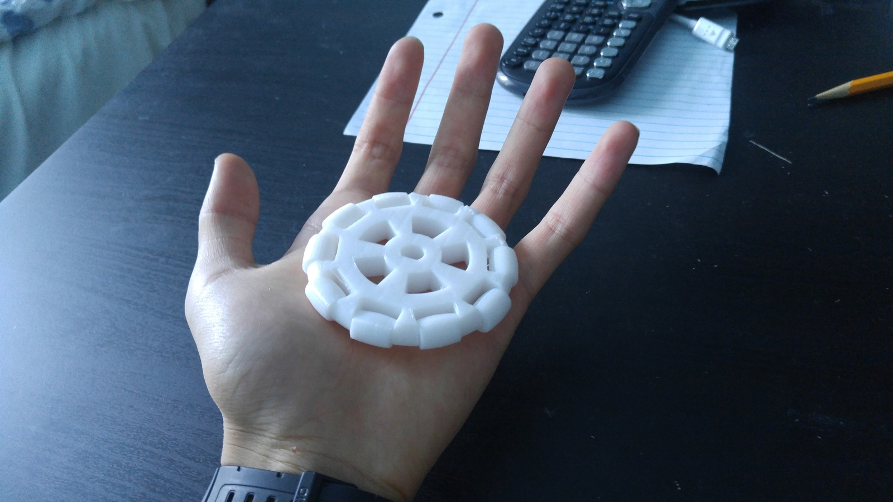
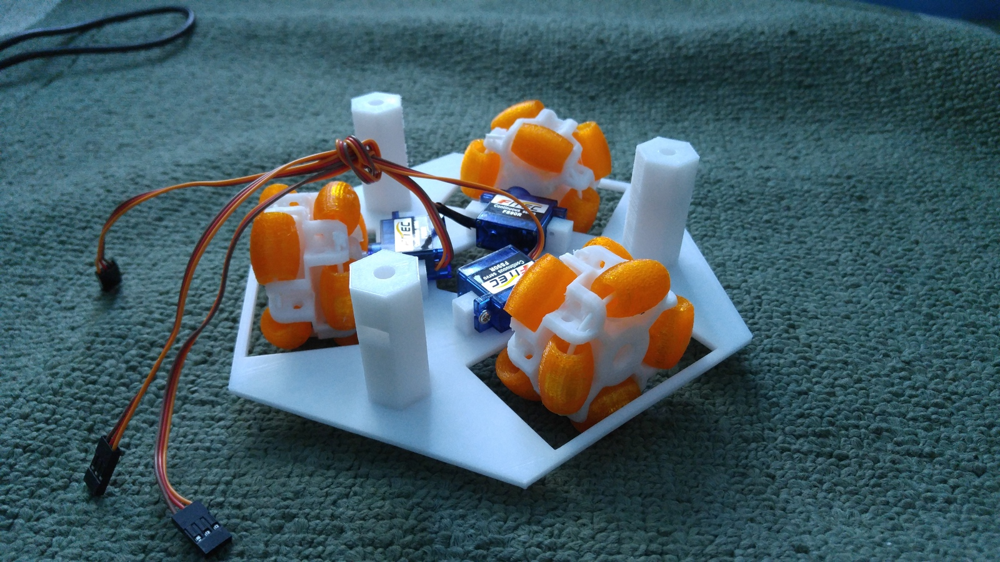
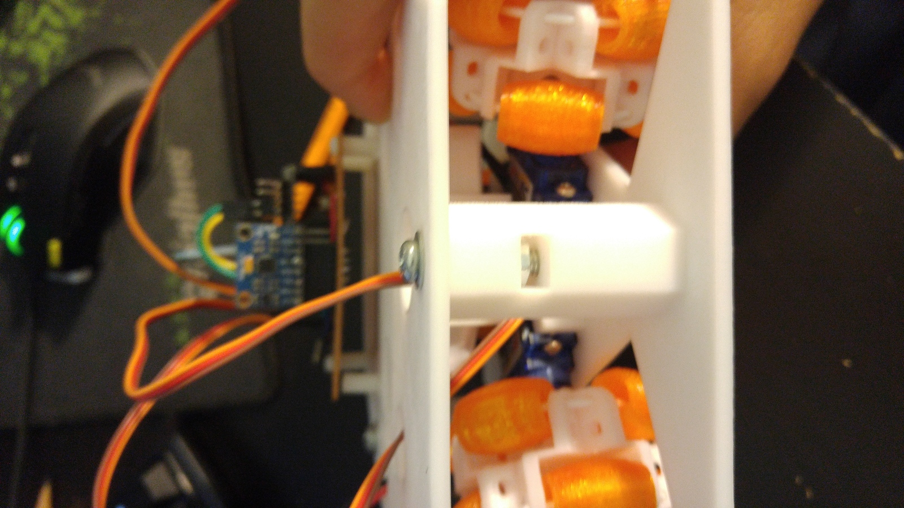

<iframe src="https://myhub.autodesk360.com/ue28d9dcb/shares/public/SH56a43QTfd62c1cd968eb1efe20e185a001?mode=embed" width="640" height="480" allowfullscreen="true" webkitallowfullscreen="true" mozallowfullscreen="true"  frameborder="0"></iframe>

<iframe src="https://myhub.autodesk360.com/ue28d9dcb/shares/public/SH56a43QTfd62c1cd968deeb555105c15399?mode=embed" width="640" height="480" allowfullscreen="true" webkitallowfullscreen="true" mozallowfullscreen="true"  frameborder="0"></iframe>

I started this project because I had figured out a way to 3D print omniwheels
and I wanted to make an omnidirectional robot with them. Unfortunately, this
project was scrapped because it turns out that CR servos do not offer very
precise movement required for an omniwheel drive.

However, I was able to program a PID system to make the robot keep facing the
same direction even when it is disturbed, as seen in the following GIF.

<iframe src="https://giphy.com/embed/Js2rsqtkQ4EMXftQDa" width="100%" height="100%" style="position:absolute" frameBorder="0" class="giphy-embed" allowFullScreen></iframe>

<a href="https://giphy.com/gifs/Js2rsqtkQ4EMXftQDa">via GIPHY</a>

## Prototypes

Here is an early prototype wheel. It was found to be too slippery and abandoned.

The wheels I used had TPU for the rollers so that it could have somewhat more
traction. In addition, the TPU was hollow to provide a sort of bounciness to it.

## Assembly

The lower deck holds the motors.

The upper deck holds the controls. It is attached to the lower deck via a M4
bolt and nut that is placed in a slot.

