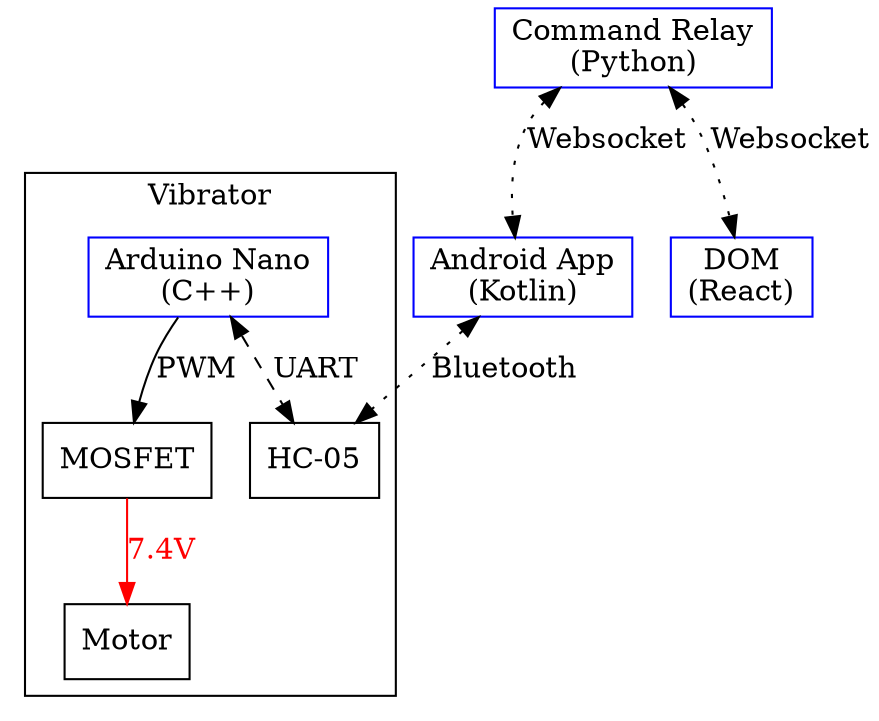

OwOstick is a simple teledildonic system allowing for internet control of a
modded vibrator.

## Motivation

My vibrator wand was a cheapo \$20 one from eBay. However, it ran on a tiny
battery, and it was getting a bit weak for my purposes. Additionally, it somehow
ended up in the laundry and got waterlogged. I had to disassemble it to let it
dry, and that was when I thought "well why not just put an Arduino in here?

And so this project was born.

## Functional Block Diagram

## Components

There are 4 discrete moving parts written in 4 different languages, making this
probably one of my most complex projects in terms of that metric. However, each
component is relatively quite simple, so that metric is very misleading.

### Vibrator

Inside the vibrator is a hastily-soldered perfboard holding an Arduino Pro Mini,
HC-05, and a MOSFET hooked up to the existing vibrator motor.
[See this blog post for more information about the teardown and reconstruction.](/2021/11/05/0/vibrator)
The Arduino firmware was written in C++.

The stock vibrator appears to have run on a 3.7v lithium ion battery, likely
powering the motor directly. Now, though, I have a 7.4v lithium battery feeding
into it. As such, the motor tends to warm up when input power is maximized.

### Android App

The Android app has a very simple interface: select device, possibly select
server, and control wand intensity. It is written in Kotlin.

### Command Relay

The command relay is also quite simple. It is written in Python and merely
serves to relay Websocket messages between the Android app and DOM interface.

### DOM Interface

Yes, that is a pun.

The DOM interface is a simple web frontend written in React (thus DOM), that
just has a simple slider for controlling vibrator intensity.
