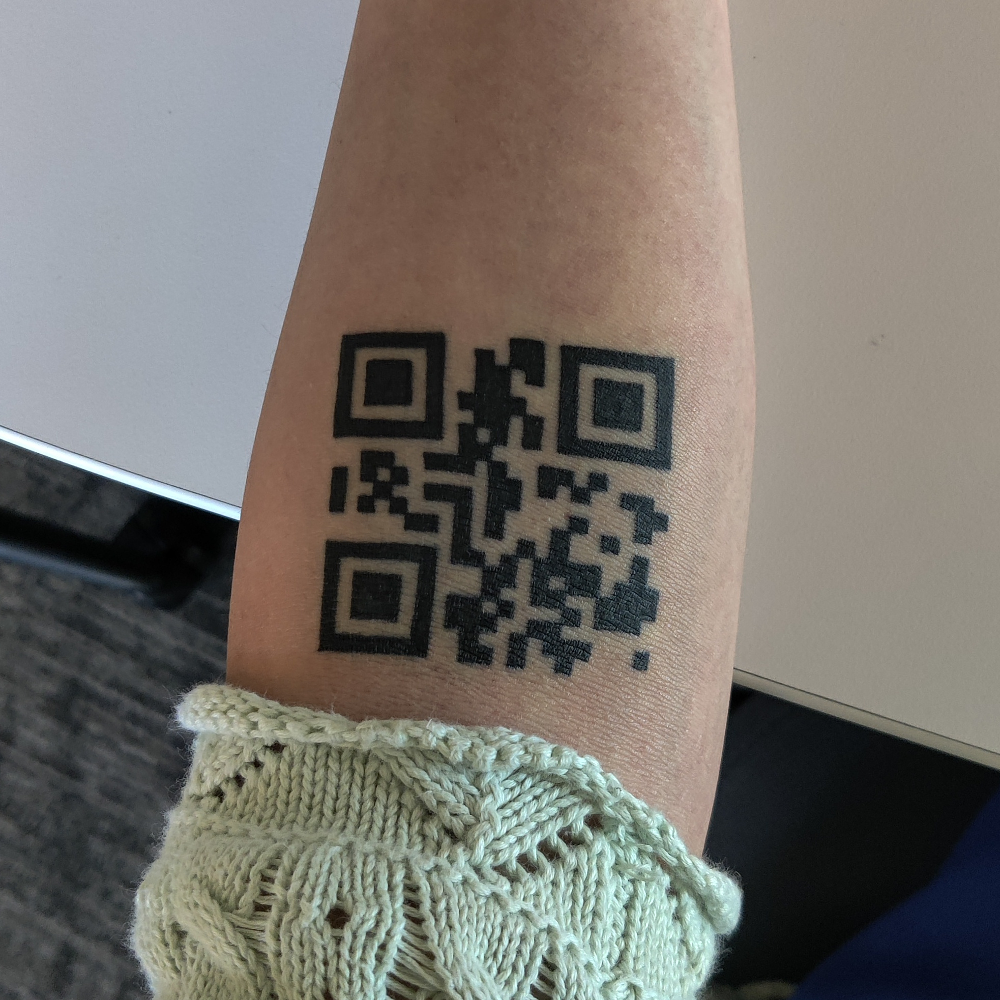

I have a QR code tattooed to my arm. It leads to any link I want it to point to.

Here are some blog posts associated with this project:

- [First post](https://astrid.tech/2021/09/22/0/qr-tattoo/)
- [Temporary tattoo results](https://astrid.tech/2021/10/03/0/temp-tattoo-results/)
- [Permanent tattoo results](https://astrid.tech/2022/03/03/22/0/qr-tattoo-result/)

## Tattoo Controller Server

