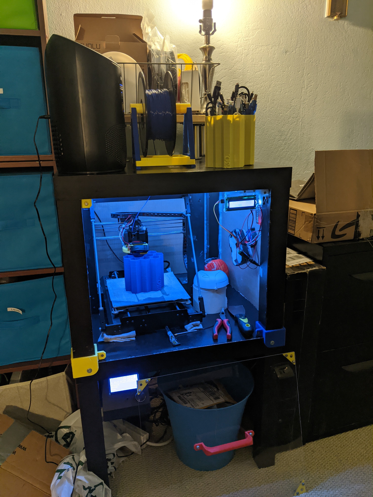
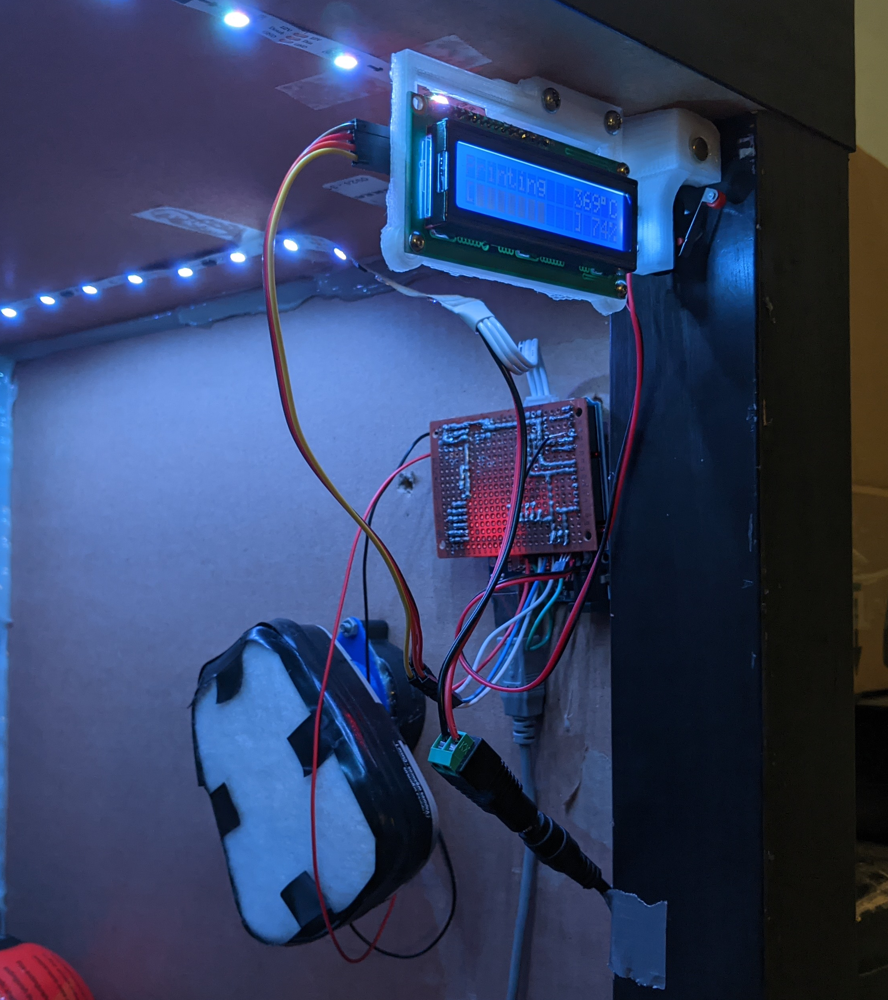
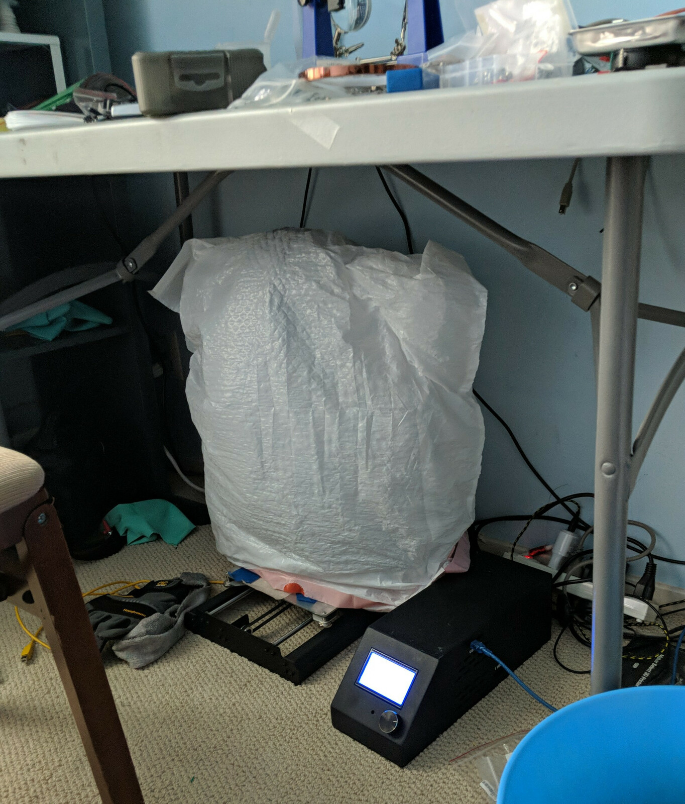

<iframe src="https://scontent-sjc3-1.cdninstagram.com/v/t50.2886-16/68904847_424438101526920_2808151939383640760_n.mp4?efg=eyJ2ZW5jb2RlX3RhZyI6InZ0c192b2RfdXJsZ2VuLjcyMC5jYXJvdXNlbF9pdGVtLmRlZmF1bHQiLCJxZV9ncm91cHMiOiJbXCJpZ193ZWJfZGVsaXZlcnlfdnRzX290ZlwiXSJ9&_nc_ht=scontent-sjc3-1.cdninstagram.com&_nc_cat=100&_nc_ohc=DaY-m1EOTjUAX_6WC86&vs=17845708822577414_2558876867&_nc_vs=HBksFQAYJEdJOW5Hd1NJU1VVeUJvSUJBTGhDU1laUGotZ21ia1lMQUFBRhUAAsgBABUAGCRHRUkxSHdUeV8xN01Bc1lIQURFc1NzM3RTZllkYmtZTEFBQUYVAgLIAQAoABgAGwAVAAAYABaMxuKn%2B6SzPxUCKAJDMywXQCjdsi0OVgQYEmRhc2hfYmFzZWxpbmVfMV92MREAde4HAA%3D%3D&oe=5F92091A&oh=878fb5ca25a9938fff748bf48ff0150d" width="800" height="800"></iframe>

It's yet another IKEA 3D printer enclosure, but with custom electronics on it! There's an [OctoPrint](https://octoprint.org/) plugin I wrote, that communicates with an Arduino I programmed, which sends and receives signals of all sorts, so the whole setup is less boring!

## Feature List

- LED strips!
- Motorized "air filter"
- Limit switch to detect the front panel
- Thermometer to measure air temperature
- LCD display that shows:
  - Printer status
  - Print progress as a percentage
  - Air temperature

## Why?

The Monoprice Maker Select i3 v1 has no enclosure. So, this is how I used to print ABS.

This is obviously a non-ideal setup.

My mom also wanted to get rid of a pair of LACK corner tables, so I decided to hop on the [LACK Enclosure train](https://blog.prusaprinters.org/cheap-simple-3d-printer-enclosure_7785/) and build my own!
