This is a tank with a functional fully 3d-printed autoloading airsoft pellet
firing mechanism.

<iframe width="560" height="315" src="https://www.youtube.com/embed/RDCPD6-U2Ko" frameborder="0" allow="accelerometer; autoplay; clipboard-write; encrypted-media; gyroscope; picture-in-picture" allowfullscreen></iframe>

## Electronics

```dot
digraph "Tanksberry Pi" {
    node [shape=box]
    label = "Electrical Block Diagram"

    subgraph cluster_tank {
        label = "Tank"

        bat [label="7.4v LiPo Battery"]
        sd5v [label="12V-5V 3A Stepdown"]

        l239d [label="L239D"]
        ml [label="Left Motor"]
        mr [label="Right Motor"]

        sty [label="Yaw Stepper"]

        subgraph cluster_deck {
            label = "Deck"
            rpi [label="Raspberry Pi 2B"]
            wifi [label="Wifi Card"]
            ss0 [label="StepStick 0"]
        }

        subgraph data {
            edge [style=dashed]

            rpi -> wifi [label="USB" dir="both"]
            rpi -> anano [label="I2C"]
            rpi -> ss0
            rpi -> l239d

            anano -> {ss1, ss2, laserctl}
        }

        subgraph power {
            edge [color=red, fontcolor=red]

            ss0 -> sty
            ss1 -> stp
            ss2 -> stf

            bat -> {l239d, ss0, ss1, ss2, sd5v} [label="7.4V"]
            sd5v -> {rpi, anano, laserctl} [label="5V"]
            laserctl -> laser [label="5V"]
            l239d -> {ml, mr} [label="±7.4V"]
        }

        subgraph cluster_turret {
            label = "Turret Assembly"
            anano [label="Arduino Pro Mini"]
            ss1 [label="StepStick 1"]
            ss2 [label="StepStick 2"]
            stp [label="Pitch Stepper"]
            stf [label="Firing Stepper"]
            laser [label="Laser Diode"]
            laserctl [label="NPN Transistor"]
        }
    }
}
```

CAD Model of the Turret

<iframe src="https://myhub.autodesk360.com/ue28d9dcb/shares/public/SH56a43QTfd62c1cd9689e22a34052172d2e?mode=embed" width="640" height="480" allowfullscreen="true" webkitallowfullscreen="true" mozallowfullscreen="true"  frameborder="0"></iframe>

<iframe src="https://giphy.com/embed/PiQQbA0SbPweBXC8l3" width="100%" height="100%" style="position:absolute" frameBorder="0" class="giphy-embed" allowFullScreen></iframe>

<a href="https://giphy.com/gifs/PiQQbA0SbPweBXC8l3">via GIPHY</a>

<iframe src="https://giphy.com/embed/L0k6cwsWxvDabb8fpb" width="100%" height="100%" style="position:absolute" frameBorder="0" class="giphy-embed" allowFullScreen></iframe>

<a href="https://giphy.com/gifs/L0k6cwsWxvDabb8fpb">via GIPHY</a>

<iframe src="https://giphy.com/embed/YRtAJsLrVtKxpI9fLb" width="100%" height="100%" style="position:absolute" frameBorder="0" class="giphy-embed" allowFullScreen></iframe>

<a href="https://giphy.com/gifs/YRtAJsLrVtKxpI9fLb">via GIPHY</a>

