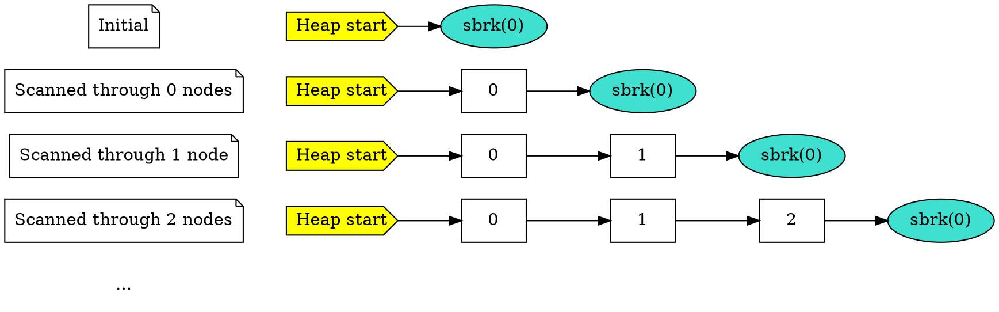
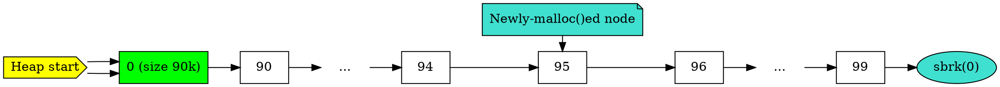

This is an implementation of the `malloc()` command in C that was second-fastest in a class of 30 students for a certain performance benchmark. My runtime was 169us, whereas the fastest one's runtime was 160us. If you would like to see the code, please email me at [hi@astrid.tech](mailto:hi@astrid.tech).

## Introduction

In almost every language, a lot of the memory management is done under the hood for you. With garbage-collected langs, like Python and Java, you literally just create an object and bam, memory. Even with C and C++, you can call `malloc()` and `free()`. No finagling with the program break and memory chunks.

So what if you're not allowed to use `malloc()` and `free()`? In my CPE 357 (systems programming) class, we were given an assignment to write our own `malloc()` and `free()` functions, moving the program break forward and backward manually with `brk()` and `sbrk()`. There is extra credit if your program is one of the top 5 fastest in the class for the following benchmark:

```c
for (int i = 0; i < 100; i++)
    a[i] = malloc(1000);

for (int i = 0; i < 90; i++)
    free(a[i]);

free(a[95]);

a[95] = malloc(1000);

for (int i = 90; i < 100; i++)
    free(a[i]);
```

Naturally, like the overachieving idiot I am, I decided to go for it.

## Analysis of the benchmark

The example implementation was to have a doubly-linked list of nodes, relying heavily on linear searches. Performing a `malloc()` will do a linear search through the chunks for the next free one. You can imagine how that implementation might not hold up so well.

We can break up the benchmark into the component parts to figure out how best to game the system.

### Long sequential allocation

The heap starts out empty, like this:


This first section will allocate sequential memory chunks:

```c
for (int i = 0; i < 100; i++)
    a[i] = malloc(1000);
```


Already, we can see that this code will cause the example implementation will go through all the $n$ existing chunks every single loop, like so:



Since we're scanning $n$ items $n$ times, this is already $O(n^2)$! This can definitely be improved, as we'll see later.

### Long sequential freeing

This second section will sequentially free most of the chunks.

```c
for (int i = 0; i < 90; i++)
    free(a[i]);
```


### Freeing in the middle

This third section frees a chunk in the middle of some sequentially-allocated chunks.

```c
free(a[95]);
```


Note that since we're scanning from the start, we had to look through 6 nodes (0, 90, 91, 92, 93, 94) before reaching the one we wanted (95), making this $O(n)$. While not terrible, this could be improved as well.

### Allocating into the best fit

The next malloc is expected to take that chunk that has just been freed because it's the smallest one that it can fit in.

```c
a[95] = malloc(1000);
```



The `malloc()` here did the same thing as the free above. Once again, not terrible, but not optimal either.

### Free everything

This final section frees the rest of the chunks. The expected result is that the heap becomes empty.

```c
for (int i = 90; i < 100; i++)
    free(a[i]);
```


Every single `free()` is 1 link away from the heap start, so in this case, it will be $O(n)$.

## How could we improve this?

The greatest amount of time comes from the first part, the $O(n^2)$ sequential `malloc()`. In a test I ran, using this implementation took about 200us on my computer, while my more optimized implementation was only 160us! The solution I came up with also ended up making every single one of the `malloc()`s and `free()`s on this benchmark $O(1)$ (though, once again, only for this benchmark).

It was fairly simple: besides keeping a doubly-linked list for node order, also keep a doubly-linked list for free nodes. In this benchmark, there are never more than 2 free nodes, so scanning through the free node list is extremely cheap. It does require a bit of extra bookkeeping every time you free or allocate a chunk, however, but it the benefits massively outweighed the downsides.

## Going further

I attempted to try and go even further by replacing the doubly-linked list with an [unrolled linked list](https://en.wikipedia.org/wiki/Unrolled_linked_list), which is like if an array list and a linked list had a child. Its main benefit is that it has the best of both worlds: you can stick on an infinite number of elements onto the end without having to reallocate the whole thing every now and then unlike an array list, but it's also much more cache efficient than a linked list.

I was going somewhat overkill on it, too: 64 bytes wide and aligned to 64-byte boundaries so that the entire thing fits on a single cache line, and using 128 bit registers to copy them for even more efficiency, among other things. I would have even attempted to use AVX/AVX2 registers to permute them in a single instruction, if not for:

a. the fact that my professor told me that that was forbidden, and
b. the fact that I ran out of time attempting to implement this godforsaken thing

So in the end, I just submitted my doubly-linked free list implementation.

If the benchmark weren't as sequential, and had more random accesses causing more fragmentation, I probably would have used a free chunk BST keyed by node size, so that I can have $O(\log n)$ rather than $O(n)$ free node scanning. This is because the best fit is the smallest chunk that fully contains the size you're allocating, so we would want to be able to do a search for that node on an ordered collection.
