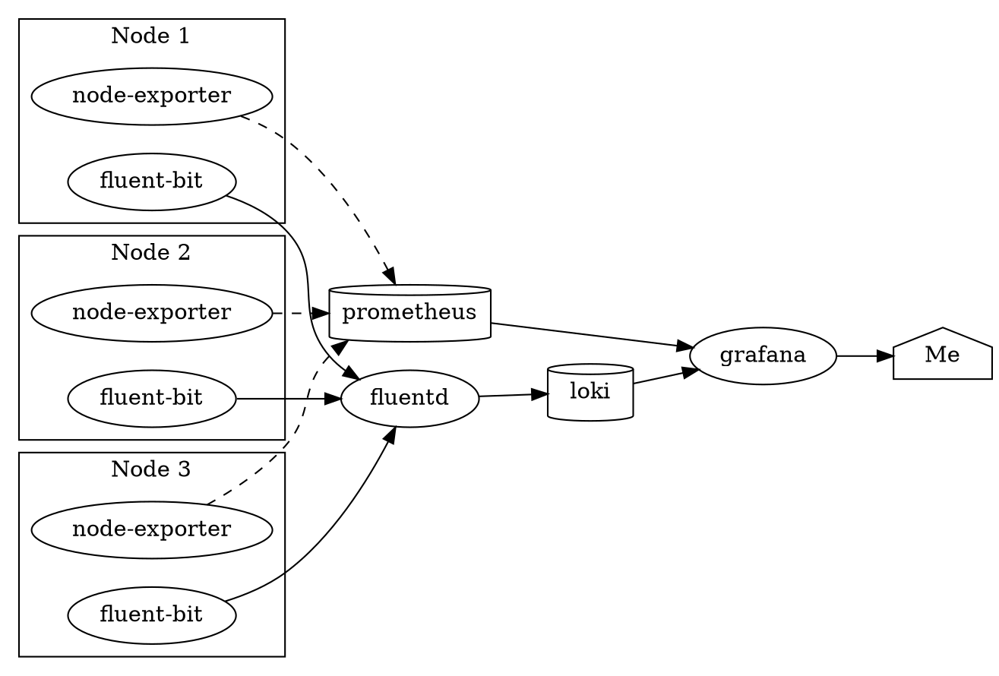

This project is an internal cloud that is scaled enough to meet the demands of a single pleb like me.

## Goals of this project

- Learn how to use industry-standard DevOps tools
- Try to adhere to Infrastructure as Code (IaC)
- Give these old devices an actual use

## Technology Stack

### End-User Services, planned and completed

| Name                  | Status    | Deployed on    | Description                                                                   |
| --------------------- | --------- | -------------- | ----------------------------------------------------------------------------- |
| OctoPrint             | Deployed  | Bare Metal     | 3D Printer sender with web UI                                                 |
| Firefly III           | Deployed  | k3s            | Budgeting App                                                                 |
| Printer Image Snapper | Deployed  | k3s            | Periodically takes pictures of my 3D Printer and uploads them to the internet |
| DokuWiki, D&D         | Deployed  | Docker Compose | A wiki for worldbuilding my D&D campaign                                      |
| Trilium Notes         | Deployed  | k3s            | Personal wiki/note-taking for school and more                                 |
| Apache Spark          | _Planned_ | k3s            | Big Data processing engine                                                    |
| Jupyter Notebook      | _Planned_ | k3s            | Interactive code notebooks                                                    |
| Bookstack             | _Planned_ | k3s            | "Internal" wiki for documenting this thing                                    |
| ELabFTW               | _Planned_ | k3s            | Lab notes                                                                     |
| NextCloud             | _Planned_ | k3s            | Personal cloud                                                                |

### Infrastructure Services

| Name                                               | Description                                                                                                | Deployed on |
| -------------------------------------------------- | ---------------------------------------------------------------------------------------------------------- | ----------- |
| [Proxmox](https://www.proxmox.com/en/)             | An open-source Type 1 Hypervisor OS                                                                        | Bare metal  |
| [K3s](https://k3s.io/)                             | A lightweight Kubernetes distribution that won't eat up most of the resources on a Raspberry Pi or craptop | VM          |
| MySQL/MariaDB                                      | Database                                                                                                   | LXC         |
| Postgres                                           | Database                                                                                                   | LXC         |
| [Docker Compose](https://docs.docker.com/compose/) | Multi-container applications stack, useful for servers dedicated to a single purpose                       | Bare metal  |
| NFS                                                | File storage                                                                                               | LXC         |

### Hardware

#### Flexible Home Resources

These resources share a variety of workloads.

| Name              | Model               | Arch  | Processor     | Cores  | RAM (GB) | Role                  |
| ----------------- | ------------------- | ----- | ------------- | ------ | -------- | --------------------- |
| crappertop[^fn-1] | Acer Aspire E1-510  | amd64 | Pentium N3520 | 4      | 4        | Proxmox: k3s, nfs     |
| cracktop[^fn-2]   | HP Pavilion x360 13 | amd64 | i5-2520M      | 4      | 8        | Proxmox: k3s          |
| thonkpad[^fn-3]   | Thinkpad T420       | amd64 | i5-6200U      | 4      | 8        | Proxmox: k3s, db, nfs |
| zerg-1[^fn-4]     | Raspberry Pi 3B+    | arm   | BCM2837B0     | 4      | 1        | k3s                   |
| zerg-2[^fn-4]     | Raspberry Pi 3B     | arm   | BCM2837       | 4      | 1        | k3s                   |
| zerg-3[^fn-4]     | Raspberry Pi 2B+    | arm   | BCM2836       | 4      | 1        | k3s                   |
| zerg-4[^fn-4]     | Orange Pi One       | arm   | sun8iw7p1     | 4      | 0.5      | k3s                   |
| **Total**         | ---                 | ---   | ---           | **28** | **23.5** | **Wasting my Time**   |

Here's what it all looks like.

#### Turnkey Home Resources

These resources are dedicated to one purpose and one purpose only.

| Name   | Model              | Role                                             |
| ------ | ------------------ | ------------------------------------------------ |
| octopi | Raspberry Pi 2B+   | OctoPrint                                        |
| BANANA | Lenovo Legion Y530 | Personal Computer: development, work, and gaming |

#### External Cloud Resources

Unfortunately, my internet connection is slow, so anything I want others to be able to use has to be hosted on an external cloud.

| Name      | Provider | Price ($/mo) | Arch  | Processor      | Cores | RAM (GB) | Role                |
| --------- | -------- | ------------ | ----- | -------------- | ----- | -------- | ------------------- |
| contabo   | Contabo  | 7.90         | amd64 | Xeon something | 4     | 8        | Docker Compose      |
| oci-1     | Oracle   | 0            | amd64 | Xeon something | 1     | 1        | Docker Compose      |
| oci-2     | Oracle   | 0            | amd64 | Xeon something | 1     | 1        | Docker Compose      |
| **Total** | ---      | 7.90         | ---   | ---            | **6** | **8**    | **Wasting my Time** |

[^fn-1]: My mom complained about it being really slow, and even with Linux, it's still slow. Thus, it's worse than crap.
[^fn-2]: This is my old laptop. I pulled it out of my backpack one day and saw the screen completely cracked for no good reason whatsoever.
[^fn-3]: :thinking: https://emoji.gg/assets/emoji/thonk.png
[^fn-4]: Zerg rushing is essentially the "quantity-over-quality" tactic in strategy games: you send many expendable units against the enemy to hopefully overwhelm them.

### Monitoring Services

| Name       | Type          | Description                            | Deployed on         |
| ---------- | ------------- | -------------------------------------- | ------------------- |
| Fluent-bit | Logs          | Reads logs from each node's containers | k3s, Docker Compose |
| Fluentd    | Logs          | Centrally parses and processes logs    | k3s                 |
| Loki       | Logs          | Stores and indexes logs                | k3s                 |
| Prometheus | Metrics       | Stores and indexes logs                | k3s                 |
| Loki       | Visualization | Stores and indexes logs                | k3s                 |

### Management Utilities

- Ansible -- Declaratively configuring servers
- Terraform -- Declaratively provisioning resources

### Things I no longer use

- ELK Stack (Elasticsearch, Logstash, Kibana, Filebeat, Metricbeat) -- This eats up a ridiculous amount of resources. As in, 6 GB (after attempts to minimize it) just dedicated to logging on a 28 GB cluster.
